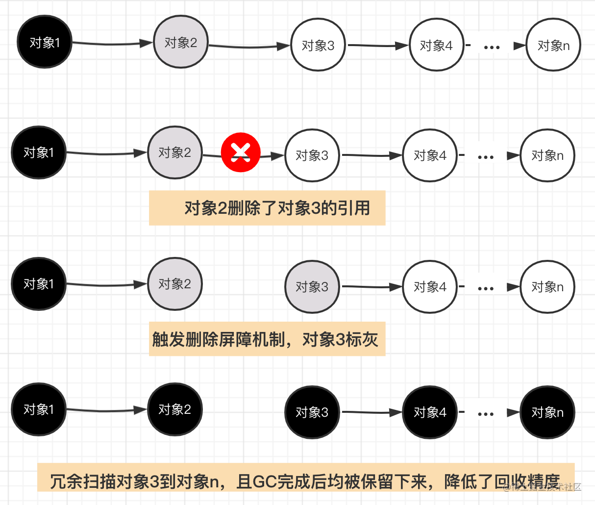

## 1. 什么是内存逃逸，什么情况下会发生内存逃逸？

​	Go的内存分配由`编译器`决定对象真正的存储位置是在`栈`上还是在`堆`上，并管理他的生命周期。内存逃逸是指原本应该被存储在`栈`上的变量，因为一些原因被存储到了`堆`上。

​	在程序中，每个函数块都会有自己的内存区域用来存自己的局部变量、返回地址、返回值之类的数据，这一块内存区域有特定的结构和寻址方式，寻址起来十分迅速，开销很少。这一块内存地址称为`栈`。栈是线程级别的，大小在创建的时候已经确定，**当变量的整个生命周期在运行时不是完全可知的时候**，会"逃逸"到`堆`上，这种现象称为`内存逃逸`。简单来说，==局部变量通过堆分配和回收，就叫内存逃逸==。

能引起变量逃逸到堆上的**典型情况**：

- **在方法内把局部变量指针返回** 局部变量原本应该在栈中分配，在栈中回收。但是由于返回时被外部引用，因此其生命周期大于栈，则溢出。
- **发送指针或带有指针的值到 channel 中。** 在编译时，是没有办法知道哪个 goroutine 会在 channel 上接收数据。所以编译器没法知道变量什么时候才会被释放。
- **在一个切片或map上存储指针或带指针的值。** 一个典型的例子就是 []*string 。这会导致切片的内容逃逸。尽管其后面的数组可能是在栈上分配的，但其引用的值一定是在堆上。
- **slice 的背后数组被重新分配了，因为 append 时可能会超出其容量( cap )。** slice 初始化的地方在编译时是可以知道的，它最开始会在栈上分配。如果切片背后的存储要基于运行时的数据进行扩充，就会在堆上分配。
- **在 interface 类型上调用方法。** 在 interface 类型上调用方法都是`动态调度`的 —— 方法的真正实现只能在运行时知道。想像一个 io.Reader 类型的变量 r , 调用 r.Read(b) 会使得 r 的值和切片b 的背后存储都逃逸掉，所以会在堆上分配

### 怎么避免**内存逃逸**？

* 对于小型的数据，使用传值而不是传指针，避免内存逃逸。
* 避免使用长度不固定的slice切片，在编译期无法确定切片长度，只能将切片使用堆分配。
* interface调用方法会发生内存逃逸，在热点代码片段，谨慎使用。

## 3.函数传指针和传值有什么区别？

​	在 `Golang` 中所有函数参数传递都是值拷贝，传指针只是拷贝了一份指针副本，同时指向原对象。一般情况下，**需要改变原始对象值**、**传递大的结构体**，传指针是最合适的，因为传一个内存地址的开销很小。反之，如果变量不可变更、`map` 或 `slice` 应该选择传值方式。

​	**==传值内存消耗较大，指针容易发生内存逃逸==**

## 4. new和 make的区别

`new`和`make`都在`堆`上分配内存，但是它们的行为不同，适用于不同的类型。

`new`用来**分配内存**，但它不会**初始化**内存，只会讲内存**置零**；`new(T)` 为每个新的类型T分配一片内存，初始化为 0 并且返回类型为*T的内存地址：这种方法 **返回一个指向类型为 T，值为 0 的地址的指针**，它适用于值类型如数组和结构体；它相当于 &T{}。

`make(T)` **返回一个类型为 T（非指针） 的初始值**，它==只适用于==3种内建的引用类型：`slice`、`map `和 `channel`，原因在于，<u>这三种类型本质上为引用类型，它们在使用前必须初始化；</u>。

换言之，new 函数分配内存，make 函数初始化

Go语言中的 new 和 make 主要区别如下：

- make 只能用来分配及初始化类型为 slice、map、chan 的数据。new 可以分配任意类型的数据；
- new 分配返回的是`指针`，即类型 *Type。make 返回`引用`，即 Type；
- new 分配的空间`被清零`。make 分配空间后，会进行`初始化`；

## 5.Go语言的GPM调度器是什么？

调度：[interview-go/go-gpm.md](https://github.com/lifei6671/interview-go/blob/master/base/go-gpm.md)

[[典藏版\] Golang 调度器 GMP 原理与调度全分析 ](https://learnku.com/articles/41728)

- `Goroutine`：就是咱们常用的用go关键字创建的执行体，它对应一个结构体g，结构体里保存了goroutine的堆栈信息

- `Machine`：表示操作系统的线程

- `Processor`：表示处理器，有了它才能建立G、M的联系

  

 **调度本质**

即**把大量的goroutine分配到少量线程上去执行，并利用多核并行，实现更强大的并发**。


 **sysmon**

`sysmon`是我们的保洁阿姨，它是一个`M`，又叫监控线程，不需要`P`就可以独立运行，每20us~10ms会被唤醒一次出来打扫卫生，主要工作就是**回收垃圾、回收长时间系统调度阻塞的P、向长时间运行的G发出抢占调度**等等

### 切换时机

- 会**阻塞的系统调用**，比如文件io，网络io；
- time系列定时操作；
- go func的时候, func执行完的时候；
- **管道读写阻塞**的情况；
- 垃圾回收之后。
- 主动调用runtime.Gosched()

### 对网络 IO 的优化

[blogpost/Go并发机制.md](https://github.com/k2huang/blogpost/blob/master/golang/并发编程/并发机制/Go并发机制.md)

1. 将标准库中的网络库全部封装为`非阻塞形式`，防止其阻塞底层的`M`并导致内核调度器切换上下文带来的系统开销。
2. 运行时系统加入`epoll`机制(针对Linux系统)，当某一个`Goroutine`在进行网络IO操作时，如果网络IO未就绪，就将其该`Goroutine`封装一下，放入`epoll`的**等待队列**中，当前G挂起，与其关联的M可以继续运行其他`G`。当相应的网络IO就绪后，Go运行时系统会将等待网络IO就绪的`G`从`epoll`**就绪队列**中取出（主要在两个地方从epoll中获取已网络IO就绪的G列表，一是sysmon监控线程中，二是自旋的`M`中），再由调度器将它们像普通的G一样分配给各个`M`去执行。

Go语言将高性能网络IO的实现方式直接集成到了Go本身的运行时系统中，与Go的并发调度系统协同高效的工作，让开发人员可以简单，高效地进行网络编程。

### GOMAXPROCS

`GOMAXPROCS`的变量(**P的数量**)来决定会有多少个操作系统的线程同时执行Go的代码。其`默认的值是运行机器上的CPU的核心数`,最大1024。

**M 的数量**：限制10000

**G 的数量**：无限制，理论上受内存的影响，创建一个 G 的初始栈大小为2-4K

goroutine的最大栈空间: `1GB`

([Go 的默认栈大小是多少？最大值多少？](https://go-interview.iswbm.com/c03/c03_04.html))

### P 和 M 创建的时机

P和M创建的时机是不同的

* P 创建：在确定了 P 的最大数量 n 后，运行时系统会根据这个数量创建 n 个 P。
* M 创建：内核级线程的初始化是由内核管理的，**当没有足够的 M 来关联 P 并运行其中的可运行的 G 时会请求创建新的 M**。比如 M 在运行 G1 时被阻塞住了，此时需要新的 M 去绑定 P ，如果没有在`休眠的M`则需要新建M

### M 的复用

复用线程：避免频繁的创建、销毁线程，而是对线程的复用。

1）work stealing 机制

 当本线程无可运行的 G 时，尝试从其他线程绑定的 P 偷取 G，而不是销毁线程。

2）hand off 机制

 当本线程因为 G 进行系统调用阻塞时，线程释放绑定的 P，把 P 转移给其他空闲的线程执行。

## 6. channel的实现和工作原理

[图解 Golang Channel 的底层原理](https://juejin.cn/post/7037656471210819614)

结构：channel是golang中用来实现多个goroutine通信的管道，它的底层是一个叫做`hchan`的结构体。在go的runtime包下。

```go
type hchan struct {
  //channel分为无缓冲和有缓冲两种。
  //对于有缓冲的channel存储数据，借助的是如下循环数组的结构
	qcount   uint           // 循环数组中的元素数量
	dataqsiz uint           // 循环数组的长度
	buf      unsafe.Pointer // 指向底层循环数组的指针
	elemsize uint16 		//能够收发元素的大小

	closed   uint32   	//channel是否关闭的标志
	elemtype *_type 	//channel中的元素类型
  
  //有缓冲channel内的缓冲数组会被作为一个“环型”来使用。
  //当下标超过数组容量后会回到第一个位置，所以需要有两个字段记录当前读和写的下标位置
	sendx    uint   // 下一次发送数据的下标位置
	recvx    uint   // 下一次读取数据的下标位置
  
  //当循环数组中没有数据时，收到了接收请求，那么接收数据的变量地址将会写入读等待队列
  //当循环数组中数据已满时，收到了发送请求，那么发送数据的变量地址将写入写等待队列
	recvq    waitq  // 读等待队列
	sendq    waitq  // 写等待队列

	lock mutex //互斥锁，保证读写channel时不存在并发竞争问题
}
```


例子：ch是长度为4的带缓冲的channel，G1是发送者，G2是接收者

- 初始`hchan`结构体中的buf为空，`sendx`和`recvx`均为0。
- 当`G1`向ch里发送数据时，首先会**对buf加锁**，然后**将数据copy到buf中**，然后`sendx++`，然后释放对buf的锁。
- 当`G2`消费ch的时候，会首先**对buf加锁**，然后将buf中的**数据copy到task变量对应的内存里**，然后`recvx++`,并释放锁。

可以发现整个过程，G1和G2没有共享的内存，**底层是通过hchan结构体的buf，并使用copy内存的方式进行通信，最后达到了共享内存的目的**，这里也体现了Go中的CSP并发模型。

### **当channel中的缓存满了之后会发生什么?**

​	GMP 调度—当`G1`向 buf 已经满了的 ch 发送数据的时候，检测到hchan的buf已经满了，**会通知调度器，调度器会将G1的状态设置为waiting, 并移除与线程M的联系**，==然后从`P`的runqueue中选择一个goroutine在线程M中执行==，此时`G1`就是`阻塞状态`，但是不是操作系统的线程阻塞，所以这个时候只用消耗少量的资源。

​	当G1变为waiting状态后，会创建一个`sudog`的结构，然后放到`sendq`这个list中，sudog结构中保存了channel相关的变量的指针


### 向没有数据的channel读数据会发生什么？

​	如果G2先运行，那么G2会从一个empty的channel里取数据，这个时候G2就会`阻塞`，和前面介绍的G1阻塞一样，G2也会创建一个`sudog`结构体，保存接收数据的变量的地址，放到`recvq`列表里。


## 7.gc（读写屏障）

[GC - 码农桃花源 (gitbook.io)](https://qcrao91.gitbook.io/go/gc/gc)

[一文弄懂 Golang GC、三色标记、混合写屏障机制【图文解析GC】](https://juejin.cn/post/7040737998014513183)

​	**垃圾回收，是一种自动内存管理机制。**即我们在程序中定义一个变量后，会在内存中开辟相应空间进行存储。当不需要此变量后，需要手动销毁此对象，并释放内存。而这种对不再使用的内存资源进行自动回收的功能即为垃圾回收

### 背景知识

1. **赋值器**:说白了就是你写的**程序代码**，在程序的执行过程中，可能会改变对象的引用关系，或者创建新的引用。

2. **回收器**:垃圾回收器的责任就是去干掉那些程序中不再被引用得对象

3. **STW**:全称是stop the word，GC期间某个阶段会**停止所有的赋值器，中断你的程序逻辑，以确定引用关系**。

4. **root对象**:根对象是指赋值器不需要通过其他对象就可以直接访问到的对象，通过Root对象, 可以追踪到其他存活的对象。常见的root对象有：

   - **全局变量**：程序在编译期就能确定的那些存在于程序整个生命周期的变量。
     
   - **执行栈**：每个 goroutine (包括main函数)都拥有自己的执行栈，这些执行栈上包含**栈上的变量及堆内存指针**。
     
   - **寄存器**：寄存器的值可能表示一个指针，参与计算的这些指针可能指向某些赋值器分配的堆内存区块


### 三色标记法

图见🔗链接2⃣️

1. 初始时，所有对象被标记为`白色`
2. GC开始，遍历`根对象`，将**直接可达**的对象标记为`灰色`
3. 遍历`灰色`对象，将**直接可达**对象标记为`灰色`，井将自身标记为`黑色`
4. 重复第3步，直到标记完所有的对象
5. 将标记为`白色`的对象当做垃圾回收掉

### 对象丢失

在三色标记法的过程中对象丢失，需要同时满足下面两个条件：

- 条件一：**白色对象被黑色对象引用**

- 条件二：**灰色对象与白色对象之间的可达关系遭到破坏**

**1 强三色不变式**

  规则：不允许黑色对象引用白色对象（破坏条件一）

**2 弱三色不变式**

  规则：黑色对象可以引用白色对象，但是白色对象的上游必须存在灰色对象（破坏条件二）

### 屏障机制

图见🔗2⃣️

#### **1 插入写屏障**

插入屏障==仅会在堆内存中生效，不对栈内存空间生效==，这是因为go在并发运行时，大部分的操作都发生在栈上，函数调用会非常频繁。

> **规则**：一个对象引用另外一个对象时，将另外一个对象标记为`灰色`。

插入写屏障哪里都好，就是`栈上的操作`管不到，所以最后需要对栈空间进行`stw保护`，然后重新扫描保证引用的白色对象存活

#### **2 删除写屏障**

> **规则**：在删除引用时，如果被删除引用的对象自身为`灰色`或者`白色`，那么被标记为`灰色`

- 在GC开始时，会扫描记录整个栈做快照，从而在删除操作时，可以拦截操作，将白色对象置为灰色对象。
- **回收精度低**：就是一个对象的引用被删除后，即使没有其他存活的对象引用它，它仍然会活到下一轮。如此一来，会产生很多的冗余扫描成本，且降低了回收精度



#### **3 混合写屏障**

1. **GC刚开始的时候，会将`栈`上的可达对象全部标记为黑色**。

2. **GC期间，任何在`栈`上新创建的对象，均为黑色**。

> 上面两点只有一个目的，将栈上的可达对象全部标黑，最后无需对栈进行STW，就可以保证栈上的对象不会丢失。

3. **`堆`上被删除的对象标记为灰色**

4. **`堆`上新添加的对象标记为灰色**

总结：

* v1.5版本中，引入了三色标记法和插入写屏障机制，其中插入写屏障机制只在堆内存中生效。但在标记过程中，最后需要对栈进行STW。
* v1.8版本中结合删除写屏障机制，推出了混合屏障机制，屏障限制只在堆内存中生效。避免了最后节点对栈进行STW的问题，提升了GC效率

### 与Java的GC区别

#### java清理

#####  mark-sweep 标记清除


mark-sweep是最基础简单的清理办法，即**标记需要回收的节点，然后清除节点即可**。但这种做法明显有很多问题，即产生较多的内存碎片。因而这种算法大部分情况下需要改进使用！

#####  copying 复制


复制算法就要机智一些，把**内存分割成两个相同的区域，每次只使用一半。当发生GC的时候，会把其中一块中的存活对象复制到另一块内存中，原先内存清空**。这种方法相对来说不会产生大量的内存碎片，但问题在于变相减半了内存空间，这显然也是无法接受的。同时如果GC比较频繁的话，会涉及到大量的内存复制，降低性能。

##### mark-compact 标记压缩


和mark-sweep比较相似，但是其多了一步整理的过程，即**将存活对象全部左移，再清理可回收对象。**这种方法有效的避免了内存碎片的产生，同时也不会像复制算法变相减小内存空间，但需要频繁的内存移动操作，对性能也有一定的影响。

**分代模型**

JVM将`堆`区分为两个部分，新生代和老年代，JVM做垃圾回收时常用的GC算法，分为`年轻代`和`老年代`，年轻代使用**复制算法**，老年代使用**标记压缩**或者**标记清除**。

在分代模型中，年轻代的回收算法有ParNew、Serial、Parallel Scavenge，老年代的回收算法有CMS、Serial Old、Parallel Old，年轻代和老年代的回收算法一定是成对出现的，常见的回收对是ParNew-CMS、Serial-Serial Old、`Parallel Scavenge-Parallel Old`（jdk1.8默认）

Go的垃圾回收官方形容为 **非分代 非紧缩 写屏障 并发标记清理**。

`非分代`是golang GC区别于JVM GC分代模型的特点；

`非紧缩`意味着在回收垃圾的过程中，不需要像复制算法那样移动内存中的对象，这样避免STW过长；

`标记清理算法`的字面解释，就是将可达的内存块进行标记mark，最后没有标记的不可达内存块将进行清理sweep；Golang中实现标记功能的算法就是三色标记法

Golang里面三色标记法会造成错标问题，使用`写屏障`来解决这种问题，而JVM里面的CMS和G1解决错标或者漏标问题的算法分别是Increment Update和SATB

## 8 map的实现，重点问题（sync.map的实现，map实现随机的方法

[Go面试题(三)：map的实现原理 ](https://juejin.cn/post/7029679896183963678)

#### 和C++的map的区别

考点：**哈希表和红黑树**

C++中的map底层用的是红黑树，而**Go语言中的map底层用的是哈希表**

**优缺点**：

1. **时间复杂度**：红黑树查询的时间复杂度是O(logn)，哈希表查询的时间复杂度是O(1)。单看复杂度似乎任何场景下哈希表都比红黑树更优，其实不然，哈希表需要用hash函数进行处理才可以用键取到对应的值，而红黑树查询操作是不需要进行额外操作的。当存储的数据量比较小时，用哈希函数的时间损耗就无法忽略了，此时用红黑树更佳。

2. **空间复杂度**：**哈希表是有额外空间浪费的**，因为存储值的线性表空间需要预设，当存储的数据量较少时，表中是存在空闲内存的。而红黑树无论数据量多少都不会存在浪费空间的问题。

   **有序性**：红黑树用for range遍历是有序的，而**哈希表遍历结果是无序的**，并且在go语言中为了让开发人员注意到这一点，作者在range时特意封装了一层，加入了随机种子，这样遍历顺序更加的混乱。但是**红黑树为了维持有序性和红黑节点的平衡性，在增删改节点时，可能都需要进行旋转操作，而哈希表只需要用哈希函数重新计算键值即可。**

#### 底层


​	在go的map实现中，它的底层结构体是`hmap`，`hmap`里维护着若干个bucket数组 (即桶数组)，`bmap`即桶。每个桶中保存了8个kv对，如果8个满了，又来了一个key落在了这个桶里，会使用`overflow`连接下一个桶(溢出桶)。

```go
type hmap struct {
	count     int    // 元素的个数
	B         uint8  // buckets 数组的长度就是 2^B 个
	overflow uint16 // 溢出桶的数量

	buckets    unsafe.Pointer // 2^B个桶对应的数组指针
	oldbuckets unsafe.Pointer  // 发生扩容时，记录扩容前的buckets数组指针

	extra *mapextra //用于保存溢出桶的地址
}
```

##### 查找数据

**假设当前 B=4 即桶数量为2^B=16个**


1. **计算k4的hash值**。[由于当前主流机都是64位操作系统，所以计算结果有64个比特位]
2. **通过最后的“B”位来确定在哪号桶**
3. *根据k4对应的hash值前8位快速确定是在这个桶的哪个位置**，一旦发现前8位一致，则会执行下一步**
4. 对比key完整的hash是否匹配**，如果匹配则获取对应value**
5. 如果都没有找到，就去连接的下一个溢出桶中找**

为什么要多维护一个tophash，即hash前8位？

这是因为tophash可以快速确定key是否正确，也可以把它理解成一种缓存措施，如果前8位都不对了，后面就没有必要比较了。

##### 插入数据

1. **通过key的hash值后“B”位确定是哪一个桶**，图中示例为4号桶。
2.  遍历当前桶，通过key的`tophash`和`hash`值，防止key重复，然后**找到第一个可以插入的位置**，即空位置处存储数据。冲突的解决手段是采用`链表法`：在 桶 中，从前往后找到第一个空位进行插入。如果8个kv满了，那么当前桶就会连接到下一个溢出桶
3. 如果**当前桶元素已满，会通过overflow链接创建一个新的桶**，来存储数据。

##### 拓容条件

$$ loadFactor:=\frac{count}{2^B} $$

即 装载因子 = map中元素的个数 / map中当前桶的个数，**是指当前map中，每个桶中的平均元素个数。**

**扩容条件1**：**装载因子 > 6.5 **(源码中定义的)

这个也非常容易理解，正常情况下，如果没有溢出桶，那么一个桶中最多有8个元素，当平均每个桶中的数据超过了6.5个，那就意味着当前容量要不足了，发生扩容。

**扩容方式为将 B + 1**，新建一个buckets数组，新的buckets大小是原来的2倍，然后旧buckets数据搬迁到新的buckets。该方法我们称之为**增量扩容**。

**扩容条件2**:  **溢出桶的数量过多**

当 B < 15 时，如果overflow的bucket数量超过 2^B。

当 B >= 15 时，overflow的bucket数量超过 2^15。

**扩容方式**为buckets数量维持不变，将长度过长的溢出桶搬运到[]bmap的其他桶上，该方法我们称之为**等量扩容**

#### 注意

**1 对map数据进行操作时不可取地址**。

你可以得到 m[1]，但是无法对它的值作出任何修改。如果你想修改value，可以使用带指针的 value

**2 map 是线程不安全的**

#### Sync.Map 的实现

```go
type Map struct {
    // 加锁作用，保护 dirty 字段
    mu Mutex
    // 只读的数据，实际数据类型为 readOnly
    read atomic.Value
    // 最新写入的数据
    dirty map[interface{}]*entry
    // 计数器，每次需要读 dirty 则 +1
    misses int
}
```

`sync.Map` 的实现原理可概括为：

- 通过 read 和 dirty 两个字段将读写分离，读的数据存在只读字段 read 上，将最新写入的数据则存在 dirty 字段上
- 读取时会先查询 read，不存在再查询 dirty，写入时则只写入 dirty
- 读取 read 并不需要加锁，而读或写 dirty 都需要加锁
- 另外有 misses 字段来统计 read 被穿透的次数（被穿透指需要读 dirty 的情况），超过一定次数则将 dirty 数据同步到 read 上
- 对于删除数据则直接通过标记来延迟删除

#### **为什么遍历 map 是无序的？**

​	**map 在扩容后，会发生 key 的迁移**，原来落在同一个 bucket 中的 key，迁移后，有些 key 就要远走高飞了（bucket 序号加上了 2^B）。而遍历的过程，就是按顺序遍历 bucket，同时按顺序遍历 bucket 中的 key。迁移后，key 的位置发生了重大的变化，有些 key 飞上高枝，有些 key 则原地不动。这样，遍历 map 的结果就不可能按原来的顺序了。

​	当我们在遍历 map 时，**==会用随机种子产生一个随机数，表示开始遍历的桶位置==，因为随机数每次产生的数字可能都是不同的，所以每次for range得到的结果也是不同的**。这样，即使你是一个写死的 map，仅仅只是遍历它，也不太可能会返回一个固定序列的 key/value 对了

重点处理 Go map 循环迭代的是两个 runtime 方法，如下：

- runtime.mapiterinit
- runtime.mapiternext

```go
func mapiterinit(t *maptype, h *hmap, it *hiter) {
  ...
  it.t = t
  it.h = h
  it.B = h.B
  it.buckets = h.buckets
  if t.bucket.kind&kindNoPointers != 0 {
    h.createOverflow()
    it.overflow = h.extra.overflow
    it.oldoverflow = h.extra.oldoverflow
  }
  // 产生随机数
  r := uintptr(fastrand())
  if h.B > 31-bucketCntBits {
    r += uintptr(fastrand()) << 31
  }
  //决定桶的开始位置
  it.startBucket = r & bucketMask(h.B)
  //决定桶中bmap的开始位置
  it.offset = uint8(r >> h.B & (bucketCnt - 1))
  // iterator state
  it.bucket = it.startBucket
    ...

  mapiternext(it)
}
```

重点是`fastrand` 的部分，是一个`生成随机数`的方法：它生成了随机数。用于决定从哪里开始循环迭代

##### 实现有序遍历

这里就需要申请一个辅助容器`slice`用来存储`key`的次序，然后顺序遍历`slice`获取到有序的`key`，再到`map`中获取`value`

## 9 主动停止协程

https://segmentfault.com/a/1190000017251049

`goroutine`在退出方面，不像线程和进程，不能通过某种手段强制关闭它们，只能等待goroutine主动退出。

### 1：使用`for-range`退出

​	`for-range`是使用频率很高的结构，常用它来遍历数据，range能够感知`channel`的关闭，当`channel`被发送数据的协程关闭时，range就会结束，接着退出for循环。

​	使用场景是：**当协程只从1个channel读取数据**，然后进行处理，处理后协程退出。下面这个示例程序，当`in通道`被关闭时，协程可自动退出。
```go
go func(in <-chan int) {
    // range 有能力探测通道的关闭/结束
    for x := range in {
        fmt.Printf("Process %d\n", x)
    }
}(inCh)
```
### 2：使用`for-select配合,ok`退出

​	`for-select`也是使用频率很高的结构，**select提供了多路复用的能力**，所以for-select可以让函数具有持续多路处理多个channel的能力。但**select没有感知channel的关闭**，这引出了2个问题：

1. 继续在关闭的通道上读，会读到通道传输数据类型的零值，如果是指针类型，读到nil，继续处理还会产生nil。
2. 继续在关闭的通道上写，将会panic。

问题2可以这样解决，**通道只由发送方关闭，接收方不可关闭**，即某个写通道只由使用该select的协程关闭，select中就不存在继续在关闭的通道上写数据的问题。

问题1可以使用`,ok`来检测通道的关闭，使用情况有2种。

* 第一种：**如果某个通道关闭后，需要退出协程**，直接`return`即可。示例代码中，该协程需要从in通道读数据，还需要定时打印已经处理的数量，有2件事要做，所有不能使用for-range，需要使用for-select，当in关闭时，ok=false，我们直接返回。
```go
go func() {
    // in for-select using ok to exit goroutine
    for {
        select {
        case x, ok := <-in:
            if !ok {
                return
            }
            fmt.Printf("Process %d\n", x)
            processedCnt++
        case <-t.C:
            fmt.Printf("Working, processedCnt = %d\n", processedCnt)
        }
    }
}()
```
* 第二种：**退出是等待所有的可读通道关闭**。我们需要使用select的一个特征：select不会在nil的通道上进行等待。这种情况，**把只读通道设置为nil即可解决**。
```go
go func() {
    // in for-select using ok to exit goroutine
    for {
        select {
        case x, ok := <-in1:
            if !ok {
                in1 = nil
            }
            // Process
        case y, ok := <-in2:
            if !ok {
                in2 = nil
            }
            // Process
        case <-t.C:
            fmt.Printf("Working, processedCnt = %d\n", processedCnt)
        }
    // If both in channel are closed, goroutine exit
    if in1 == nil && in2 == nil {
        return
    }
}
}()
```

### 3：使用退出通道退出

​	使用`,ok`来退出使用`for-select`协程，解决是当读入数据的通道关闭时，没数据读时程序的正常结束。想想下面这2种场景`,ok`还能适用吗？

1. 接收的协程要退出了，如果它直接退出，不告知发送协程，发送协程将阻塞。
2. 启动了一个工作协程处理数据，如何通知它退出？

**使用一个专门的通道，发送退出的信号，可以解决这类问题**。以第2个场景为例，协程入参包含一个停止通道`stopCh`，当`stopCh`被关闭，`case <-stopCh`会执行，直接返回即可。

当我启动了100个worker时，只要main()执行`关闭stopCh`，每一个worker都会都到信号，进而关闭。如果main()向`stopCh`发送100个数据，这种就低效了。

```go
func worker(stopCh <-chan struct{}) {
    go func() {
        defer fmt.Println("worker exit")
        // Using stop channel explicit exit
        for {
            select {
            case <-stopCh:
                fmt.Println("Recv stop signal")
                return
            case <-t.C:
                fmt.Println("Working .")
            }
        }
    }()
    return
}
```

## 10 go的高并发如何实现的，线程与协程

[关于 Golang 优势之思考](https://xqinger.com/post/golang-advantage/)

### **进程与线程的区别**

1. **进程是CPU资源分配的基本单位，线程是 CPU 调度的基本单位。**
2. 进程拥有自己的资源空间，一个进程包含若干个线程，线程与CPU资源分配无关，**多个线程共享同一进程内的资源**。
3. 线程的调度与切换比进程快很多：**进程切换和线程切换**最主要的一个区别在于==进程切换涉及虚拟地址空间的切换而线程不会==。 因为每个进程都有自己的虚拟地址空间，而线程是共享所在进程的虚拟地址空间的，因此同一个进程中的线程进行线程切换时不涉及虚拟地址空间的转换。

### 线程

* **进程间的信息难以共享数据**，父子进程并未共享内存，需要通过进程间通信（IPC），在**进程间进行信息交换，性能开销较大**。
* **创建进程的性能开销较大。**

一个`进程`可以由多个称为`线程`的执行单元组成。每个线程都运行在进程的上下文中，共享着同样的代码和全局数据

### 协程

​	**`协程`（Coroutine）是用户态的轻量级线程，==拥有独立的栈空间，共享堆空==间，调度由用户自己控制**。通常创建协程时，会从进程的堆中分配一段内存作为协程的栈。**线程的栈有 8 MB，而 Go 语言的协程栈只有 2-4KB，非常的轻巧。**

​	对于 CPU 密集场景，这种`协程`不能真正并行，无法有效发挥性能，在碰到**阻塞式 I/O** 的时候也该阻塞还是会阻塞。不过大部分 Web 服务器正是 I/O 密集场景，所以这些语言在一定程度上也可以称是高性能的。

**简单地说，`协程`适合频繁协作和 I/O 密集场景，`线程`适合 CPU 密集场景。**

​	Go 中的 `goroutine` 类似运行在线程池里并且带调度的`协程`。它在实现了**真正并行的情况下令性能开销尽可能低**，结合了两者的优点。并且只需要一句 `go fun()` 就可以进行调用，极其方便。而 `channel` 是 `goroutine` 的通信机制，类似消息队列。提倡**通过通信共享内存而不是通过共享内存而实现通信**。这样能够避免很多情况下因为操作共享资源导致的`线程`安全问题。

:star: 总结：

**第一：线程创建和切换太重**

​	操作系统线程的**创建和切换**都需要进入`内核`，而进入内核所消耗的性能代价比较高，开销较大；`goroutine`是`用户态线程`，其==创建和切换都在用户代码中完成而无需进入操作系统内核==，所以其开销要远远小于系统线程的创建和切换；

**第二：线程内存使用太重**

​	内核在创建操作系统`线程`时默认会为其分配一个**较大的栈内存**，然而在绝大多数情况下，系统线程远远用不了这么多内存，这导致了浪费；另一方面，**栈内存空间**一旦创建和初始化完成之后其**大小不能再有变化**，这决定了在某些特殊场景下系统线程栈还是有溢出的风险。`goroutine`启动时默认栈大小只有2k，即使不够用，也会自动扩大；如果栈太大了还能自动收缩，这样既没有栈溢出的风险，也不会造成栈内存空间的大量浪费。

### 为什么协程开销更小？

​	`goroutine` 不是内核线程，只是在**用户态**创建一个数据结构，然后给它分配对应的堆。**内核里面是没有对应的线程对象创建的**。

1. 协程切换**完全在用户空间进行**，线程切换涉及**特权模式切换，需要在内核空间完成**
2. 协程切换相比线程切换**做的事情更少**。

​	协程切换只涉及基本的**`CPU上下文切换`**，所谓的 CPU 上下文，就是一堆寄存器，里面保存了 CPU运行任务所需要的信息「%rip：[指令指针寄存器](https://www.zhihu.com/search?q=指令指针寄存器&search_source=Entity&hybrid_search_source=Entity&hybrid_search_extra={"sourceType"%3A"answer"%2C"sourceId"%3A572499202})，标识 CPU 运行的下一条指令），栈顶的位置（**%rsp：** 是[堆栈指针寄存器](https://www.zhihu.com/search?q=堆栈指针寄存器&search_source=Entity&hybrid_search_source=Entity&hybrid_search_extra={"sourceType"%3A"answer"%2C"sourceId"%3A572499202})，通常会指向栈顶位置），当前栈帧在哪（%rbp 是栈帧指针，用于标识当前栈帧的起始位置）」。协程切换非常简单，就是把**当前协程的 CPU 寄存器状态保存起来，然后将需要切换进来的协程的 CPU 寄存器状态加载的 CPU 寄存器上**就 ok 了。而且**完全在用户态进行**。

​	**线程的调度只有内核空间才可以完成**，所以线程的切换涉及到**用户空间和内核空间的切换**，然后**需要操作系统调度模块完成线程调度**，而且除了和协程相同基本的 `CPU 上下文`，还有**==线程私有的栈和寄存器、PC==**等

（线程公有：堆、代码区、数据区）

## 11 切片和数组 的区别

**array**

* golang中的数组是**值类型**,也就是说，如果你将一个数组赋值给另外一个数组，那么，实际上就是整个数组拷贝了一份
* 如果golang中的数组作为函数的参数，那么实际传递的参数是一份数组的拷贝
* 类型相同的两个数组可以进行比较

**slice**


* slice是一个**引用类型**，是一个动态的指向数组切片的指针。
* slice是一个**不定长**的，总是指向底层的数组array的数据结构。
* 类型相同的两个切片不可以进行比较

### slice 拓容机制和时机

[2.1 slice 扩容后容量及内存如何计算？ — Go语言面试宝典](https://go-interview.iswbm.com/c02/c02_01.html)

`slice `扩容 在使用`append` 向`slice `追加元素时，若slice 空间不足则会发生扩容，扩容会重新分配一块更大的内存，将原slice 拷贝到新slice ，然后返回新slice。 扩容后再将数据追加进去。

```go
sli := []int{1,2}
sli = append(sli, 3, 4, 5）
```

- old.cap：扩容前的容量，对于此例，就是 2
- cap：扩容前容量加上扩容的元素数量，对于此例，就是 2+3=5

```go
// runtime/slice.go
newcap := old.cap
if newcap+newcap < cap {
    newcap = cap
} else {
    for {
        if old.len < 1024 {
            newcap += newcap
        } else {
            newcap += newcap / 4
        }
        if newcap >= cap {
            break
        }
    }
}
```

计算出扩容后的预估容量，也就是 `newcap`，计算的具体逻辑是：

1. 若 old.cap * 2 小于 cap，那 `newcap` 就取大的 cap
2. 若 old.cap * 2 大于 cap，并且old.cap **小于 1024**，那 `newcap = old.cap * 2`
3. 若 old.cap * 2 大于 cap，但是old.cap **大于 1024**，那两倍冗余可能就有点大了，系数换成 1.25，也即 `newcap = old.cap * 1.25`

#### 内存对齐

但 **newcap 只是预估容量**，并不是最终的容量，要计算最终的容量，还需要参考另一个维度，也就是**内存分配**，原则如下：

- 在小于16字节时，每次以8个字节增加
- 当大于16小于 $2^8$ 时，每次以16字节增加
- 当大于$2^8$小于 $2^9$ 时以32字节增加
- 依此规律…

例子中，主人公是一个元素类型为 int 的切片，每个 int 占用为 8 个字节，由于我们计算出的 newcap 为 5，因此新的切片，最少最少要占用 5*8 = 40 个字节。

再到第二节中的表格中查看，发现离 40 byte 最接近的是 32 和 48 两个档位。如果是 32 byte，就是不够用了，因此 只能选择 48 这个档位去分配内存。

有了实际分配的内存，再反回去计算容量，就是扩容后真实的切片容量，也就是 `48/8 = 6`

## 12 grpc 为什么高效

[为什么要用gRpc？gRpc快在哪里？ - 知乎 ](https://zhuanlan.zhihu.com/p/377860784)

RPC (Remote Procedure Call)从字面上理解，就是调用一个方法，但是这个方法不是运行在本地，而是运行在远端的服务器上。也就是说，**客户端应用可以像调用本地函数一样，直接调用运行在远端服务器上的方法**。

调用流程：


### 1 基于http2.0

- **http/1.*** ：一次请求，一个响应，建立一个连接用完关闭，每一个请求都要建立一个连接

- **http1.1 **:**引入了长连接（ persistent connection）**，即TCP连接默认不关闭，可以 被多个请求复用，不用声明Connection: keep-alive。 **引入了管道机制（ pipelining）**，若干个请求**排队串行化单线程处理，后面的请求等待前面请求的返回才能获得执行机会**，一旦有某请求超时等，后续请求只能被阻塞，毫无办法，也就是人们常说的线头阻塞

- **http2**: http/2是一个彻底的二进制协议，**头信息和数据体都是二进制**，并且统称为"帧"。**多个请求或回应可同时在一个连接上并行执行**。某个请求任务耗时严重，不会影响到其它连接的正常执行

- 

- **grpc 多路复用还有哪些优点**

- - 减少了tcp的连接，降低了服务端和客户端对于内存，cpu等的压力
  - 减少了tcp的连接，保证了不频繁触发tcp重新建立，这样就不会频繁有慢启动
  - 减少了tcp的连接，使网络拥塞情况得以改善

- **为什么http/1.1不能实现多路复用而http2.0可以？**

- - 因为http/1.1传输是用的文本，而http2.0用的是二进制分帧传输

### 2 protobuf 比 json 性能高

`protobuf` 比 `json` 快六倍

- **体积小**
  - **无需分隔符**：TLV存储方式不需要分隔符（逗号，双引号等）就能分隔字段，减少了分隔符的使用
  - **空字段省略**：若字段没有被设置字段值，那么该字段序列化时的数据是完全不存在的，即不需要进行编码，而json会传key和空值的value
  - **tag二进制表示**：是用字段的数字值然后转换成**二进制表示**的，比json的key用**字符串表示**更加省空间

- **编解码快**：tag的里面存储了字段的类型，可以**直接知道value的长度**，或者当value是字符串的时候，则用length存储了长度，可以直接从length后取n个字节就是value的值，而如果不知道value的长度，我们就必须要做字符串匹配

## 12 GMP 和 GM 比较

#### GM

`M`(内核线程)从**加锁**的Goroutine队列中获取G(协程)执行，如果G在运行过程中创建了新的G，那么新的G也会被放入**全局队列**中。

很显然这样做有俩个缺点:

* 调度，返回G都**需要获取队列锁**，形成了激烈的竞争。
* M转移G没有把资源最大化利用。比如当M1在执行G1时，M1创建了G2，为了继续执行G1，需要把G2交给M2执行，因为G1和G2是相关的，而寄存器中会保存G1的信息，因此G2最好放在M1上执行，而不是其他的M。

#### GMP 相对 GM 的优化

1. 每个 P 有自己的**本地队列**，而不是所有的G操作都要经过全局的 G 队列，这样**减少了队列锁的竞争**。而 GM 模型的性能开销大头就是锁竞争。

2. P的本地队列平衡上，在 GMP 模型中也**实现了 Work Stealing 算法**，如果 P 的本地队列为空，则会从全局队列或其他 P 的本地队列中窃取可运行的 G 来运行（通常是偷一半），**减少空转，提高了资源利用率。**

3. **hand off机制**：当M0线程因为G1进行**系统调用阻塞**时，线程M **释放绑定的P，把P转移给其他空闲的线程M1执行**，同样也是提高了资源利用率。

#### 队列和线程的优化可以做在G层和M层，为什么要加一个P层呢？

​	这是因为**M层是放在内核的，我们无权修改**，在[前面协程的问题](https://link.zhihu.com/?target=https%3A//mp.weixin.qq.com/s%3F__biz%3DMzg3MDYwODc5Nw%3D%3D%26mid%3D2247483888%26idx%3D1%26sn%3D028a10b410396a8f74c06d8877cab470%26scene%3D21%23wechat_redirect)中回答过，内核级也是用户级线程发展成熟才加入内核中。所以**在M无法修改的情况下，所有的修改只能放在用户层。将队列和M绑定，由于hand off机制M会一直扩增，因此队列也需要一直扩增**，那么为了使Work Stealing 能够正常进行，队列管理将会变的复杂。因此设定了P层作为中间层，进行队列管理，控制GMP数量（最大个数为P的数量）。


## 13 对已经关闭的的chan进行读写，会怎么样

- **`读`**已经关闭的 chan 能一直读到东西，但是读到的内容根据通道内关闭前是否有元素而不同。
  - 如果 chan 关闭前，buffer 内有元素还未读 , 会正确读到 chan 内的值，且返回的第二个 bool 值（是否读成功）为 true。
  - 如果 chan 关闭前，buffer 内有元素已经被读完，chan 内无值，接下来所有接收的值都会非阻塞直接成功，**返回 channel 元素的零值，但是第二个 bool 值一直为 false。**
- **`写`**已经关闭的 chan 会 panic

chan 没有close会发生泄露吗？（面试官说不会，因为有gc） 

## 14 同步原语

`channel `为什么是并发安全的呢？是因为 `channel `内部使用了互斥锁来保证并发的安全，这节课，我将为你介绍互斥锁的使用。

在 Go 语言中，不仅有 `channel `这类比较易用且高级的同步机制，还有 `sync.Mutex`、`sync.WaitGroup` 等比较原始的同步机制。通过它们，我们可以更加灵活地控制数据的同步和多协程的并发，下面我为你逐一讲解。

#### sync.Mutex

互斥锁，顾名思义，指的是在同一时刻只有一个协程执行某段代码，其他协程都要等待该协程执行完毕后才能继续执行。互斥锁的使用非常简单，它只有两个方法 `Lock `和 `Unlock`，代表加锁和解锁。当一个协程获得 Mutex 锁后，其他协程只能等到 Mutex 锁释放后才能再次获得锁。

**Mutex 的 Lock 和 Unlock 方法总是成对出现**，而且要确保 `Lock `获得锁后，一定执行 `UnLock `释放锁，所以在函数或者方法中会采用 `defer `语句释放锁

#### sync.RWMutex

对比互斥锁的示例，读写锁的改动有两处：

1. 把锁的声明换成读写锁 `sync.RWMutex`。
2. 把函数 readSum 读取数据的代码换成读锁，也就是 RLock 和 RUnlock。

这样性能就会有很大的提升，因为多个 goroutine 可以同时读数据，不再相互等待。

#### sync.WaitGroup

在以上示例中，相信你注意到了这段 time.Sleep(2 * time.Second) 代码，这是为了防止主函数 main 返回使用，一旦 main 函数返回了，程序也就退出了。

因为我们不知道 100 个执行 add 的协程和 10 个执行 readSum 的协程什么时候完全执行完毕，所以设置了一个比较长的等待时间，也就是两秒。所以存在一个问题，如果这 110 个协程在两秒内执行完毕，main 函数本该提前返回，但是偏偏要等两秒才能返回，会产生性能问题。

那么有没有办法解决这个问题呢？也就是说有没有办法 **监听所有协程的执行，一旦全部执行完毕，程序马上退出**，这样既可保证所有协程执行完毕，又可以及时退出节省时间，提升性能。你第一时间应该会想到上节课讲到的 channel。没错，channel 的确可以解决这个问题，不过非常复杂，Go 语言为我们提供了更简洁的解决办法，它就是 `sync.WaitGroup`。

`sync.WaitGroup` 的使用比较简单，一共分为三步：

1. 声明一个 `sync.WaitGroup`，然后通过 `Add `方法**设置计数器的值**，需要跟踪多少个协程就设置多少，这里是 110；
2. 在每个协程执行完毕时调用 `Done `方法，让**计数器减 1**，告诉 `sync.WaitGroup` 该协程已经执行完毕；
3. 最后调用 `Wait` 方法一直等待，**直到计数器值为 0**，也就是所有跟踪的协程都执行完毕。

sync.WaitGroup 适合协调多个协程共同做一件事情的场景，比如下载一个文件，假设使用 10 个协程，每个协程下载文件的 1/10 大小，只有 10 个协程都下载好了整个文件才算是下载好了。这就是我们经常听到的多线程下载，通过多个线程共同做一件事情，显著提高效率。

```go
func run(){

   var wg sync.WaitGroup
   //因为要监控110个协程，所以设置计数器为110
   wg.Add(110)

   for i := 0; i < 100; i++ {
      go func() {
         //计数器值减1
         defer wg.Done()
         add(10)
      }()
   }

   for i:=0; i<10;i++ {
      go func() {
         //计数器值减1
         defer wg.Done()
         fmt.Println("和为:",readSum())
      }()
   }
   //一直等待，只要计数器值为0
   wg.Wait()
}
```


#### sync.Once

在实际的工作中，你可能会有这样的需求：让代码只执行一次，哪怕是在高并发的情况下，比如创建一个单例。

针对这种情形，Go 语言为我们提供了 sync.Once 来保证代码只执行一次

#### sync.Cond

在 Go 语言中，sync.WaitGroup 用于最终完成的场景，关键点在于一定要等待所有协程都执行完毕。

而 sync.Cond 可以用于发号施令，一声令下所有协程都可以开始执行，关键点在于协程开始的时候是等待的，要等待 sync.Cond 唤醒才能执行。

sync.Cond 从字面意思看是条件变量，它具有阻塞协程和唤醒协程的功能，所以可以在满足一定条件的情况下唤醒协程，但条件变量只是它的一种使用场景。

sync.Cond 有三个方法，它们分别是：

1. **Wait**，阻塞当前协程，直到被其他协程调用 Broadcast 或者 Signal 方法唤醒，使用的时候需要加锁，使用 sync.Cond 中的锁即可，也就是 L 字段。
2. **Signal**，唤醒一个等待时间最长的协程。
3. **Broadcast**，唤醒所有等待的协程。
