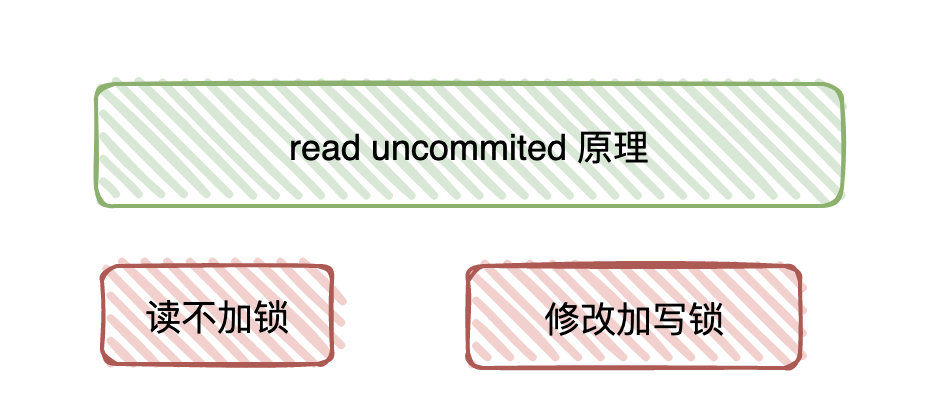
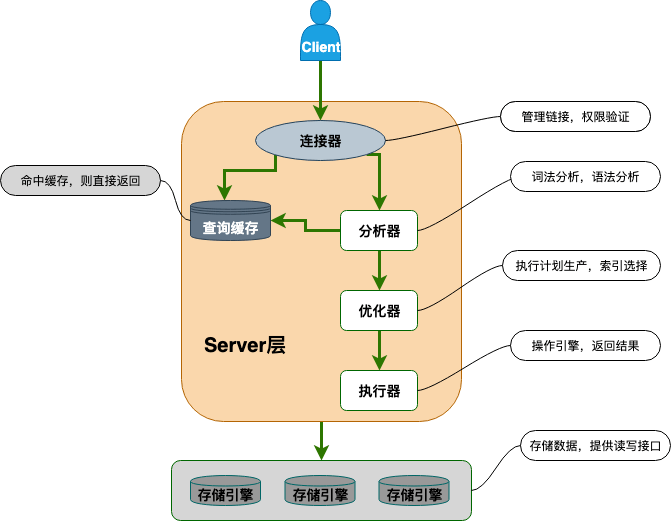
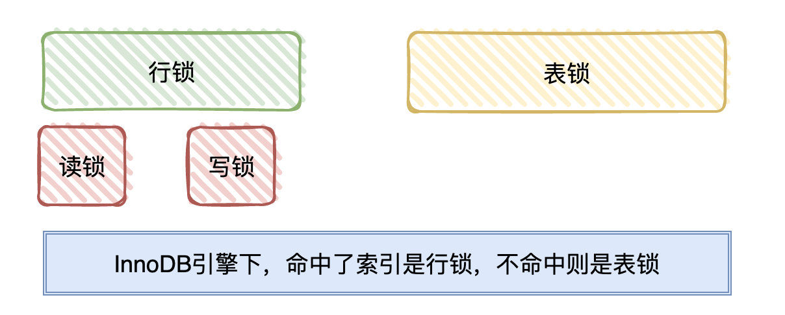
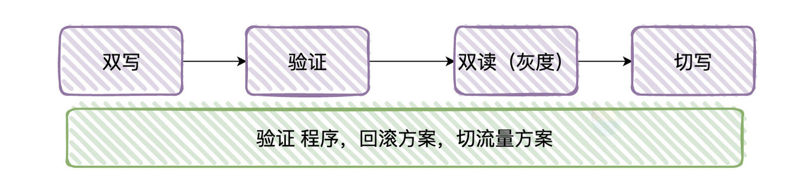
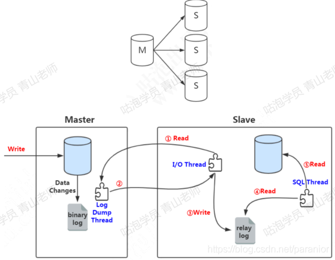
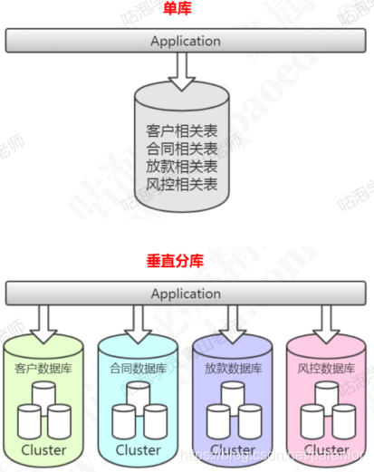
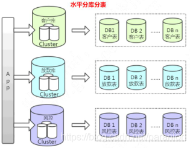
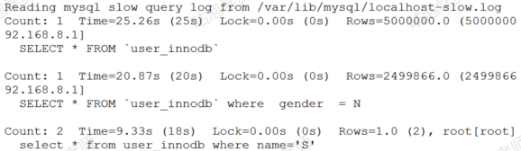
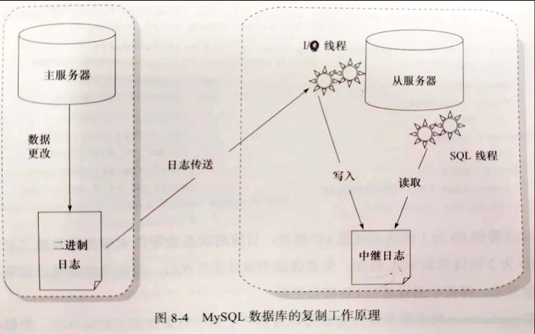

一）Mysql

[对线面试官-知乎](https://www.zhihu.com/question/486105337/answer/2269843039?utm_oi=946790191365591040)

## **1 B+、B、红黑树的区别。InnoDB 为什么使用B+做索引**

**为什么MySQL 没有使用 hash 作为索引的数据结构呢？**

1. **Hash 冲突问题** ：我们上面也提到过Hash 冲突了，不过对于数据库来说这还不算最大的缺点。
2. **Hash 索引不支持顺序和范围查询：** 这是它最大的缺点，假如我们要对表中的数据进行排序或者进行范围查询，那 Hash 索引可就不行了。
2. 利用**Hash需要把数据全部加载到内存中**，如果数据量大，是一件很消耗内存的事，而采用B+树，是 **基于按照节点分段加载，由此减少内存消耗**。

**相对于红黑树**

B树、B+数是多路树，红黑树是二叉树！红黑树一个节点只能存出一个值，B树一个节点可以存储多个值，红黑树的深度会更大,定位时 红黑树的查找次数会大一些。

**B 树& B+树两者有何异同呢？**

- B 树的所有节点既存放键(key) 也存放 数据(data)，而 B+树只有叶子节点存放 key 和 data，其他内节点只存放 key。
- B 树的叶子节点都是独立的;B+树的叶子节点有一条引用链指向与它相邻的叶子节点。
- B 树的检索的过程相当于对范围内的每个节点的关键字做二分查找，可能还没有到达叶子节点，检索就结束了。而 B+树的**检索效率就很稳定**了，任何查找都是从根节点到叶子节点的过程，叶子节点的顺序检索很明显。

**使用B+树的好处**

1. **更少的 IO 次数**：B+ 树的非叶节点只包含键，而不包含真实数据，因此**每个节点存储的记录个数比 B 数多很多**（即阶 m 更大），因此 B+ **树的高度更低，访问时所需要的 IO 次数更少**。此外，由于每个节点存储的记录数更多，所以对访问局部性原理的利用更好，缓存命中率更高。
1. **更适于范围查询和遍历**：在 B 树中进行范围查询时，首先找到要查找的下限，然后对 B 树进行`中序遍历`，直到找到查找的上限；而 B+ 树的范围查询，**只需要对链表进行遍历即可**。
1. **更稳定的查询效率**：B 树的查询时间复杂度在1到树高之间（分别对应记录在根节点和叶节点），而 B+ 树的查询复杂度则稳定为树高，因为所有数据都在叶节点。

​	数据库的数据读取都是需要进行代价巨大的磁盘IO操作，因此，更快地缩小范围和更少的读取次数是数据库需要关注的重点。而B+树在这些点上比B树做的更好。

## **2 聚簇索引和非聚簇索引的区别**

**1  聚集索引:索引结构和数据一起存放的索引。`主键索引`属于聚集索引。**

​	在 Mysql 中，InnoDB 引擎的表的 .ibd文件就包含了该表的索引和数据，对于 InnoDB 引擎表来说，该表的索引(B+树)的每个非叶子节点存储索引，叶子节点存储索引和索引对应的数据。

**优点**

​	聚集索引的**查询速度非常的快**，因为整个 B+树本身就是一颗多叉平衡树，叶子节点也都是有序的，定位到索引的节点，就相当于定位到了数据

**缺点**

1. **依赖于有序的数据** ：因为 B+树是多路平衡树，如果索引的数据不是有序的，那么就需要在插入时排序，如果数据是整型还好，否则类似于字符串或 UUID 这种又长又难比较的数据，插入或查找的速度肯定比较慢。
2. **更新代价大** ： 如果对索引列的数据被修改时，那么对应的索引也将会被修改， 而且况聚集索引的叶子节点还存放着数据，修改代价肯定是较大的， 所以对于主键索引来说，主键一般都是不可被修改的。

**2  非聚集索引:索引结构和数据分开存放的索引。`辅助索引`属于非聚集索引**

优点：**更新代价比聚集索引要小** 。

缺点

1. 跟聚集索引一样，非聚集索引也**依赖于有序的数据**
2. **可能会二次查询(回表)** :这应该是非聚集索引最大的缺点了。 当查到索引对应的指针或主键后，可能还需要根据指针或主键再到数据文件或表中查询。

### 主要区别

1. 存储方式：聚簇索引将索引和数据行存放在一起，而非聚簇索引将索引和数据行分开存储。
2. 索引顺序：聚簇索引中，数据行的物理存放顺序和索引顺序是一致的，而非聚簇索引中，数据行的物理存放顺序和索引顺序是无关的。
3. 查询效率：对于**范围查询**和**排序**操作，聚簇索引相比非聚簇索引具有更高的查询效率，因为数据行的物理存放顺序和索引顺序一致，可以减少磁盘访问次数；而对于**单条记录的查询**，非聚簇索引更快，因为数据行和索引行是分开存储的，只需要访问一次索引即可。
4. 空间利用效率：聚簇索引中，数据行的物理存放顺序和索引顺序一致，因此对于表中的`重复数据`，聚簇索引的存储空间利用率更**高**；而非聚簇索引中，数据行和索引行是分开存储，对于表中的重复数据，非聚簇索引需要存储多次相同的索引值，因此空间利用率相对较低。

总体而言，聚簇索引适合于经常进行范围查询和排序操作的表，而非聚簇索引适合于单条记录查询比较频繁的表。

## **3 组合索引(覆盖索引)的作用，组合索引在B+树是如何存储的**

​	联合索引是指对表上的多个列进行索引。

```mysql
select name from user where id_card = xxx;
```

这会导致回表查询，通过 `id_card` 这棵辅助索引树只能找到`主键 id`，然后需要再回到主键索引树上根据主键 id 查找相应的 name。

**对于高频请求可以建立一个组合索引**[(id_card, name)]来进行优化，对于这条语句来说，也就是`覆盖索引`，在这个高频请求上用到`覆盖索引`，**不再需要回表** 查整行记录，大幅减少了语句的执行时间。

**存储：**

​	联合索引的`所有索引列`都出现在索引树上，并**依次比较大小**，只不过比单值索引多了几列。对于联合索引，存储引擎会首先根据第一个索引列排序，如果第一列相等则再根据第二列排序，依次类推就构成了索引树。

下图为(b,c,d)索引，同样是B+树的结构，只不过它的`data`部分(紫色)存储的是联合索引所在行的`主键值`（a）


### 最左前缀原则

​	在MySQL建立联合索引时会遵守最左前缀匹配原则，即最左优先，在检索数据时从联合索引的最左边开始匹配。==只要查询的是联合索引的最左 N 个字段，就可以利用该联合索引来加速查询==。

​	假设建立了一个联合索引(name,age)，可以看到，**索引项是按照索引定义里面出现的字段顺序排序的**，先根据名字排序，名字相同的就根据年龄排序。

如有索引(a,b,c,d)，查询条件`a=1 and b=2 and c>3 and d=4`，则会在每个节点依次命中a、b、c，无法命中d

先匹配最左边的，**索引只能用于查找key是否存在(相等) ，遇到范围查询(>、<、between、like左匹配)等就不能进一步匹配了 ，后续退化为线性查找**

### 索引下推

[ MySQL索引，最左前缀匹配的内部原理是什么？](https://www.zhihu.com/question/52536048)

最左前缀可以用于在索引中定位记录，那么，那些不符合最左前缀的部分，会怎么样呢？

<u>数据库在取出索引的同时，会根据 where 条件直接过滤掉不满足条件的记录，减少回表次数</u>。这就是 **索引下推 (Index Condition Pushdown,ICP)**

以用户表的联合索引（name, age）为例，假设现在有一个需求，找出所有姓 “张” 并且 20 岁的男性：

```
select * from tuser where name like '张%' and age = 20 and sex = male
```

**对于联合索引，如果查询中有某个列的`范围查询`，则其右边所有列都无法使用索引进行快速定位**

所以对于这条语句来说，其实并不能完全踩中 (name, age) 这个联合索引，他只能踩到 name。

具体来说，这个语句在搜索（name，age）的联合索引树的时候，并不会去看 age 的值，只是按顺序把 “name 第一个字是张” 的记录一条条取出来，然后开始回表，到主键索引上找出数据行，再一个一个判断其他条件是否满足。

而 MySQL 5.6 开始，InnoDB 在 (name,age) 索引内部就判断了 age 是否等于 20，对于不等于 20 的记录，直接判断并跳过，所以只需要对 ID1 这条记录进行回表判断就可以了。

## **4 mysql的事务实现原理**

###  mysql的事务特性

* **原子性：** 事务是最小的执行单位，不允许分割。事务的原子性确保动作要么全部完成，要么全部回滚到原始状态。如果事务中的任何操作失败，整个事务都将被回滚。
* **一致性：** 执行事务前后，数据保持一致，例如转账业务中，无论事务是否成功，转账者和收款人的总额应该是不变的；
* **隔离性：** 并发访问数据库时，一个用户的事务不被其他事务所干扰，各并发事务之间数据库是独立的；
* **持久性：** 一个事务被提交之后。它对数据库中数据的改变是持久的，即使数据库发生故障也不应该对其有任何影响。

### 实现

#### 2.1 原子性

​	==InnoDB依赖`undo log`实现原子性==。当事务对数据库进行修改时，InnoDB会生成对应的undo log日志。如果事务执行失败或者调用rollback，导致事务回滚，便**可以利用undo log中的信息将数据回滚到修改之前的样子**；

​	undo log是`逻辑日志`，记录的是sql执行相关的信息，当发生回滚时，**InnoDB会根据undo log的内容做与之前相反的工作**：

#### 2.2 隔离性

mysql的隔离性依赖的是`MVCC、锁机制`来实现的，mvcc**本质依旧是依赖undo log生成版本快照**。

#### 2.3 持久性

​	==持久性依赖的是`redo log`来保证==。这里简述下：为了减少与磁盘的交互次数，mysql的更新操作只会更新Buffer Pool（内存）级别。Buffer Pool中的数据会定时的写入到磁盘中，但是引入了一个新问题？当mysql宕机时，如何保证数据不丢失？

​	依赖的就是redo log来实现，具体是通过WAL（Write-ahead Logging 预写式日志）来实现，即**先写入日志，在更新到Buffer Pool，以保证系统宕机后可以安全恢复。**

#### 2.4 一致性

​	一致性是事务追求的最终目标，上面说到的原子性、隔离性、持久性都是为了保证数据库状态的一致性。

## **6 事务隔离级别**

1. **READ-UNCOMMITTED(读取未提交)：** 最低的隔离级别，允许读取尚未提交的数据变更，**可能会导致脏读、幻读或不可重复读**。

2. **READ-COMMITTED(读取已提交)：** 允许读取并发事务已经提交的数据，**可以阻止脏读，但是幻读或不可重复读仍有可能发生**。

3. **REPEATABLE-READ(可重复读)：** 对同一字段的多次读取结果都是一致的，除非数据是被本身事务自己所修改，**可以阻止脏读和不可重复读，但幻读仍有可能发生**。

4. **SERIALIZABLE(可串行化)：** 最高的隔离级别，完全服从ACID的隔离级别。所有的事务依次逐个执行，这样事务之间就完全不可能产生干扰，也就是说，**该级别可以防止脏读、不可重复读以及幻读**。

## **7 脏读、幻读如何出现的，如何解决**

1. **脏读（Dirty read）:** 当一个事务正在访问数据并且对数据进行了修改，而这种修改还没有提交到数据库中，这时另外一个事务也访问了这个数据，然后使用了这个数据。因为这个数据是还没有提交的数据，那么另外一个事务读到的这个数据是“脏数据”，依据“脏数据”所做的操作可能是不正确的。

2. **（脏写）丢失修改（Lost to modify）:** 指在一个事务读取一个数据时，另外一个事务也访问了该数据，那么在第一个事务中修改了这个数据后，第二个事务也修改了这个数据。这样第一个事务内的修改结果就被丢失，因此称为丢失修改。 例如：事务1读取某表中的数据A=20，事务2也读取A=20，事务1修改A=A-1，事务2也修改A=A-1，最终结果A=19，事务1的修改被丢失。

3. **不可重复读（Unrepeatableread）:** 指在一个事务内多次读同一数据。在这个事务还没有结束时，另一个事务也访问该数据。那么，在**第一个事务中的两次读数据**之间，由于第二个事务的修改导致第一个事务两次读取的数据可能不太一样。这就发生了在一个事务内两次读到的数据是不一样的情况，因此称为不可重复读。

4. **幻读（Phantom read）:** 幻读与不可重复读类似。它发生在一个事务（T1）读取了几行数据，接着另一个并发事务（T2）**插入了一些数据**时。在随后的查询中，第一个事务（T1）就会发现多了一些原本不存在的记录，就好像发生了幻觉一样，所以称为幻读。

### 怎么解决幻读

#### SELECT 语句分类

首先 SELECT 查询分为**快照读和实时读**，快照读通过` MVCC（并发多版本控制）`来解决幻读问题，实时读通过`行锁`来解决幻读问题。

### 快照读

#### 1.1 快照读是什么？

因为 MySQL 默认的隔离级别是**可重复读**，这种隔离级别下，我们**普通的 SELECT 语句都是快照读**，也就是在一个事务内，多次执行 SELECT 语句，查询到的数据都是事务开始时那个状态的数据，这样就解决了幻读的问题。

#### 1.2 是怎么解决快照读的幻读问题的？

​	快照读就是每一行数据中额外保存**两个隐藏的列**，插入这个数据行时的版本号，删除这个数据行时的`版本号`（可能为空），`回滚指针`(指向 undo log 中用于事务回滚的日志记录)。[MVCC 隐藏段：`DB_TRX_ID`、`DB_ROLL_PTR`]

事务在对数据修改后，进行保存时，==如果数据行的当前版本号与事务开始取得数据的版本号一致就保存成功，否则保存失败==。

#### 1.2.4 查询操作

数据行要被查询出来必须满足两个条件，

- 数据行删除版本号为空或者>当前事务版本号的数据（否则数据已经被标记删除了)

- 创建版本号<=当前事务版本号的数据（否则数据是后面的事务创建出来的）

简单来说，就是查询时，

- 如果该行数据`没加行锁 X 锁`（也就是没有其他事务对这行数据进行修改），那么直接读取数据。
- 该行数据`被加了行锁 X 锁`（也就是现在有其他事务对这行数据进行修改），那么读数据的事务不会进行等待，而是回去 undo log 端里面读之前版本的数据，在**可重复读**的隔离级别下，从 undo log 中读取的数据总是**事务开始时**的快照数据，==在**提交读**的隔离级别下，从 undo log 中读取的总是最新的快照数据。==

### 实时读

#### 实时读是什么？

如果说快照读总是读取事务开始时那个状态的数据，实时读就是查询时总是执行这个查询时数据库中的数据。

一般使用以下这两种查询语句进行查询时就是实时读。【🔒S锁：共享锁；🔒X锁：排他锁】

```mysql
SELECT *** FOR UPDATE #在查询时会先申请 X 锁
SELECT *** IN SHARE MODE #在查询时会先申请 S 锁
insert、update、delete 操作 #对记录加 X 锁，且其它事务不能加任何锁
```

####  innodb 是怎么解决实时读的幻读问题的？

​	如果我们不在一开始将将隔离级别设置为**提交读**，其实是不会产生幻读问题的，因为 MySQL 的默认隔离级别是**可重复读**，在这种情况下，我们执行第一次 `SELECT...FOR UPDATE`查询语句是，其实是会==先申请行锁==，因为一开始数据库就只有 a:4 一行数据，那么加锁区间其实是

```
(负无穷，4](4,正无穷)
```

​	我们查询条件是 a>2，上面两个加锁区间都会可能有数据满足条件，所以会申请行锁中的` next-key lock`，是会对上面这两个区间都加锁，这样其他事务不能往这两个区间插入数据，事务 B 会执行插入时会一直等待获取锁，直到事务 A 提交，释放行锁，事务 B 才有可能申请到锁，然后进行插入。这样就解决了幻读问题。

​	在 `Repeatable Read` 下 `MVCC` 防止了部分幻读，这边的 “部分” 是指在 `一致性非锁定读` 情况下，只能读取到第一次查询之前所插入的数据（根据 Read View 判断数据可见性，Read View 在第一次查询时生成）。但是！如果是 `实时读` ，每次读取的都是最新数据，这时如果两次查询中间有其它事务插入数据，就会产生幻读。所以， **`InnoDB` 在实现`Repeatable Read` 时，如果执行的是实时读，则会对读取的记录使用 `Next-key Lock` ，来防止其它事务在间隙间插入数据**

## 8 对 MVCC 的实现

[InnoDB存储引擎对MVCC的实现 | JavaGuide](https://javaguide.cn/database/mysql/innodb-implementation-of-mvcc/#)

​	`MVCC`（Multi-Version Concurrency Control）：多版本并发控制，是一种并发控制的方法，一般在数据库管理系统中，实现对数据库的并发访问，在编程语言中实现事务内存。

​	`MVCC` 的实现依赖于：**隐藏字段、Read View、undo log**。在内部实现中，`InnoDB` 通过数据行的 `DB_TRX_ID` 和 `Read View` 来**判断数据的可见性**，如不可见，则通过数据行的 `DB_ROLL_PTR` 找到 `undo log` 中的历史版本。每个事务读到的数据版本可能是不一样的，在同一个事务中，用户只能看到该事务创建 `Read View` 之前已经提交的修改和该事务本身做的修改


### 隐藏字段

在内部，`InnoDB` 存储引擎为每行数据添加了隐藏字段 ：

- `DB_TRX_ID（6字节）`：表示最后一次插入或更新该行的事务 id。此外，`delete` 操作在内部被视为更新，只不过会在记录头 `Record header` 中的 `deleted_flag` 字段将其标记为已删除
- `DB_ROLL_PTR（7字节）` 回滚指针，指向该行的 `undo log` 。如果该行未被更新，则为空

### ReadView

​	ReadView 主要是用来做`可见性判断`，里面保存了 “当前对本事务不可见的其他活跃事务”

- 在 RC 隔离级别下的 **`每次select`** 查询前都生成一个`Read View`
- 在 RR 隔离级别下只在事务开始后 **`第一次select`** 数据前生成一个`Read View`

### undo-log

`undo log` 主要有两个作用：

- 当事务回滚时用于将数据恢复到修改前的样子
- 另一个作用是 `MVCC` ，当读取记录时，若该记录被其他事务占用或当前版本对该事务不可见，则可以通过 `undo log` 读取之前的版本数据，以此实现`非锁定读`

**在 `InnoDB` 存储引擎中 `undo log` 分为两种： `insert undo log` 和 `update undo log`：**

1. **`insert undo log`** ：指在 `insert` 操作中产生的 `undo log`。因为 `insert` 操作的记录只对事务本身可见，对其他事务不可见，故该 `undo log` 可以在事务提交后直接删除。不需要进行 `purge` 操作

2. **`update undo log`** ：`update` 或 `delete` 操作中产生的 `undo log`。该 `undo log`可能需要提供 `MVCC` 机制，因此不能在事务提交时就进行删除。提交时放入 `undo log` 链表，等待 `purge线程` 进行最后的删除

### RC 和 RR 隔离级别下 MVCC 的差异

在事务隔离级别 `RC` 和 `RR` （InnoDB 存储引擎的默认事务隔离级别）下，`InnoDB` 存储引擎使用 `MVCC`（非锁定一致性读），但它们生成 `Read View` 的时机却不同

- 在 RC 隔离级别下的 **`每次select`** 查询前都生成一个`Read View` 
- 在 RR 隔离级别下只在事务开始后 **`第一次select`** 数据前生成一个`Read View`

##  9 SQL 语句在 MySQL 中的执行



- MySQL 主要分为 `Server 层`和`引擎层`，Server 层主要包括==连接器、查询缓存、分析器、优化器、执行器==，同时还有一个==日志模块（binlog）==，这个日志模块所有执行引擎都可以共用，redolog 只有 InnoDB 有。
- 引擎层是插件式的，目前主要包括，MyISAM,InnoDB,Memory 等。
- 查询语句的执行流程如下：==权限校验（如果命中缓存）--->查询缓存--->分析器--->优化器--->权限校验--->执行器--->引擎==
- 更新语句执行流程如下：分析器---->权限校验---->执行器--->引擎---==redo log(prepare 状态)--->binlog--->redo log(commit状态)==
- 

## 10 三大log

Redo Log是在存储引擎和InnoDB存储引擎之间的一个重要接口。当存储引擎收到一条写操作时，它将先将数据写入到`内存`中的缓冲区，然后再将操作记录到Redo Log中。一旦`事务提交`，InnoDB存储引擎将从Redo Log中读取操作记录，然后将其应用到磁盘上的表空间中，从而确保数据的持久性和一致性。

### undo log 和 redo log 的区别

​	undo 用来回滚行记录到某个版本。`undo log` 一般是`逻辑日志`，根据每行记录进行记录。`redo log `是`物理日志`，记录的是“在某个数据页上做了什么修改”；`binlog `是`逻辑日志`，记录的是这个语句的原始逻辑，比如“给 ID=2 这一行的 c 字段加 1 ”。

　　undo 日志用于**记录事务开始前的状态**，用于`事务失败时的回滚操作`；redo 日志记录**事务执行后的状态**，用来`恢复未写入 data file 的已成功事务更新的数据`。例如某一事务的事务序号为 T1，其对数据 X 进行修改，设 X 的原值是 0，修改后的值为 1，那么 Undo 日志为 <T1, X, 0>，Redo 日志为 < T1, X, 1>。

​	在执行 undo 的时候，仅仅是将数据从`逻辑`上恢复至事务之前的状态，而不是从`物理`页面上操作实现的，这一点是不同于 redo log 的。

---------------------------------------------

`redo log`让`InnoDB`存储引擎拥有了崩溃恢复能力。

`binlog`保证了`MySQL`集群架构的数据一致性。

虽然它们都属于持久化的保证，但是侧重点不同。

在执行更新语句过程，会记录`redo log`与`binlog`两块日志，以基本的事务为单位，`redo log`在**事务执行过程中**可以不断写入，而`binlog`只有在提交事务时才写入，所以`redo log`与`binlog`的写入时机不一样

### binlog 记录格式

`binlog` 日志有三种格式，可以通过`binlog_format`参数指定。

- **statement**
- **row**
- **mixed**

指定`statement`，==记录的内容是`SQL`语句原文==，比如执行一条`update T set update_time=now() where id=1`，记录的内容如下。


同步数据时，会执行记录的`SQL`语句，但是有个问题，`update_time=now()`这里会获取当前系统时间，直接执行会导致与原库的数据不一致。

为了解决这种问题，我们需要指定为`row`，==记录的内容不再是简单的`SQL`语句了，还包含操作的具体数据==，记录内容如下。


`row`格式记录的内容看不到详细信息，要通过`mysqlbinlog`工具解析出来。

`update_time=now()`变成了具体的时间`update_time=1627112756247`，条件后面的@1、@2、@3 都是该行数据第 1 个~3 个字段的原始值（**假设这张表只有 3 个字段**）。

这样就能保证同步数据的一致性，通常情况下都是指定为`row`，这样可以为数据库的恢复与同步带来更好的可靠性。

但是这种格式，需要更大的容量来记录，比较占用空间，恢复与同步时会更消耗`IO`资源，影响执行速度。

所以就有了一种折中的方案，指定为`mixed`，记录的内容是前两者的混合。

`MySQL`会判断这条`SQL`语句是否可能引起数据不一致，如果是，就用`row`格式，否则就用`statement`格式。

### 崩溃恢复原理

[MySQL 的 crash-safe 原理解析](https://cloud.tencent.com/developer/article/1631999)

MySQL 保证数据不会丢的能力主要体现在两方面：

1. 能够恢复到任何时间点的状态；
2. 能够保证MySQL在任何时间段突然奔溃，重启后之前提交的记录都不会丢失；

​	对于第一点将MySQL恢复到任何时间点的状态，相信很多人都知道，只要保留有足够的binlog，就能通过`重跑 binlog `来实现。

​	对于第二点的能力，也就是本文标题所讲的**crash-safe**。即在 InnoDB 存储引擎中，**事务提交过程中任何阶段**，MySQL突然奔溃，**重启后都能保证事务的完整性，已提交的数据不会丢失，未提交完整的数据会自动进行回滚**。这个能力依赖的就是`redo log`和`undo log`两个日志。

从上图可以清晰地看出一条**更新语句**在MySQL中是怎么执行的，简单进行总结一下：

1. 从==内存==中找出这条数据记录，对其进行更新；
2. 将对数据页的更改记录到`redo log`中；
3. 将逻辑操作记录到`binlog`中；
4. 对于内存中的数据和日志，都是由后台线程，当触发到落盘规则后再异步进行刷盘；

#### WAL机制

**问题：为什么不直接更改磁盘中的数据，而要在内存中更改，然后还需要写日志，最后再落盘这么复杂？**

​	MySQL更改数据的时候，之所以不直接写磁盘文件中的数据，最主要就是性能问题。因为**直接写磁盘文件是`随机写`**，开销大性能低，没办法满足MySQL的性能要求。所以才会设计成**先在内存中对数据进行更改，再异步落盘**。但是内存总是不可靠，万一断电重启，还没来得及落盘的内存数据就会丢失，所以还需要加上写日志这个步骤，万一断电重启，还能通过日志中的记录进行恢复。

​	**写日志虽然也是写磁盘**，但是它是`顺序写`，相比随机写开销更小，能提升语句执行的性能

​	奔溃重启后会检查`redo log`中是完整并且处于`prepare状态`的事务，然后根据XID（事务ID），从`binlog`中找到对应的事务，如果找不到，则利用`undo log`回滚；找到并且事务完整则重新`commit redo log`，完成事务的提交。

## 11 InnoDB 锁的算法

​	在InnoDB引擎下，按锁的粒度分类，可以简单分为`行锁`和`表锁`。`行锁`实际上是作用在索引之上的。当我们的 SQL 命中了索引，那锁住的就是命中条件内的索引节点(这种就是行锁)，如果没有命中索引，那我们锁的就是整个索引树(`表锁`)。简单来说就是:锁住的是整棵树还是某几个节点，完全取决于SQL条件是否有命中到对应的索引节点。

​	而行锁又可以简单分为`读锁(共享锁、S锁)`和`写锁(排它锁、X锁)`。`读锁`是共享的，多个事务可以同时读取同一个资源，但不允许其他事务修改。`写锁`是排他的，写锁会阻塞其他的写锁和读锁。



**InnoDB 存储引擎的行锁的算法有三种：**

- `Record lock`：记录锁，单个行记录上的锁
- `Gap lock`：间隙锁，锁定一个范围，不包括记录本身
- `Next-key lock`：record+gap 临键锁，锁定一个范围，包含记录本身

 **注** 对于`Next_Key Lock`：

1. 如果我们锁定了一个行，且查询的索引含有唯一属性时（即有==唯一索引==），那么这个时候InnoDB会将`Next_Key Lock`优化成`Record Lock`，也就是**锁定当前行，而不是锁定当前行加一个范围**
2. 如果我们使用的不是唯一索引锁定一行数据，那么此时InnoDB就会**按照本来的规则锁定一个范围和记录**。
3. 还有需要注意的点是，当唯一索引由多个列组成时，如果查询仅是查找其中的一个列，**这时候不会降级**。
4. 还有注意的点是，InnoDB存储引擎还会对辅助索引的下一个键值区间加上`Gap lock`（这么做也是为了防止幻读）。`Next_Key Lock`是为了解决数据库出现`幻读`的问题。

### 乐观锁和悲观锁

​	`乐观锁`假定大概率不会发生并发更新冲突，访问、处理数据过程中不加锁，==只在更新数据时 再根据版本号或时间戳判断是否有冲突，有则处理，无则提交事务。==用**数据版本（Version）记录机制实现**，这是乐观锁最常用的一种实现方式

​	`悲观锁`假定大概率会发生并发更新冲突，访问、处理数据前就加排他锁，在整个数据处理过 程中锁定数据，事务提交或回滚后才释放锁。另外与乐观锁相对应的，悲观锁是由数据库自己实现了 的，要用的时候，我们直接调用数据库的相关语句就可以了。

## 12 三个范式

* 第一范式（1NF）：数据库表中的字段都是**单一属性的，不可再分**。
*  第二范式（2NF）：数据库表中不存在非关键字段对任一候选关键字段的`部分函数依赖`（`部分函数依赖`指的是存在组合关键字中的某些字段决定非关键字段的情况），也即所有非关键字段都完全依赖于任意一组候选关键字。 
* 第三范式（3NF）：在第二范式的基础上，数据表中如果不存在非关键字段对任一候选关键字段的`传递函数依赖`，则符合第三范式。所谓`传递函数依赖`，指的是如果存在"A → B → C"的决定关系，则 C传递函数依赖于A。因此，满足第三范式的数据库表应该不存在如下依赖关系： 关键字段 → 非关键字段 x → 非关键字段y

## 13 ⼤表优化

当MySQL单表记录数过⼤时，数据库的CRUD性能会明显下降，⼀些常⻅的优化措施如下：

#### 限定数据的范围

务必禁⽌不带任何限制数据范围条件的查询语句。⽐如：我们当⽤户在查询订单历史的时候，我们可以 控制在⼀个⽉的范围内；

#### 读写分离

​		经典的数据库拆分⽅案，主库负责写，从库负责读；从库的数据由主库发送的`binlog`进而更新，实现主从数据一致（在一般场景下，主从的数据是通过异步来保证最终一致性的）

#### 缓存

#### 垂直分区

根据数据库⾥⾯**数据表的相关性**进⾏拆分。 例如，⽤户表中既有⽤户的登录信息⼜有⽤户的基本信息， 可以将⽤户表拆分成两个单独的表，甚⾄放到单独的库做分库。

简单来说垂直拆分是指数据表列的拆分，把⼀张列⽐较多的表拆分为多张表。

* 垂直拆分的优点： 可以使得列数据变⼩，在查询时减少读取的Block数，减少I/O次数。此外，垂直分区可以简化表的结构，易于维护。 
* 垂直拆分的缺点：主键会出现冗余，需要管理冗余列，并会引起Join操作，可以通过在应⽤层进⾏ Join来解决。此外，垂直分区会让事务变得更加复杂；

#### ⽔平分区

​	保持数据表结构不变，通过某种策略存储数据分⽚。这样每⼀⽚数据分散到不同的表或者库中，达到了 分布式的⽬的。 ⽔平拆分可以⽀撑⾮常⼤的数据量。


#### 分库分表时迁移的过程

我们一般采取「双写」的方式来进行迁移，大致步骤就是:



1. 增量的消息各自往新表和旧表写一份
2. 将旧表的数据迁移至新库
3. 迟早新表的数据都会追得上旧表(在某个节点上数据是同步的)
4. 校验新表和老表的数据是否正常(主要看能不能对得上)
5. 开启双读(一部分流量走新表，一部分流量走老表)，相当于灰度上线的过程
6. 读流量全部切新表，停止老表的写入
7. 提前准备回滚机制，临时切换失败能恢复正常业务以及有修数据的相关程序。

## 14 雪花算法 snowflake

[分布式 id 生成器](https://chai2010.cn/advanced-go-programming-book/ch6-cloud/ch6-01-dist-id.html)


​	首先确定我们的数值是64位，int64类型，被划分为四部分

1. 不含开头的第一个bit，因为这个bit是符号位。
2. 41位来表示`收到请求时的时间戳`，单位为毫秒，
3. `5位`来表示`数据中心的id`，
4. 再`5位`来表示`机器的实例id`
5. 最后`12位`的`循环自增id`（到达1111,1111,1111后会归0）

​	这样的机制可以支持我们在同一台机器上，同一毫秒内产生`2 ^ 12 = 4096`条消息。一秒共409.6万条消息。从值域上来讲完全够用了。

​	数据中心加上实例id共有10位，可以支持我们每数据中心部署32台机器，所有数据中心共1024台实例。

​	表示`timestamp`的41位，可以支持我们使用69年。当然，我们的时间毫秒计数不会真的从1970年开始记，那样我们的系统跑到`2039/9/7 23:47:35`就不能用了，所以这里的`timestamp`只是相对于某个时间的增量，比如我们的系统上线是2018-08-01，那么我们可以把这个timestamp当作是从`2018-08-01 00:00:00.000`的偏移量

#### worker_id分配

​	`timestamp`，`datacenter_id`，`worker_id`和`sequence_id`这四个字段中，`timestamp`和`sequence_id`是由程序在**运行期生成**的。但`datacenter_id`和`worker_id`需要我们在**部署阶段**就能够获取得到，并且一旦程序启动之后，就是**不可更改的了**（想想，如果可以随意更改，可能被不慎修改，造成最终生成的id有冲突）。

​	一般不同数据中心的机器，会提供对应的获取数据中心id的API，所以`datacenter_id`我们可以在部署阶段轻松地获取到。而`worker_id`是我们逻辑上给机器分配的一个id，这个要怎么办呢？**比较简单的想法是由能够提供这种自增id功能的工具来支持，比如MySQL，从MySQL中获取到`worker_id`之后，就把这个`worker_id`直接持久化到本地，以避免每次上线时都需要获取新的`worker_id`。让单实例的`worker_id`可以始终保持不变**

## 15 优化

https://blog.csdn.net/paranior/article/details/115095669

[【对线面试官】MySQL调优 (qq.com)](https://mp.weixin.qq.com/s?__biz=MzU4NzA3MTc5Mg==&mid=2247484508&idx=1&sn=4e81d365409bf32c08e4ea985e3ca593&chksm=fdf0ec03ca876515d59c49f033cf83f72b62fafe356e678b4d162ad3623d31bf60fb6620176f&scene=178&cur_album_id=1657204970858872832#rd)

### 缓存——架构优化

（1）缓存

在应用系统的并发数非常大的情况下，如果没有缓存，会造成两个问题:一方面是会给数据库带来很大的压力。另一方面，从应用的层面来说，操作数据的速度也会受到影响。

我们可以用第三方的缓存服务来解决这个问题，例如Redis。


（2）集群，主从复制

如果单台数据库服务满足不了访问需求，那我们可以做数据库的集群方案。


做了主从复制的方案之后，我们只把数据写入master节点，而读的请求可以分担到slave节点。我们把这种方案叫做`基于主从复制的读写分离`。



> 读写分离可以一定程度低减轻数据库服务器的访问压力，但是需要特别注意主从数据一致性的问题。会有一定程度的延迟。

（3）分库分表

垂直分库，减少并发压力。水平分表，解决存储瓶颈。
垂直分库的做法，把一个数据库按照业务拆分成不同的数据库:




水平分表：把单张表的数据按照一定规则分布到多个数据库。 



### 优化器——SQL语句分析与优化

#### 慢查询日志  Slow query log

（1）打开慢日志开关

因为开启慢查询日志是有代价的，所以它默认是关闭的:

```mysql 
show variables like 'slow_qucry%';
5.1.2慢日志分析
```

（1）日志内容

```mysql
show global status like 'slow_qucries"; --查看有多少慢查询
show variables like "%slow_query%': --获取幔日志目录
cat /var/ib/mysql localhost-slow.log

SET timestamp=1577536552;
select * from user_innodb where name='青山' ;
```


（2）mysqldumpslow

https://dev.mysql.com/doc/refman/5.7/en/mysqldumpslow.html

MySQL提供了`mysqldumpslow `的工具，在MySQL的bin目录下。

```mysql
mysqldumpslow --help
#例如:查询用时最多的10条慢SQL:
mysqldumpslow -s t -t 10 -g "select'/var/lib/mysqllocalhost-slow.log
```



* Count 代表这个SQL执行了多少次;

* Time 代表执行的时间，括号里面是累计时间;
* Lock表示锁定的时间，括号是累计;

* Rows 表示返回的记录数，括号是累计。

#### SHOW PROFILE


SHOW PROFILE是谷歌高级架构师Jeremy Cole贡献给MySQL社区的，可以查看SQL语句执行的时候使用的资源，比如CPU、IO的消耗情况。在SQL中输入help profile可以得到详细的帮助信息。


查看profile 统计(命令最后带一个s)

可以查到所有语句的执行详细过程信息：

`show profiles;`
查看最后一个SQL的执行详细信息，从中找出耗时较多的环节(没有s)。

`show profile:`

也可以根据ID查看执行详细信息，在后面带上for query + ID。

`show profile for query 1:
`
现在我们已经知道哪些SQL慢了，为什么慢呢?慢在哪里?MySQL提供了一个执行计划的工具（在架构中我们有讲到，优化器最终生成的就是一个执行计划)，其他数据库，例如Oracle 也有类似的功能。

####  EXPLAIN 执行计划

**通过`EXPLAIN`我们可以模拟优化器执行SQL查询语句的过程，来知道MySQL是==怎么处理一条SQL语句==的。通过这种方式我们可以分析语句或者表的性能瓶颈。**

执行命令

```mysql
explain select * from jarye_class;
```


**优化目标：type字段要达到range级别，最好是ref级别**

 **1.id：序列号**

id是查询序列编号，每张表都是单独访问的，一个SELECT 就会有一个序号。

1. id值不同的时候，先查询id值大的(先大后小)。

2. id值相同时，查询从上往下（受数据量影响）

3. 既有相同也有不同：如果ID有相同也有不同，就是ID不同的先大后小，ID 相同的从上往下。

在**连接查询**中，先查询的叫做`驱动表`，后查询的叫做`被驱动表`,我们肯定要**把小表放在前面查询，因为它的中间结果最少。**

 **2.select_type：表示查询的类型**

* SIMPLE：不包含子查询和关联查询的简单查询
* PRIMARY： 子查询SQL语句中的主查询，也就是最外面的那层查询。
* SUBQUERY：子查询中所有的内层查询都是SUBQUERY类型的。
* DERIVED：派生查询，表示在得到最终查询结果之前会用到临时表。例如:
**对于关联查询，先执行右边的table (UNION) ，再执行左边的table**
 * UNION：用到了UNION查询(UNION 会用到内部的临时表)。
 * UNION ALL不需要去重，因此不用临时表。
 * UNION RESULT：主要是显示哪些表之间存在UNION查询。<union2,3> 代表id=2和id=3的查询存在UNION。

 **3. 🌟type：表的连接类型**

> **最优到最差顺序：system > const > eq_ref > ref > range > index > ALL
> 优化目标：查询要达到range级别，最好是ref级别**

1. `const`、`system`: mysql能对查询的某部分进行优化并将其转化成一个常量（可以看show warnings 的结果）。用于 primary key 或 unique key 的所有列与常数比较时，所以表最多有一个匹配行，读取1次，速度比较快。system是const的特例，表里只有一条元组匹配时为system
2. `eq_ref`: primary key 或 unique key 索引的所有部分被连接使用 ，最多只会返回一条符合条件的记录。这可能是在 const 之外最好的联接类型了，简单的 select 查询不会出现这种 type。
3. `ref`: 不使用唯一索引，而是使用普通索引或者唯一性索引的部分前缀，索引要和某个值相比较，可能会找到多个符合条件的行
4. `range`:范围扫描通常出现在 in(), between ,> ,<, >= 等操作中。对索引进行范围扫描
5. `index`: 扫描全表索引，这通常比ALL快一些。（index是从索引中读取的，而all是从硬盘中读取）
6. `ALL`：即全表扫描，意味着mysql需要从头到尾去查找所需要的行。通常情况下这需要增加索引来进行优化了

**4.🌟possible_keys：表示查询时，可能使用的索引**

- **possible_keys有值，而key显示为null**：这种情况是因为表中数据不多，mysql认为索引对此查询帮助不大，选择了全表查询。
- **possible_keys无值**：表示没有相关的索引，可以通过检查where子句看是否可以创造一个适当的索引来提高查询性能。

 **5.🌟key：实际使用的索引**

 **6.key_len：索引字段的长度**

 **7.rows**：MySQL认为扫描多少行(数据或者索引)才能返回请求的数据，是一个预估值。一般来说行数越少越好。

**8. filtered**：这个字段表示存储引擎返回的数据在server层过滤后，剩下多少满足查询的记录数量的比例，它是一一个百分比。如果比例很低，说明存储引擎层返回的数据需要经过大量过滤，这个是会消耗性能的，需要关注。

**9.Extra**：执行计划给出的额外信息说明。

* using index：属于覆盖索引，不需要回表。
* using where：使用了where过滤，表示存储引擎返回的记录并不是所有的都满足查询条件，需要在server层进行过滤。
* using index condition：索引下推
* using filesort：不能使用索引来排序，用到了额外的排序（跟磁盘或文件没有关系）需要优化
* using temporary：在查询的时候，需要做去重、排序之类的工作的时候，可能会用到临时表。（如distinct、group by、使用join时group任意列）。需要优化、例如创建复合索引。

模拟优化器执行SQL查询语句的过程,来知道MySQL是怎么处理一条SQL语句的。
通过这种方式我们可以分析语句或者表的性能瓶颈。
如果需要具体的cost信息，可以用:
EXPLAIN FORMAT= JSON。
如果觉得EXPLAIN还不够详细，可以用开启optimizer trace.

**总结**

一、分析查询基本情况
1、涉及到表结构,字段的索引情况、每张表的数据量、查询的业务含义。
这个非常重要，因为有的时候你会发现SQL根本没必要这么写，或者表设计有问题的。

二、找出慢的原因

1. `EXPLAIN`查看执行计划，分析SQL的执行情况，了解表访问顺序、访问类型、索引、扫描行
   数等信息。
2. 如果总体的时间很长，不确定哪一个因素影响最大, 通过条件的增减，顺序的调整,
   找出引起查询慢的主要原因，不断地尝试验证。

找到原因:比如是没有走索引引起的，还是关联查询引起的,还是order by引起的。

三、对症下药

1. 创建索引或者联合索引

2. 改写SQL,这里需要平时积累经验，例如:
   1.  连表查询：**小表驱动大表**数据避免全表扫描，超过三张表禁止使用 join
   
   2. 用join来代替子查询
   
   3. not exist转换为left join IS NULL
   
   4. or 改成union
   
   5. 使用UNION ALL代替UNION,如果结果集允许重复的话
   
   6. 大偏移的limit,先过滤再排序。
   

如果SQL本身解决不了了,就要上升到表结构和架构了。

3. 表结构(冗余、拆分、not null等)、架构优化。

4. 业务层的优化，必须条件是否必要。

## 16 主从同步

[MySQL 主从复制原理不再难](https://www.cnblogs.com/rickiyang/p/13856388.html)

[24 MySQL是怎么保证主备一致的？.md](https://learn.lianglianglee.com/专栏/MySQL实战45讲/24  MySQL是怎么保证主备一致的？.md)

MySQL的主从同步，又称为复制（replication），是一种内置的高可用高性能集群解决方案，主要功能有：

* 数据分布：同步不需要很大带宽，可以实现多数据中心复制数据。

* 读取的负载均衡：通过服务器集群，可以通过DNS轮询、Linux LVS等GSLB（全局负载均衡）方式，降低主服务器的读压力。

* 数据库备份：复制是备份的一部分，但并不能代替备份。还需要与快照相结合。

* 高可用性和故障转移：从服务器可以快速切换为主服务器，减少故障的停机时间和恢复时间。

  

主从同步分为3步：

1. 主服务器（master）把数据更改记录到`binlog`中。

2. 从服务器（slave）把主服务器的`binlog`复制到自己的`中继日志（relay log）`中。

3. 从服务器重做`中继日志`中的日志，把更改应用到自己的数据库上，达到数据的一致性。

主从同步是一个异步实时的同步，会实时的传输，但存在执行上的延时，如果主服务器压力很大，延时也会扩大。

通过上面的图，可以看到一共需要3个线程：

1. 主服务器的`日志传送线程`：负责将`binlog增量`传送到备机
2. 从服务器的`I/O线程`：负责**读取**主服务器的`binlog`，并保存为`中继日志`
3. 从服务器的`SQL线程`，负责执行中继日志

### 双 M 循环复制问题

通过上面对 MySQL 中 binlog 基本内容的理解，你现在可以知道，binlog 的特性确保了在备库执行相同的 binlog，可以得到与主库相同的状态。

因此，我们可以认为正常情况下主备的数据是一致的。也就是说，图 1 中 A、B 两个节点的内容是一致的。其实，图 1 中我画的是 M-S 结构，但实际生产上使用比较多的是**双 M 结构**，也就是图 9 所示的主备切换流程。


图 9 MySQL 主备切换流程 -- 双 M 结构

对比图 9 和图 1，你可以发现，双 M 结构和 M-S 结构，其实区别只是多了一条线，**即：节点 A 和 B 之间总是互为主备关系。这样在切换的时候就不用再修改主备关系。**

但是，双 M 结构还有一个问题需要解决。

业务逻辑在节点 A 上更新了一条语句，然后再把生成的 binlog 发给节点 B，节点 B 执行完这条更新语句后也会生成 binlog。

那么，如果节点 A 同时是节点 B 的备库，相当于又把节点 B 新生成的 binlog 拿过来执行了一次，然后节点 A 和 B 间，会不断地循环执行这个更新语句，也就是循环复制了。这个要怎么解决呢？

MySQL 在 binlog 中记录了**这个命令第一次执行时所在实例**的` server id`。因此，我们可以用下面的逻辑，来解决两个节点间的循环复制的问题：

1. 规定两个库的 server id 必须不同，如果相同，则它们之间不能设定为主备关系；
2. 一个备库接到 binlog 并在重放的过程中，**生成与原 binlog 的 server id 相同的新的 binlog**；
3. 每个库在收到从自己的主库发过来的日志后，先判断 server id，**如果跟自己的相同，表示这个日志是自己生成的，就直接丢弃这个日志**。

按照这个逻辑，如果我们设置了双 M 结构，日志的执行流就会变成这样：

1. 从节点 A 更新的事务，binlog 里面记的都是 A 的 server id；
2. 传到节点 B 执行一次以后，节点 B 生成的 binlog 的 server id 也是 A 的 server id；
3. 再传回给节点 A，A 判断到这个 server id 与自己的相同，就不会再处理这个日志。所以，死循环在这里就断掉了。

### 新一代主从复制模式 - GTID 复制模式

在传统的复制里面，当发生故障，需要**主从切换**，需要找到 Binlog 和 位点信息，恢复完成数据之后将主节点指向新的主节点。在 MySQL 5.6 里面，提供了新的数据恢复思路，只需要知道主节点的 IP、端口以及账号密码就行，因为复制是自动的，MySQL 会通过内部机制 **GTID** 自动找点同步。

基于 GTID 的复制是 MySQL 5.6.5 后新增的复制方式。

**GTID (global transaction identifier)** 即全局事务 ID，一个事务对应一个 GTID，保证了在每个在主库上提交的事务在集群中有一个唯一的 ID。

##### GTID复制原理

在原来基于日志的复制中，从库需要告知主库要从哪个偏移量进行增量同步， 如果指定错误会造成数据的遗漏，从而造成数据的不一致。

而基于 GTID 的复制中，从库会告知主库已经执行的事务的 GTID 的值，然后主库会将所有未执行的事务的 GTID 的列表返回给从库，并且可以保证同一个事务只在指定的从库执行一次，**通过全局的事务 ID 确定从库要执行的事务的方式代替了以前需要用 Binlog 和 位点确定从库要执行的事务的方式**。

基于 GTID 的复制过程如下：

1. master 更新数据时，会在事务前产生 GTID，一同记录到 Binlog 日志中。
2. slave 端的 I/O 线程将变更的 Binlog，写入到本地的 relay log 中,读取值是根据`gitd_next变量`，告诉我们 slave 下一个执行哪个 GTID。
3. SQL 线程从 relay log 中获取 GTID，然后对比 slave 端的 Binlog 是否有记录。如果有记录，说明该 GTID 的事务已经执行，slave 会忽略。
4. 如果没有记录，slave 就会从 relay log 中执行该 GTID 的事务，并记录到 Binlog。
5. 在解析过程中会判断是否有主键，如果没有就用二级索引，如果没有二级索引就用全部扫描。

##### GTID 组成

 GTID = source_id:transaction_id

`source_id` 正常即是 `server_uuid`，在第一次启动时生成(函数 `generate_server_uuid`)，并持久化到 `DATADIR/auto.cnf` 文件里。

`transaction_id` 是`顺序化的序列号`(sequence number)，在每台 MySQL 服务器上都是从 1 开始自增长的序列，是事务的唯一标识。

##### GTID 生成

GTID 的生成受 `gtid_next` 控制。

在 Master 上，`gtid_next` 是默认的 `AUTOMATIC`,即 GTID 在每次事务提交时自动生成。它从当前已执行的 GTID 集合(即 gtid_executed)中，找一个大于 0 的未使用的最小值作为下个事务 GTID。在实际的更新事务记录之前将 GTID 写入到 Binlog。

在 Slave 上，从 Binlog 先读取到主库的 GTID(即 set gtid_next 记录)，而后执行的事务采用该 GTID。

##### GTID 的好处

1. GTID 使用 `master_auto_position=1` 代替了 Binlog 的主从复制方案，相比 Binlog 方式更容易搭建主从复制。
2. GTID 方便实现主从之间的 failover（主从切换），不用一步一步的去定位 Binlog日志文件和查找 Binlog 的位点信息。
