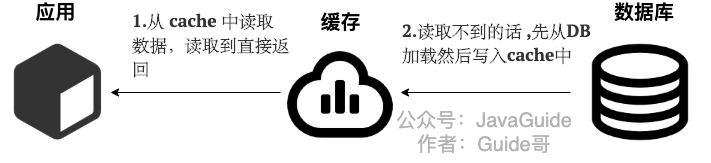
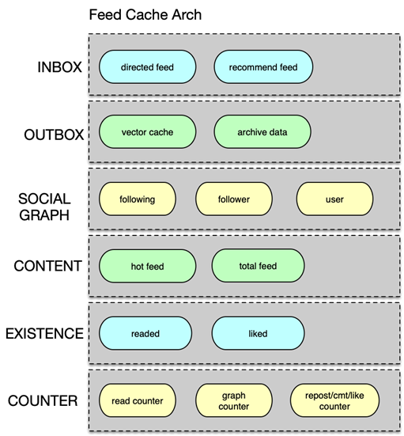

## 1 数据结构

[一文理解Redis底层数据结构](https://www.modb.pro/db/71948)

[面试官：你看过Redis数据结构底层实现吗？](https://www.cnblogs.com/javazhiyin/p/11063944.html)

[图解Redis之数据结构篇——跳跃表](https://www.modb.pro/db/72128)


### SDS


​	`len`可以避免**二进制安全**：通俗的讲，C语言中，用“\0”表示字符串的结束，如果字符串本身就有“\0”字符，字符串就会被截断，即非二进制安全；若通过某种机制，保证读写字符串时不损害其内容，这就是二进制安全。

#### **空间预分配**

​	当SDS的API对一个SDS进行修改，并且需要对SDS进行空间扩展的时候，程序不仅会为SDS分配修改所必须要的空间，还会为SDS分配额外的未使用空间。其中，额外分配的未使用空间数量由以下公式决定：

- 如果对SDS进行修改之后，SDS的长度将小于1MB，那么程序分配和len属性同样大小的未使用空间。
- 如果对SDS进行修改之后，SDS的长度将大于等于1MB，那么程序会分配1MB的未使用空间。

​	在扩展SDS空间之前，SDS API会先检查未使用空间是否足够，如果足够的话，API就会直接使用未使用空间，而无需执行内存重分配。通过空间预分配策略，Redis可以减少连续执行字符串增长操作所需的内存重分配次数。

#### **惰性空间释放**

​	当SDS的API需要缩短SDS保存的字符串时，**程序不会立即使用内存重分配来回收缩短后多出来的字节，而是使用free属性将这些字节的数量记录下来，并等待将来使用。**

​	通过惰性空间释放策略，SDS避免了缩短字符串时所需的内存重分配操作，并为将来可能的增长操作提供了优化。

### List


列表特点：

- 双端链表：带有指向前置节点和后置节点的指针，获取这两个节点的复杂度为O(1)。
- 无环：表头节点的prev和表尾节点的next都指向NULL，对链表的访问以NULL结束。
- 链表长度计数器：带有len属性，获取链表长度的复杂度为O(1)。
- 多态：链表节点使用 void*指针保存节点值，可以保存不同类型的值。

### Hash


可以看出：

1. Reids的Hash采用**链地址**法来处理冲突，然后它没有使用红黑树优化。
2. 哈希表节点采用**单链表**结构。

字典

```c++
typedef struct dict {
    // 类型特定函数
    dictType *type;
    // 私有数据
    void *privdata;
    // 哈希表
    dictht ht[2];
    // rehash 索引
    // 当 rehash 不在进行时，值为 -1
    int rehashidx; /* rehashing not in progress if rehashidx == -1 */
} dict;
```

哈希表

```C++
typedef struct dictht {
    // 哈希表数组
    dictEntry **table;
    // 哈希表大小
    unsigned long size;
    // 哈希表大小掩码，用于计算索引值
    // 总是等于 size - 1
    unsigned long sizemask;
    // 该哈希表已有节点的数量
    unsigned long used;
} dictht;
```

Hash表节点

```c++
typedef struct dictEntry {
    // 键
    void *key;
    // 值
    union {
        void *val;
        uint64_t u64;
        int64_t s64;
    } v;
    // 指向下个哈希表节点，形成链表
    struct dictEntry *next;  // 单链表结构
} dictEntry;
```

* ziplist：键值对的键和值的长度都小于64字节，且键值对个数小于512。【用两个连续的压缩列表节点来表示哈希对象中的一个键值对】

* hashtable：不满足上述条件的其他情况

#### 渐进式hash

字典类型容量变化过程叫做`rehash`。需要满足一定的条件才能触发扩容机制：

1. 服务器当前没有进行`BGWRITEAOF`或者`BGSAVE`命令，且当前键值对个数超过一维数组的大小，才会触发扩容。
2. 如果当前键值对个数超过一维数组大小的五倍，无论是否在进行`BGWRITEAOF`或者`BGSAVE`命令，都会强制扩容。
3. 如果当前键值对个数少于一维数组大小的十分之一，则触发缩容过程。缩容不会考虑当前服务器是否在进行BGWRITEAOF或者BGSAVE命令。

渐进式hash的过程，简单来说类似数据库的迁移，**读的时候先读ht[0]，读不到读ht[1]；写的时候只写ht[1]；ht[0]数据慢慢地往ht[1]上搬。**

当ht[0]的所有键值都迁至ht[1]之后，ht[0]变为空表，释放ht[0]。并将ht[1]设置为ht[0]，并在ht[1]新创建一个空白哈希表，将rehashidx属性的值设为-1，表示rehash操作已完成。

具体步骤如下：

1. 为字典的备用哈希表分配空间：如果执行的是**扩展操作**，那么备用哈希表的大小为第一个大于等于(已用节点个数)*2的2^n 如果执行的是**收缩操作**，那么备用哈希表的大小为第一个大于等于(已用节点个数)的2^n
2. 在字典中维持一个索引计数器变量rehashidx，并将它的值设置为0，表示rehash工作正式开始（为-1时表示没有进行rehash）。
3. rehash进行期间，每次对字典执行**添加、删除、查找或者更新操作**时，程序除了执行指定的操作以外，还会顺带将ht[0]哈希表在rehashidx索引上的所有键值对rehash到ht[1]，当一次rehash工作完成之后，程序将rehashidx属性的值+1。同时在serverCron中调用rehash相关函数，在1ms的时间内，进行rehash处理，每次仅处理少量的转移任务(100个元素)。随着字典操作的不断执行，最终在某个时间点上，ht[0]的所有键值对都会被rehash至ht[1]，这时程序将rehashidx属性的值设为-1，表示rehash操作已完成。

### set

* intset：所有元素都是整数且元素个数小于 512

* hashtable：不满足上述条件的其他情况

### sorted set

为什么需要同时使用跳跃表以及字典呢？

- 当只使用字典来实现，可以以O(1)的时间复杂度获取成员的分值，但是由于字典是无序的，当需要进行 **范围性操作** 的时候，需要对字典中的所有元素进行排序，这个时间复杂度至少需要 O(nlogn)。
- 当只使用跳跃表来实现，可以在O(logn)的时间进行范围排序操作，但是如果要获取到某个元素的分值，时间复杂度也是O(logn)。

因此，将字典和跳跃表结合进行使用，可以在O(1)的时间复杂度下完成查询分值操作，而对一些范围操作使用跳跃表可以达到O(logn)的时间复杂度

* ziplist：元素数量少于128且所有元素成员的长度小于64字节

* skiplist：不满足上述条件的其他情况

------------------------------------------------

### Skip List

​	跳跃表是有序集合（Sorted Set）的底层实现之一，如果有序集合包含的元素比较多，或者元素的成员是比较长的字符串时，Redis会使用跳跃表做有序集合的底层实现。

​	Redis 的跳跃表实现由 `zskiplist` 和 `zskiplistNode` 两个结构组成， 其中 `zskiplist` 用于保存跳跃表信息（比如表头节点、表尾节点、长度）， 而` zskiplistNode` 则用于表示跳跃表节点。 每个跳跃表节点的层高都是 1 至 32 之间的随机数。


它有几个概念：

1. 层(level[])：层，也就是`level[]`字段，层的数量越多，访问节点速度越快。(因为它相当于是索引，层数越多，它索引就越细，就能很快找到索引值)。最底层的链表包含所有的元素

2. 前进指针(forward)：层中有一个`forward`字段，用于从表头向表尾方向访问。

3. 跨度(span)：用于记录两个节点之间的距离

4. 后退指针(backward)：用于从表尾向表头方向访问。

5. 跳跃表的**查找**次数近似于层数，时间复杂度为O(logn)，插入、删除也为 O(logn)

#### skipList & AVL 之间的选择

   1. 从==算法实现难度==上来比较，skiplist比平衡树要简单得多。
   2. ==平衡树的插入和删除操作可能引发子树的调整，逻辑复杂==，而skiplist的插入和删除只需要修改相邻节点的指针，操作简单又快速。
   3. 查找单个key，skiplist和平衡树的时间复杂度都为`O(log n)`，大体相当。
   4. 在做==范围查找==的时候，平衡树比skiplist操作要复杂。

### ziplist

压缩列表（ziplist）是为了节约内存而设计的，是由一系列**==特殊编码的连续内存块组成==**的顺序性（sequential）数据结构，一个压缩列表可以包含多个节点，每个节点可以保存一个字节数组或者一个整数值。

压缩列表是列表（List）和散列（Hash）的底层实现之一，一个列表只包含少量列表项，并且每个列表项是小整数值或比较短的字符串，会使用压缩列表作为底层实现（在3.2版本之后是使用quicklist实现）。

压缩列表的结构图：


- zlbytes：记录整个压缩列表占用的内存字节数，在压缩列表内存重分配，或者计算zlend的位置时使用。
- zltail：记录压缩列表表尾节点距离压缩列表的起始地址有多少字节，通过该偏移量，可以不用遍历整个压缩列表就可以确定表尾节点的地址。
- zllen：记录压缩列表包含的节点数量。
- entryX：压缩列表的节点。
- zlend：特殊值0xFF（十进制255），用于标记末端。

压缩列表节点的构成：


- previous_entry_ength：记录压缩列表 **前一个字节的长度**。
- encoding：节点的encoding保存的是节点的content的内容类型。
- content：content区域用于保存节点的内容，节点内容类型和长度由encoding决定。

###  quicklist

一个由`ziplist`组成的**双向链表**。但是一个quicklist可以有多个quicklist节点，它很像B树的存储方式。是在redis3.2版本中新加的数据结构，用在**列表的底层实现**。


### intset


​	整数集合（intset）是 Redis 用于保存整数值的集合抽象数据结构，可以保存类型为int16_t、int32_t、int64_t的整数值，并且保证集合中不会出现重复元素。整数集合是集合（Set）的底层实现之一，如果一个 Set 只包含整数值元素，且元素数量不多时，会使用整数集合作为底层实现。

#### 整数集合的升级

当想要添加一个新元素到整数集合中时，并且新元素的类型比整数集合现有的所有元素的类型都要长，整数集合需要先进行升级，才能将新元素添加到整数集合里面。每次想整数集合中添加新元素都有可能会引起升级，每次升级都需要对底层数组已有的所有元素进行类型转换。

升级添加新元素：

- 根据新元素类型，扩展整数集合底层数组的空间大小，并为新元素分配空间。
- 把数组现有的元素都转换成新元素的类型，并将转换后的元素放到正确的位置，且要保持数组的有序性。
- 添加新元素到底层数组。

整数集合的升级策略可以提升整数集合的灵活性，并尽可能的节约内存。另外，**整数集合不支持降级，一旦升级，编码就会一直保持升级后的状态。**

## 2 持久化

[Redis之AOF重写及其实现原理](https://blog.csdn.net/hezhiqiang1314/article/details/69396887)

### RDB

快照持久化是 Redis 默认采用的持久化方式，Redis提供了两个命令来生成 RDB 文件：

- save：在主进程中执行，会导致写请求阻塞。
- bgsave：fork一个子进程，专门用于写入 RDB 文件，避免了主进程的阻塞。

​	为了快照而阻塞写请求，这是系统无法接受的，因此Redis借助操作系统提供的`写时复制技术`（Copy-On-Write, COW），在执行快照的同时，正常处理写操作。

​	==Redis在执行持久化时，会`fork`出一个`bgsave子进程`，这个子进程可以共享主进程的所有内存数据，bgsave子进程运行后，会去读取主进程的内存数据，并把它们写入RDB文件。==

​	有小伙伴问，为什么要fork一个子线程？

​	redis是单线程程序，**若单线程同时在服务线上的请求还需要进行文件IO操作，这不仅影响性能而且还会阻塞线上业务**，因此这里主进程 fork 出一个子进程，**由子进程来生成 RDB 文件，而不是由父进程生成 RDB 文件**，因为生成 RDB 文件时进程是没有办法响应新进入的请求的。

#### 写时拷贝

​	既然父进程和子进程拥有完全相同的内存空间并且两者对内存的写入都不会相互影响，那么是否意味着子进程在 `fork` 时需要对父进程的内存进行全量的拷贝呢？**写时拷贝**的主要作用就是**将拷贝推迟到写操作真正发生时**，这也就避免了大量无意义的拷贝操作。

 `fork` 函数调用时，父进程和子进程会、被 Kernel 分配到==不同==的`虚拟内存空间`中，所以在两个进程看来它们访问的是不同的内存：

- 在真正访问`虚拟内存空间`时，Kernel 会将虚拟内存映射到物理内存上，所以父子进程共享了物理上的内存空间；
- 当父进程或者子进程==对共享的内存进行修改时，共享的内存才会**以页为单位对⚛️物理地址进行拷贝**==，父进程会保留原有的⚛️物理空间，而子进程会使用拷贝后的⚛️新物理空间；
- 刚 fork 出来，父子进程各自持有自己的虚拟空间，但是对应的⚛️物理空间是同一个，此时把内存页的权限设置为 read-only，当`父进程尝试写操作`时，触发 page-fault，触发 kernel 中断，kernel 把触发异常的页复制一份，**父子进程各自持有独立的一份页，各自读写**

​	在 Redis 服务中，子进程只会读取共享内存中的数据，它并不会执行任何写操作，只有**父进程会在写入时才会触发这一机制**，而对于大多数的 Redis 服务或者数据库，写请求往往都是远小于读请求的，所以使用 `fork` 加上写时拷贝这一机制能够带来非常好的性能，也让 `BGSAVE` 这一操作的实现变得非常简单。

> 为什么不能另外起一个线程而是子进程来快照呢？

如果用线程来做快照，在做快照的过程中，**所有写操作会立即对redis状态产生影响，这样最终做出来的快照整体上就不是全局一致的了**，即可能出现一个快照中，有些部分的数据较新（在快照阶段后期持久化），有些数据版本更老（在快照阶段前期持久化）。

> OS怎么知道父子进程所访问的变量是不同的?

 fork 刚结束时这个时候父子进程中变量 x 对应的虚拟地址和物理地址都相同，但等到虚拟地址空间被写时，对应的物理内存空间被复制，这个时候父子进程中变量 x 对应的虚拟地址还是相同的，但是物理地址不同。【通过虚拟地址】

-----------------------------

触发 RDB 快照的几种方式：

1. **服务器正常关闭**时，会照一次快照  ./bin/redis-cli shutdown
2. key满足一定条件，会照一次快照（通过上述Redis.conf配置）
3. 通过`BGSAVE`命令（在redis中执行）手动触发RDB快照保存

**优点：**

1. RDB文件紧凑，体积小，网络传输快，适合全量复制

2. 与AOF方式相比，通过RDB文件恢复数据比较快更快
3. RDB最大化了Redis的性能，因为Redis父进程持久化时只需要fork一个子进程，这个子进程可以共享主进程的所有内存数据，子进程会去读取主进程的内存数据，并把它们写入RDB文件。

**缺点：**

1. 快照是定期生成的，所有在 Redis 故障时或多或少会丢失一部分数据
2. 当数据量比较大时，fork 的过程是非常耗时的，fork 子进程时是会阻塞的，在这期间 Redis 是不能响应客户端的请求的。

### AOF

​	Redis会把每一个写请求都记录在一个日志文件里，在Redis重启时，会把AOF文件中记录的所有写操作顺序执行一遍，确保数据恢复到最新。

​	Redis 会在收到客户端修改指令后，先进行**参数校验**，如果没问题，就立即将该指令文本存储到 AOF 日志中，也就是**先存到磁盘，然后再执行指令**。这样即使遇到突发宕机，已经存储到 AOF 日志的指令进行重放一下就可以恢复到宕机前的状态。

AOF 日志在长期的运行过程中会变的很大，Redis重启时需要加载 AOF 日志进行指令重放，此时这个过程就会非常耗时。 所以需要定期进行**AOF 重写**，给 AOF 日志进行瘦身。

#### AOF重写

​	Redis 提供了 `bgrewriteaof` 指令用于对 AOF 日志进行瘦身。每次执行重写时，主进程 fork 出一个`bgrewriteaof` 子进程，会把主进程的内存拷贝一份给 `bgrewriteaof `子进程，**对内存进行遍历转换成一系列 Redis 的操作指令，序列化到一个新的 AOF 日志文件中**[==AOF重写并不需要对原有AOF文件进行任何的读取，写入，分析等操作，这个功能是通过读取服务器当前的数据库状态来实现的==]。序列化完毕后**再将操作期间发生的增量 AOF 日志追加到这个新的 AOF 日志文件中**，追加完毕后就立即替代旧的 AOF 日志文件了，瘦身工作就完成了。

Redis提供了AOF rewrite功能，可以重写AOF文件，只保留能够把数据恢复到最新状态的最小写操作集。

**优点：**

1. 数据安全性高，可以根据业务需求配置fsync策略

2. AOF文件易读，可修改，在进行了某些错误的数据清除操作后，只要AOF文件没有rewrite，就可以把AOF文件备份出来，把错误命令删除，然后恢复数据

**缺点：**

1. AOF方式生成的日志文件太大，即使通过AOF重写，文件体积仍然很大

2. **数据恢复速度比RDB慢**

### 混合持久化

​	如果我们采用 RDB 持久化会丢失一段时间数据。如果我们采用 AOF 持久化，AOF日志较大，重放比较慢。

​	Redis 4.0 为了解决这个问题，支持混合持久化。将 RDB 文件的内容和增量的 AOF 日志文件存在一起。

混合持久化同样也是通过 `bgrewriteaof `完成的，不同的是当开启混合持久化时，**fork出的子进程先将共享的内存副本全量的以 RDB 方式写入 AOF 文件，然后在将重写缓冲区的增量命令以 AOF 方式写入到文件**，写入完成后通知主进程更新统计信息，并将新的含有RDB格式和 AOF 格式的 AOF 文件替换旧的的 AOF 文件。简单的说：新的AOF文件前半段是RDB格式的全量数据后半段是AOF格式的增量数据。

于是在 Redis 重启的时候，可以先加载 rdb 的内容，然后再重放增量 AOF 日志就可以完全替代之前的 AOF 全量文件重放，重启效率因此大幅得到提升。

## 3 一致性

[缓存和数据库一致性问题，看这篇就够了](https://mp.weixin.qq.com/s?__biz=MzIyOTYxNDI5OA==&mid=2247487312&idx=1&sn=fa19566f5729d6598155b5c676eee62d&chksm=e8beb8e5dfc931f3e35655da9da0b61c79f2843101c130cf38996446975014f958a6481aacf1&scene=178&cur_album_id=1699766580538032128#rd)

[如何保证本地缓存、分布式缓存、数据库之间的数据一致性？](https://wukong.toutiao.com/question/6714183141491212558/)

**先更新数据库，后删除缓存**

## 4 缓存击穿、穿透、雪崩、降级

[一文教你看懂缓存击穿、穿透、雪崩、降级等](https://segmentfault.com/a/1190000038422024)

[布隆过滤器](https://javaguide.cn/cs-basics/data-structure/bloom-filter.html#常用命令一览)

### 缓存穿透

而缓存穿透是指缓存和数据库中都没有的数据，这样每次请求都会去查库，不会查缓存，如果同一时间有大量请求进来的话，就会给数据库造成巨大的查询压力，甚至击垮db系统。

**解决：**

1. 缓存空对象
2. 布隆过滤器

​	布隆过滤器由一个长度为m比特的**位数组**（bit array）与**k个哈希函数**（hash function）组成的数据结构。原理是当一个元素被加入集合时，通过K个散列函数将这个元素映射成一个位数组中的K个点，把它们置为1。检索时，我们只要看看这些点是不是都是1就大约知道集合中有没有它了，也就是说，**如果这些点有任何一个0，则被检元素一定不在；如果都是1，则被检元素很可能在。**

### 缓存击穿

缓存击穿从字面上看很容易让人跟穿透搞混，

简单来说，缓存击穿是指一个`key`非常热点，在不停的扛着大并发，大并发集中对这一个点进行访问，当这个`key`在**失效的瞬间**，持续的大并发就穿破缓存，直接请求数据库，就好像堤坝突然破了一个口，大量洪水汹涌而入。

**解决:**

1. **不对这个key设置失效时间: **既然是热点key，那么说明该key会一直被访问，既然如此，我们就**不对这个key设置失效时间了**，如果数据需要更新的话，我们可以后台开启一个异步线程，发现过期的key直接重写缓存即可。当然，这种解决方案只适用于不要求数据严格一致性的情况，因为当后台线程在构建缓存的时候，其他的线程很有可能也在读取数据，这样就会访问到旧数据了。

2. **互斥锁**: 当key失效的时候，让一个线程读取数据并构建到缓存中，其他线程就先等待，直到缓存构建完后重新读取缓存即可。

### 缓存雪崩

​	缓存雪崩也是`key失效`后大量请求打到数据库的异常情况，不过，==跟缓存击穿不同的是，缓存击穿因为指**一个热点key**失效导致的情况，而缓存雪崩是指缓存中**大批量的数据**同时过期==，巨大的请求量直接落到db层，引起db压力过大甚至宕机，这也符合字面上的“雪崩”说法。

**解决方案**

缓存雪崩的解决方案和击穿的思路一致，可以**设置key不过期**或者**互斥锁**的方式。

除此之外，因为是预防大面积的key同时失效，可以**给不同的key过期时间加上随机值，让缓存失效的时间点尽量均匀 ，这样可以保证数据不会在同一时间大面积失效**。

```java
redisTemplate.opsForValue().set(Key, value, time + Math.random() * 1000, TimeUnit.SECONDS)；  
```

同时还可以结合**主备缓存策略**来让互斥锁的方式更加的可靠，

主缓存：有效期按照经验值设置，设置为主读取的缓存，主缓存失效后从数据库加载最新值。

备份缓存：有效期长，获取锁失败时读取的缓存，主缓存更新时需要同步更新备份缓存。

## 5 分布式锁

[面试官：你真的了解Redis分布式锁吗](https://segmentfault.com/a/1190000038988087)

[Redlock：Redis分布式锁最牛逼的实现](https://zhuanlan.zhihu.com/p/59256821)                                                                                  

分布式锁，顾名思义，就是分布式项目开发中用到的锁，可以用来控制分布式系统之间同步访问共享资源，一般来说，分布式锁需要满足的特性有这么几点：

1. **互斥性**：在任何时刻，对于同一条数据，只有一台应用可以获取到分布式锁；

2. **高可用性**：在分布式场景下，一小部分服务器宕机不影响正常使用，这种情况就需要将提供分布式锁的服务以集群的方式部署；
3. **防止锁超时**：如果客户端没有主动释放锁，服务器会在一段时间之后自动释放锁，防止客户端宕机或者网络不可达时产生死锁；
4. **独占性**：**加锁解锁必须由同一台服务器进行**，也就是锁的持有者才可以释放锁，不能出现你加的锁，别人给你解锁了；

业界里可以实现分布式锁效果的工具很多，但操作无非这么几个：加锁、解锁、防止锁超时。

### 1 SETEX+LUA脚本

用法`SETEX key seconds value`。将值 `value` 关联到 `key` ，并将 `key` 的生存时间设为 `seconds` (以秒为单位)。如果 `key` 已经存在，SETEX 命令将覆写旧值。

 **怎么释放锁**

​	因为分布式锁必须由**锁的持有者**自己释放，所以我们必须先确保当前释放锁的线程是持有者再删除，这样一来，就变成两个步骤了，似乎又违背了原子性了，怎么办呢？

不慌，可以用 **lua脚本** 把两步操作做拼装

```python
- 获取锁（unique_value可以是UUID等）
SET resource_name unique_value NX PX 30000

- 释放锁（lua脚本中，一定要比较value，防止误解锁）
if redis.call("get",KEYS[1]) == ARGV[1] then
    return redis.call("del",KEYS[1])
else
    return 0
end
```

**缺陷**

1. **客户端长时间阻塞导致锁失效问题**

​	客户端1得到了锁，因为网络问题或者GC等原因导致长时间阻塞，然后**业务程序还没执行完锁就过期了**，这时候客户端2也能正常拿到锁，可能会导致线程安全的问题。

2. **redis服务器时钟漂移问题**

​	如果redis服务器的机器时钟发生了向前跳跃，**就会导致这个key过早超时失效**，比如说客户端1拿到锁后，key的过期时间是12:02分，但redis服务器本身的时钟比客户端快了2分钟，导致key在12:00的时候就失效了，这时候，如果客户端1还没有释放锁的话，就可能导致多个客户端同时持有同一把锁的问题。

3. **单点实例安全问题（主从切换，出现锁丢失**

​	因为redis的**主从同步是异步进行的**，可能会出现客户端1设置完锁后，master挂掉，slave提升为master，因为异步复制的特性，客户端1设置的锁丢失了，这时候客户端2设置锁也能够成功，导致客户端1和客户端2同时拥有锁。

### 2 RedLock

我们假设有 N 个Redis master。这些节点**完全互相独立，不存在主从复制或者其他集群协调机制**。

- 获取当前Unix时间，以毫秒为单位。
- 依次尝试从 N 个实例，使用相同的key和**具有唯一性的value**（例如UUID）获取锁。当向Redis请求获取锁时，客户端应该设置一个网络连接和响应`超时时间`，这个**超时时间应该小于锁的失效时间**。例如你的锁自动失效时间为10秒，则超时时间应该在5-50毫秒之间。这样可以避免服务器端Redis已经挂掉的情况下，客户端还在死死地等待响应结果。如果服务器端没有在规定时间内响应，客户端应该尽快尝试去另外一个Redis实例请求获取锁。
- 客户端使用**当前时间减去开始获取锁时间**（步骤1记录的时间）就得到`获取锁使用的时间`。==**当且仅当从大多数**（N/2+1）**的Redis节点都取到锁，并且使用的时间小于锁失效时间时，锁才算获取成功**。==
- 如果取到了锁，key的`真正有效时间`等于`有效时间`减去`获取锁所使用的时间`（步骤3计算的结果）。
- 如果因为某些原因，获取锁失败（没有在至少N/2+1个Redis实例取到锁或者取锁时间已经超过了有效时间），客户端应该在==**所有的Redis实例上进行解锁**==。

### 3 Zookepper分布式锁

​	一个机器接收到了请求之后，先获取 zookeeper 上的一把分布式锁（zk会创建一个 `znode`），执行操作；然后另外一个机器也**尝试去创建**那个 `znode`，结果发现自己创建不了，因为被别人创建了，那只能等待，等第一个机器执行完了方可拿到锁。

使用 ZooKeeper 的顺序节点特性，假如我们在/lock/目录下创建3个节点，ZK集群会按照发起创建的顺序来创建节点，节点分别为/lock/0000000001、/lock/0000000002、/lock/0000000003，最后一位数是依次递增的，节点名由zk来完成。

ZK中还有一种名为临时节点的节点，临时节点由某个客户端创建，当客户端与ZK集群断开连接，则该节点自动被删除

根据ZK中节点是否存在，可以作为分布式锁的锁状态，以此来实现一个分布式锁，下面是分布式锁的基本逻辑：

1. 客户端调用`create()`方法创建名为“/dlm-locks/lockname/lock-”的临时顺序节点。
2. 客户端调用`getChildren(“lockname”)`方法来获取所有已经创建的子节点。
3. 客户端获取到所有子节点 path 之后，如果发现自己在步骤 1 中创建的节点是所有节点中序号最小的，就是看自己创建的序列号是否排第一，如果是第一，那么就认为这个客户端获得了锁，在它前面没有别的客户端拿到锁。
4. 如果创建的节点不是所有节点中需要最小的，那么则监视比自己创建节点的序列号小的最大的节点，进入等待。直到下次监视的子节点变更的时候，再进行子节点的获取，判断是否获取锁。

释放锁的过程相对比较简单，就是删除自己创建的那个子节点即可，不过也仍需要考虑删除节点失败等异常情况。


## 6 大 key

[Redis大Key解决方案 ](https://cloud.tencent.com/developer/article/1807122)

[面试官：大key和大value的危害，如何处理？](https://www.cnblogs.com/cxy2020/p/13748658.html)

Redis的大key有什么危害？

1. **内存不均**：单value较大时，可能会导致节点之间的内存使用不均匀，间接地影响key的部分和负载不均匀
2. **阻塞请求**：redis为单线程，单value较大**读写或删除**需要较长的处理时间，会阻塞后续的请求处理；
3. **阻塞网络**：单value较大时会占用服务器网卡较多带宽，可能会影响该服务器上的其他Redis实例或者应用。

**解决方法：**

### 1 单个Key存储的Value很大

#### 该key需要每次都整存整取

尝试将对象分拆成几个K.V， 使用`multiGet`获取值。 拆分旨在降低单次操作的压力，将操作压力平摊到多个Redis实例，降低对单个redis的I/O影响。

#### 该对象每次只需要存取部分数据

- 类似上一种方案，拆分成几个K.V
- 也可将这个大对象存储**在一个`hash`，每个`field`代表一个具体属性**    
  - hget、hmget获取部分value
  - hset，hmset来更新部分属性

### 2 **hash、set、zset、list中存储过多的元素**

如果key个数过多，会带来更多内存空间占用，可以参考的方案是**转Hash结构存储**，即原先是直接使用Redis String 的结构存储，现在将多个key存储在一个Hash结构

####  key本身具备强相关性

比如多个K代表一个对象，每个K是对象的一个属性，这种可直接按照特定对象的特征来**设置一个新K—Hash结构， 原先的K则作为这个新Hash 的field**。

####  key本身无相关性

**业务场景：**

即通过`hash`的方式来存储每一天用户订单次数。那么`key = order_20200102`, `field = order_id`, `value = 10`。那么如果一天有百万千万甚至上亿订单的时候，key后面的值是很多，存储空间也很大，造成所谓的大key。

**以hash为例，将原先的hget、hset方法改成（加入固定一个hash桶的数量为10000），先计算field的hash值模取10000，确定该field在哪一个key上。**

将大key进行分割，为了均匀分割，可以对`field`进行`hash`并通过质数N取余，将余数加到`key`上面，我们取质数N为997。

那么新的key则可以设置为：

```java
newKey = order_20200102_String.valueOf( Math.abs(order_id.hashcode() % 997) )

field = order_id
value = 10

hset(newKey, field, value) ;  
hget(newKey, field)
```


## 7 hsacn时候遇到rehash会不会取到重复数据

[redis hsacn时候遇到rehash会不会取到重复数据 - 掘金 (juejin.cn)](https://juejin.cn/post/6844903985803952141)

1. 首先redis 的hash结构底层实现是字典

2. 字典扩容和缩容是会发生rehash

3. rehash是渐进式的

4. hscan 取数据时，如果正发生rehash，会取到重复数据吗？

​	如果返回游标1时正在进行`rehash`,`ht[0]`中的bucket 1中的部分数据可能已经`rehash`到` ht[1]`中的bucket[1]或者bucket[5]，此时必须将`ht[0]`和`ht[1]`中的相应bucket全部遍历，否则可能会有遗漏数据

redis 发明了一种`reverse binary iteration`的方法，具体的游标算法很简单：


比如第一个游标0，下一个计算后是2，2再计算下一个是 1，1再计算下一个是3，3再计算下一个是0


遍历size为4时的游标状态转移为0-2-1-3.

同理,size为8时的游标状态转移为0-4-2-6-1-5-3-7.

但是当size由16变为了4 的时候，但如果游标返回的不是这四（0，2，1，3）,例如返回了10,10&11之后变为了2,所以会从2开始继续遍历.但由于size为16时的bucket2已经读取过,并且2,10,6,14都会rehash到size为4的bucket2,所以会造成重复读取

==**总结：redis里边rehash从小到大时，scan系列命令不会重复也不会遗漏.而从大到小时,有可能会造成重复但不会遗漏.**==

## 8 redis 单线程为什么快

[6.Redis单线程为什么这么快？ - 掘金 (juejin.cn)](https://juejin.cn/post/6993902033178722312)

严格来说， **Redis Server是多线程的，**  只是它的请求处理整个流程是单线程处理的。 这一点我们一定要清楚了解到，不要单纯地认为Redis Server是单线程的。

Redis的性能非常之高，每秒可以承受10W+的QPS，它如此优秀的性能主要取决于以下几个方面：

- Redis大部分操作在内存完成
- 采用IO多路复用机制
- 非CPU密集型任务
- 单线程的优势

### 1.纯内存操作

Redis是一个内存数据库，它的数据都存储在内存中，这意味着我们读写数据都是在内存中完成，这个速度是非常快的。

Redis底层采用了高效的数据结构，例如哈希表和跳表，这是它实现高性能的一个重要原因。

### 2.采用IO多路复用机制

Redis 基于 Reactor 模式开发了自己的**网络事件处理器**：这个处理器被称为`文件事件处理器`（file event handler）。文件事件处理器使用 I/O 多路复用（multiplexing）程序来**同时监听多个套接字**，并根据套接字目前执行的任务来为套接字关联不同的事件处理器。

当被监听的套接字准备好执行连接应答（accept）、读取（read）、写入（write）、关闭（close）等操作时，与操作相对应的文件事件就会产生，这时文件事件处理器就会调用套接字之前关联好的事件处理器来处理这些事件。

虽然文件事件处理器以单线程方式运行，但通过使用 I/O 多路复用程序来监听多个套接字，文件事件处理器既实现了高性能的网络通信模型，又可以很好地与 Redis 服务器中其他同样以单线程方式运行的模块进行对接，这保持了 Redis 内部单线程设计的简单性。

### 3.非CPU密集型任务

采用单线程的缺点很明显，无法使用多核CPU。Redis作者提到，由于Redis的大部分操作并不是CPU密集型任务，而**Redis的瓶颈在于内存和网络带宽。**

在高并发请求下，Redis需要更多的内存和更高的网络带宽，否则瓶颈很容易出现在内存不够用和网络延迟等待的情况。

当然，如果你觉得单个Redis实例的性能不足以支撑业务，Redis作者推荐部署多个Redis节点，组成集群的方式来利用多核CPU的能力，而不是在单个实例上使用多线程来处理。

### 4.单线程的优点

基于以上特性，Redis采用单线程已足够达到非常高的性能，所以Redis没有采用多线程模型。

另外，单线程模型还带了以下好处：

- 避免多线程**上下文切换**导致的性能损耗
- 避免多线程访问共享资源**加锁导致的性能损耗**

所以Redis正是基于有以上这些优点，所以采用了单线程模型来完成请求处理的工作。

### 5.单线程的缺点

单线程处理最大的缺点就是，**如果前一个请求发生耗时比较久的操作**，那么整个Redis都会被阻塞，其他请求也无法进来，直到这个耗时久的操作处理完成并返回，其他请求才能被处理到。

我们平时遇到Redis响应变慢或长时间阻塞的问题，大部分都是因为Redis处理请求是单线程这个原因导致的。

所以，我们在使用Redis时，**一定要避免非常耗时的操作**，例如使用时间复杂度过高的方式获取数据、一次性获取过多的数据、大量key集中过期导致Redis淘汰key压力变大等等，这些场景都会阻塞住整个处理线程，直到它们处理完成，势必会影响业务的访问。

## 9 HyperLogLog

[HyperLogLog 算法的原理讲解以及 Redis 是如何应用它的](https://juejin.cn/post/6844903785744056333)

​	在一定条件允许下，如果允许统计在巨量数据面前的误差率在可接受的范围内，1000万浏览量允许最终统计出少了一两万这样子，那么就可以采用`HyperLogLog`算法来解决上面的计数类似问题。

`HyperLogLog,`存在以下的特点：

- 代码实现较难。
- 能够使用极少的内存来统计巨量的数据，在 `Redis` 中实现的 `HyperLogLog`，只需要`12K`内存就能统计`2^64`个数据。
- 计数存在一定的误差，误差率整体较低。标准误差为 0.81% 。
- 误差可以被设置`辅助计算因子`进行降低。

#### 伯努利实验

对于这`n`次`伯努利试验`中，必然会有一个最大的抛掷次数`k`，例如抛了12次才出现正面，那么称这个为`k_max`，代表抛了最多的次数。

`伯努利试验`容易得出有以下结论：

1. n 次伯努利过程的投掷次数都不大于$ k_{max}$。
2. n 次伯努利过程，至少有一次投掷次数等于$ k_{max}$

​	最终结合极大似然估算的方法，发现在`n`和`k_max`中存在估算关联：$n = 2^{k_{max} }$

下面是 `HyperLogLog` 的结合了**调和平均数**的估算公式，

​	$$D V_{H L L}=c o n s t *m*\left(\frac{m}{\sum_{j=1}^{m} \frac{1}{2^{R_{\mathrm{j}}}}}\right)$$

**步骤：**

1. 通过`hash`函数，将数据转为`比特串`

2. 分桶

   分桶就是分多少轮。抽象到计算机存储中去，就是存储的是一个以单位是比特(bit)，长度为` L` 的大数组 `S` ，将 `S` 平均分为 `m `组，注意这个 `m `组，就是对应多少轮，然后每组所占有的比特个数是平均的，设为 `P`。容易得出下面的关系：

   - L = S.length
   - L = m * p
   - 以 K 为单位，S 占用的内存 = L / 8 / 1024

   在 `Redis` 中，`HyperLogLog`设置为：m=16834，p=6，L=16834 * 6。占用内存为=16834 * 6 / 8 / 1024 = 12K。

   value 被转为 64 位的比特串,，`HyperLogLog` 仅用了：`16384 * 6 /8 / 1024 K` 存储空间就能统计多达 $2^{64} $个数。

3. 对应
  
   现在回到我们的原始APP页面统计用户的问题中去。
   
   - 设 APP 主页的 key 为： main
   - 用户 id 为：idn , n->0,1,2,3....
   
   在这个统计问题中，不同的用户 id 标识了一个用户，那么我们可以**把用户的 id 作为被`hash`的输入**。每个`比特串`的前多少位转为10进制后，其值就对应于所在桶的标号。假设`比特串`的低两位用来计算桶下标志，此时有一个用户的id的`比特串`是：1001011000011。它的所在桶下标为：`11(2) = 1*2^1 + 1*2^0 = 3`，处于第3个桶，即第3轮中。
   
   模仿上面的流程，多个不同的用户 id，就被分散到不同的桶中去了，且每个桶有其 k_max。然后当要统计出 `mian` 页面有多少用户点击量的时候，就是一次估算。
   
   
   

用法：   
- pfadd key value，将 key 对应的一个 value 存入
- pfcount key，统计 key 的 value 有多少个

​	它的实现中，设有 16384 个桶，即：2^14 = 16384，每个桶有 6 位，每个桶可以表达的最大数字是：2^5+2^4+...+1 = 63 ，二进制为： `111 111` 。	

​	在存入时，value 会被 hash 成 64 位，即 64 bit 的比特字符串，前 14 位用来分桶，**前 14 位的二进制转为 10 进制就是桶标号**。之所以选 `14位` 来表达桶编号是因为，分了 16384 个桶，而 2^14 = 16384，刚好地，最大的时候可以把桶利用完，不造成浪费。剩下 50 位，那么极端情况，出现 1 的位置，是在第 50 位，即位置是 50。此时 index = 50。此时先将 index 转为 2 进制，它是：110010 。

## 10 三种集群模式

### 1 主从复制

[10.全网最容易理解的Redis主从复制原理(高频面试题)](https://juejin.cn/post/6994683758171389965)

主从复制的方式：

1. 全量复制
2. 增量复制

#### 一、全量复制

假设我们有两个节点，A节点是 Master 节点，B节点是 Slave 节点。

当我们在节点B上执行`slaveof`命令后，节点B会与节点A建立一个TCP连接，然后发送`psync ${runid} ${offset}`命令，告知节点A需要开始同步数据。

参数介绍：

- `runid`：每个 Redis 实例启动时都会自动生成的一个随机 ID，用来唯一标记这个实例
- `offset`：偏移量，slave需要从哪个位置开始同步数据


由于是第一次同步，Slave 节点不知道 Master节点的`runid`，所以 Slave 节点会发送`psync ? -1`，表示需要全量同步数据。

Master 节点在收到 Slave 节点发来的`psync`后，会给slave回复`+fullresync ${runid} ${offset}`，这个`runid`就是master的唯一标识，slave会记录这个`runid`，用于后续断线重连同步请求。

Master 执行 bgsave 命令，生成 RDB 文件，接着通过`socket`将文件发给 Slave。**Slave 接收到 RDB 文件后，会先清空当前数据库，然后加载 RDB 文件。**这是因为Slave在通过 replicaof 命令开始和 Master 同步前，可能保存了其他数据。为了避免之前数据的影响，Slave 需要先把当前数据库清空。

在 Master 将数据同步给 Slave 的过程中，Master 不会被阻塞，仍然可以正常接收请求。否则，Redis 的服务就被中断了。但是，这些请求中的`写操作`并没有记录到刚刚生成的 RDB 文件中。为了保证主 Slave 的数据一致性，**Master 会在内存中用 `repl_backlog_buffer` 记录 RDB 文件生成后收到的`所有写操作`。**

最后，Master 会把 `repl_backlog_buffer`数据再发送给从库。这样一来，主从库就实现同步了。

全量复制的开销：

* 主节点：生成RDB文件会占用内存、硬盘资源，网络传输RDB的时候会占用一定的网络带宽资源

* 从节点：清空数据，若数据量大，需要消耗一定的时间，加载RDB也需要一定的时间

#### 二、增量同步

​	主从因为故障断开，故障恢复后，他们重新建立连接，Slave 节点向 Master 节点发送数据 同步请求：`psync ${runid} ${offset}`，**Master 收到`psync`命令之后，检查slave发来的`runid`与自身的`runid`一致，如果一致，说明之前已经同步过数据，这次只需要同步部分数据即可**。

这里分为两种情况：

1. 如果`offset`在`repl_backlog_buffer`范围内，那么 Master 节点给 Slave 节点回复`+continue`，表示这次只同步部分数据。之后 Master 节点把复制缓冲区`offset`之后的数据给 Slave 节点，接下来 Slave 节点执行这些命令后就与 Master 数据一致了。
2. 如果`offset`不在`repl_backlog_buffer`范围内，说明断开连接很久了，如果`offset`在`repl_backlog_buffer`的内容已经被新的内容覆盖了，此时只能触发全量数据同步。

#### **主从复制缺点**

- Redis**不具备自动容错和恢复功能**，主机从机的宕机都会导致前端部分读写请求失败，需要等待机器重启或者手动切换前端的IP才能恢复（**也就是要人工介入**）；
- 主机宕机，宕机前有部分数据未能及时同步到从机，切换IP后还会引入数据不一致的问题，降低了系统的可用性；
- 如果多个 Slave 断线了，需要重启的时候，尽量不要在同一时间段进行重启。因为只要 Slave 启动，就会发送sync 请求和主机全量同步，当多个 Slave 重启的时候，可能会导致 Master IO 剧增从而宕机。
- Redis 较难支持在线扩容，在集群容量达到上限时在线扩容会变得很复杂；

### 2 哨兵模式

第一种主从同步/复制的模式，当主服务器宕机后，需要手动把一台从服务器切换为主服务器，这就需要人工干预，费事费力，还会造成一段时间内服务不可用。这不是一种推荐的方式，更多时候，我们优先考虑哨兵模式。

哨兵模式是一种特殊的模式，首先 Redis 提供了哨兵的命令，**哨兵是一个独立的进程，作为进程，它会独立运行。其原理是哨兵通过发送命令，等待Redis服务器响应，从而监控运行的多个 Redis 实例**。


#### **作用**

- 通过发送命令，让 Redis 服务器返回监控其运行状态，包括主服务器和从服务器；
- ==当哨兵监测到 master 宕机，会自动将 slave 切换成 master== ，然后通过**发布订阅模式**通知其他的从服务器，修改配置文件，让它们切换主机；

然而一个哨兵进程对Redis服务器进行监控，也可能会出现问题，为此，我们可以使用多个哨兵进行监控。各个哨兵之间还会进行监控，这样就形成了`多哨兵模式`。


#### **故障切换的过程**

​	假设主服务器宕机，哨兵1先检测到这个结果，系统并不会马上进行 failover 过程，仅仅是哨兵1主观的认为主服务器不可用，这个现象成为**主观下线**。当后面的哨兵也检测到主服务器不可用，并且数量达到一定值时，那么哨兵之间就会进行一次投票，投票的结果由一个哨兵发起，进行 failover 操作。切换成功后，就会通过发布订阅模式，让各个哨兵把自己监控的从服务器实现切换主机，这个过程称为**客观下线**。这样对于客户端而言，一切都是透明的。

#### 工作方式

- 每个Sentinel（哨兵）进程以每秒钟一次的频率向整个集群中的 Master 主服务器，Slave 从服务器以及其他Sentinel（哨兵）进程发送一个 PING 命令。
- 如果一个实例（instance）距离最后一次有效回复 PING 命令的时间超过 down-after-milliseconds 选项所指定的值， 则这个实例会被 Sentinel（哨兵）进程标记为`主观下线`（SDOWN）
- 如果一个 Master 主服务器被标记为`主观下线`（SDOWN），则正在监视这个 Master 主服务器的所有 Sentinel（哨兵）进程要以每秒一次的频率确认 Master 主服务器的确进入了`主观下线`状态
- 当有足够数量的 Sentinel（哨兵）进程在指定的时间范围内确认 Master 主服务器进入了`主观下线`状态（SDOWN）， 则 Master 主服务器会被标记为`客观下线`（ODOWN）
- 在一般情况下， 每个 Sentinel（哨兵）进程会以每 10 秒一次的频率向集群中的所有 Master 主服务器、Slave 从服务器发送 INFO 命令。
- 当 Master 主服务器被 Sentinel（哨兵）进程标记为`客观下线`（ODOWN）时，Sentinel（哨兵）进程向下线的 Master 主服务器的所有 Slave 从服务器发送 INFO 命令的频率会从 10 秒一次改为每秒一次。
- 若没有足够数量的 Sentinel（哨兵）进程同意 Master主服务器下线， Master 主服务器的客观下线状态就会被移除。若 Master 主服务器重新向 Sentinel（哨兵）进程发送 PING 命令返回有效回复，Master主服务器的主观下线状态就会被移除。

#### 优缺点

**优点：**

- 哨兵模式是基于主从模式的，所有主从的优点，哨兵模式都具有。
- 主从可以自动切换，系统更健壮，可用性更高(**可以看作自动版的主从复制**)。

**缺点：**

- Redis较难支持在线扩容，在集群容量达到上限时在线扩容会变得很复杂。

#### 主从复制和故障转移的过程中会导致数据丢失吗

从「主从复制」流程来看，这个过程是异步的（在复制的过程中：主服务器会一直接收请求，然后把修改命令发给从服务器）

1. 假如**主服务器的命令还没发完给从服务器就挂掉了**。这时候想要让从服务器顶上主服务器，但从服务器的数据是不全的
2. 还有另一种情况就是：有可能**哨兵认为主服务器挂了，但真实是主服务器并没有挂(网络抖动）**，而哨兵已经选举了台从服务器当做是主服务器了，此时「客户端」还没反应过来，还继续写向旧主服务器写数据。等到旧主服务器重连的时候，已经被纳入到新主服务器的人服务器了⋯所以，那段时间里，客户端写进旧主服务器的数据就丢了

**解决：**达到一定的國值，直接禁止主服务器接收写请求，企图减少数据丢失的风险

### 3 Cluster 集群模式

[对线面试官-redis分片](https://mp.weixin.qq.com/s?__biz=MzU4NzA3MTc5Mg==&mid=2247484915&idx=1&sn=c50e991f750615c09bb67b2acfa05458&chksm=fdf0edacca8764ba5487496933956ed53937de742d74e6530e93b370b0f7461959162dd9a402&scene=178&cur_album_id=1657204970858872832#rd)

​	Redis 的哨兵模式基本已经可以实现高可用，读写分离 ，但是在这种模式下每台 Redis 服务器都存储相同的数据，很浪费内存，所以在 redis3.0上加入了 Cluster 集群模式，实现了 Redis 的分布式存储，**也就是说每台 Redis 节点上存储不同的内容**。


在这个图中，每一个蓝色的圈都代表着一个 redis 的服务器节点。它们任何两个节点之间都是相互连通的。客户端可以与任何一个节点相连接，然后就可以访问集群中的任何一个节点。对其进行存取和其他操作。

**分类：**

* Redis Cluster：直连 redis 实例
* 服务端路由：有个`代理层`专门对接客户端的请求，然后再转发到Redis集群进行处理，例如codis

​	Codis对Key路由的方案跟Redis Cluster很类似，Codis初始化出1024个哈希槽，然后分配到不同的Redis服务器中，哈希槽与Redis实例的**映射关系由**`Zookeeper`进行存储和管理，`Proxy`会通过Codis DashBoard得到最新的映射关系，并缓存在本地上.

迁移过程：

1. 「原实例」某 solt 的部分数据发送给「目标实例」
2. 「日标实例」收到数据后，给「原实例」返回`ack`
3. 「原实例」收到ack之后，在本地删除掉刚刚给「目标实例」的数据，不断循环♻️1，2，3


**异步迁移**：「原实例」发送数据后，不等待「目标实例」返回ack，就可以继续接收客户端的请求

#### **集群的数据分片**

Redis 集群没有使用`一致性 hash`，而是引入了`哈希槽【hash slot】`的概念。

Redis 集群有`16384` 个哈希槽，每个 key 通过 `CRC16` 校验后对 16384 取模来决定放置哪个槽。集群的每个节点负责一部分hash槽，举个例子，比如当前集群有3个节点，那么：

- 节点 A 包含 0 到 5460 号哈希槽
- 节点 B 包含 5461 到 10922 号哈希槽
- 节点 C 包含 10923 到 16383 号哈希槽

​	这种结构很容易**添加**或者**删除节点**。比如如果我想新**添加个节点 D** ， 我需要从节点 A， B， C 中部分槽到 D 上。如果我想**移除节点 A** ，需要将 A 中的槽移到 B 和 C 节点上，然后将没有任何槽的 A 节点从集群中移除即可。由于从一个节点将哈希槽移动到另一个节点并不会停止服务，所以无论添加删除或者改变某个节点的哈希槽的数量都不会造成集群不可用的状态。

​	**在集群的中==每个Redis实例都会向其他实例「传播」自己所负责的哈希槽有哪些==。**这样一来，每台Redis实例就可以记录着`所有哈希槽与实例的映射关系`，有了这个映射关系以后，**客户端也会「缓存」一份到自己的本地上**，那自然客户端就知道去哪个Redis实例上操作了

**添加**或者**删除节点**后，当客户端请求时某Key时，还是会请求到「原来」的Redis实例上。

1. 如果已经迁移完毕了，原来的Redis实例会返回 `moved` 命令，客户端接收到 `moved` 命令之后，就去新的Redis实例请求了，并**更新客户端自身**`所有哈希槽与实例的映射关系`。
2. 如果数据还没完全迁移完，那这时候会返回客户端 `ask` 命令。也是让客户端去请求新的Redis实例，**但客户端这时候不会更新本地缓存**

​	在 Redis 的每一个节点上，都有这么两个东西，一个是`插槽`（slot），它的的取值范围是：0-16383。还有一个就是 `cluster`，可以理解为是一个集群管理的插件。当我们的存取的 Key到达的时候，Redis 会根据 `CRC16 `的算法得出一个结果，然后把结果对 `16384` 求余数，这样每个 key 都会对应一个编号在 0-16383 之间的哈希槽，通过这个值，去找到对应的插槽所对应的节点，然后直接自动跳转到这个对应的节点上进行存取操作。

##### 为什么不用一致性hash而是hash槽

​	如果在集群中新增或者删除实例，在`一致性hash`算法下，就得知道是「哪一部分数据」受到影响了，需要进行对受影响的数据进行迁移。而`哈希槽`的方式，在==集群中的每个实例都能拿到槽位相关的信息==。集群的扩容、缩容都是以`哈希槽`作为基本单位进行操作，总的来说就是「实现」会更加简单，过程大概就是把部分槽进行重新分配，然后迁移槽中的数据即可，不会影响到集群中某个实例的所有数据。

#### Redis 集群的主从复制模型

为了保证高可用，redis-cluster集群引入了主从复制模型，一个主节点对应一个或者多个从节点，当主节点宕机的时候，就会启用从节点。当其它主节点 ping 一个主节点 A 时，如果**半数以上的主节点与 A 通信超时，那么认为主节点 A 宕机了**。如果主节点 A 和它的从节点 A1 都宕机了，那么该集群就无法再提供服务了。

#### **集群的特点**

- 所有的 redis 节点彼此互联(PING-PONG机制)，内部使用二进制协议优化传输速度和带宽。
- 节点的 fail 是通过集群中**超过半数的节点检测失效时才生效**。
- 客户端与 Redis 节点直连，不需要中间代理层.客户端不需要连接集群所有节点，连接集群中任何一个可用节点即可。
- Redis Cluster的主从复制的模式是异步复制的模式，也就是主节点执行修改命令后，返回结果给客户端后，有一个异步线程会一直从aof_buf缓冲区里面取命令发送给从节点，所以不是一种强一致性，**只满足CAP理论中的CA**。

## 11 🌟和数据库同步数据

[缓存和数据库一致性问题，看这篇就够了](https://mp.weixin.qq.com/s?__biz=MzIyOTYxNDI5OA==&mid=2247487312&idx=1&sn=fa19566f5729d6598155b5c676eee62d&chksm=e8beb8e5dfc931f3e35655da9da0b61c79f2843101c130cf38996446975014f958a6481aacf1&scene=178&cur_album_id=1699766580538032128#rd)

想要缓存利用率「最大化」，我们很容易想到的方案是，缓存中只保留最近访问的「热数据」。但具体要怎么做呢？

我们可以这样优化：

- 写请求依旧只写数据库
- 读请求先读缓存，如果缓存不存在，则从数据库读取，并重建缓存
- 同时，写入缓存中的数据，都设置失效时间

### 缓存读写策略

#### 1 旁路缓存模式

**Cache Aside Pattern 是我们平时使用比较多的一个缓存读写模式，比较适合读请求比较多的场景。**

Cache Aside Pattern 中服务端需要同时维系 DB 和 cache，并且是以 DB 的结果为准。

下面我们来看一下这个策略模式下的缓存读写步骤。

**写** ：

- 先更新 DB
- 然后直接删除 cache 。

简单画了一张图帮助大家理解写的步骤。


**读** :

- 从 cache 中读取数据，读取到就直接返回
- cache中读取不到的话，就从 DB 中读取数据返回
- 再把数据放到 cache 中。

当你这样回答之后，面试官可能会紧接着就追问：“**在写数据的过程中，先更新DB，后删除cache就没有问题了么？**”

**答案：** 理论上来说还是可能会出现数据不一致性的问题，不过概率非常小，==因为缓存的写入速度是比数据库的写入速度快很多==！

比如请求1先读数据 A，请求2随后写数据A，并且数据A不在缓存中的话也有可能产生数据不一致性的问题。这个过程可以简单描述为：

> 请求1从DB读数据A->请求2写更新数据 A 到数据库并把删除cache中的A数据->请求1将数据A写入cache。

现在我们再来分析一下 **Cache Aside Pattern 的缺陷**。

**缺陷1：首次请求数据一定不在 cache 的问题**

解决办法：可以将热点数据可以提前放入cache 中。

**缺陷2：写操作比较频繁的话导致cache中的数据会被频繁被删除，这样会影响缓存命中率 。**

解决办法：

- 数据库和缓存数据强一致场景 ：更新DB的时候同样更新cache，不过我们需要加一个锁/分布式锁来保证更新cache的时候不存在线程安全问题。
- 可以短暂地允许数据库和缓存数据不一致的场景 ：更新DB的时候同样更新cache，但是给缓存加一个比较短的过期时间，这样的话就可以保证即使数据不一致的话影响也比较小。

#### 2 读写穿透

Read/Write Through Pattern 中服务端把 cache 视为主要数据存储，从中读取数据并将数据写入其中。cache 服务负责将此数据读取和写入 DB，从而减轻了应用程序的职责。

这种缓存读写策略小伙伴们应该也发现了在平时在开发过程中**非常少见**。抛去性能方面的影响，大概率是因为我们经常使用的分布式缓存 Redis 并没有提供 cache 将数据写入DB的功能。

**写（Write Through）：**

- 先查 cache，cache 中不存在，直接更新 DB。
- cache 中存在，则先更新 cache，然后 cache 服务自己更新 DB（**同步更新 cache 和 DB**）。

简单画了一张图帮助大家理解写的步骤。


**读(Read Through)：**

- 从 cache 中读取数据，读取到就直接返回 。
- 读取不到的话，先从 DB 加载，写入到 cache 后返回响应。

简单画了一张图帮助大家理解读的步骤。



Read-Through Pattern 实际只是在 Cache-Aside Pattern 之上进行了封装。在 Cache-Aside Pattern 下，发生读请求的时候，如果 cache 中不存在对应的数据，是由客户端自己负责把数据写入 cache，而 Read-Through Pattern 则是 cache 服务自己来写入缓存的，这对客户端是透明的。

和 Cache Aside Pattern 一样， Read-Through Pattern 也有首次请求数据一定不再 cache 的问题，对于热点数据可以提前放入缓存中。

#### 3 异步缓存写入

Write Behind Pattern 和 Read/Write Through Pattern 很相似，两者都是由 cache 服务来负责 cache 和 DB 的读写。

但是，两个又有很大的不同：**Read/Write Through 是同步更新 cache 和 DB，而 Write Behind Caching 则是只更新缓存，不直接更新 DB，而是改为异步批量的方式来更新 DB。**

很明显，这种方式对数据一致性带来了更大的挑战，比如cache数据可能还没异步更新DB的话，cache服务可能就就挂掉了。

这种策略在我们平时开发过程中也非常非常少见，但是不代表它的应用场景少，比如消息队列中消息的异步写入磁盘、MySQL 的 InnoDB Buffer Pool 机制都用到了这种策略。

Write Behind Pattern 下 DB 的写性能非常高，非常适合一些数据经常变化又对数据一致性要求没那么高的场景，比如浏览量、点赞量。

### 如何保证缓存与数据库双写时的数据一致性？

操作缓存的时候我们都是采取`删除缓存策略`的，原因如下：

1. 高并发环境下，无论是先操作数据库还是后操作数据库而言，如果加上更新缓存，那就更加容易导 致数据库与缓存数据不一致问题。(删除缓存直接和简单很多)

2. 如果每次更新了数据库，都要更新缓存【这里指的是频繁更新的场景，这会耗费一定的性能】，倒 不如直接删除掉。等再次读取时，缓存里没有，那我到数据库找，在数据库找到再写到缓存里边(体 现懒加载)

这里就又有个问题：是先更新数据库，再删除缓存，还是先删除缓存，再更新数据库呢

#### 先更新数据库，再删除缓存

正常的情况是这样的：

先更新数据库，成功； 再删除缓存，也成功；

如果原子性被破坏了：

第一步成功(操作数据库)，第二步失败(删除缓存)，会导致数据库里是新数据，而缓存里是旧数据。 如果第一步(操作数据库)就失败了，我们可以直接返回错误(Exception)，不会出现数据不一致。

如果在高并发的场景下，出现数据库与缓存数据不一致的概率特别低，也不是没有：

缓存刚好失效 线程A查询数据库，得一个旧值 线程B将新值写入数据库 线程B删除缓存 线程A将查到的旧值写入缓存

其实概率「很低」，这是因为它必须满足 3 个条件：

1. 缓存刚好已失效
2. 读请求 + 写请求并发
3. 更新数据库 + 删除缓存的时间（步骤 3-4），要比读数据库 + 写缓存时间短（步骤 2 和 5）

仔细想一下，条件 3 发生的概率其实是非常低的。因为写数据库一般会先「加锁」，所以写数据库，通常是要比读数据库的时间更长的。所以，==我们应该采用这种方案，来操作数据库和缓存==。

#### 先删除缓存，再更新数据库

正常情况是这样的：

先删除缓存，成功； 再更新数据库，也成功；

如果原子性被破坏了：

第一步成功(删除缓存)，第二步失败(更新数据库)，数据库和缓存的数据还是一致的。 如果第一步(删除缓存)就失败了，我们可以直接返回错误(Exception)，数据库和缓存的数据还是一 致的。

看起来是很美好，但是我们在并发场景下分析一下，就知道还是有问题的了：

线程A删除了缓存 线程B查询，发现缓存已不存在 线程B去数据库查询得到旧值 线程B将旧值写入缓存 线程A将新值写入数据库，所以也会导致数据库和缓存不一致的问题。

### 主从库延迟和延迟双删问题

**`第一个问题`**，还记得前面讲到的「先删除缓存，再更新数据库」方案，导致不一致的场景么？

这里我再把例子拿过来让你复习一下：

2 个线程要并发「读写」数据，可能会发生以下场景：

1. 线程 A 要更新 X = 2（原值 X = 1）
2. 线程 A 先删除缓存
3. 线程 B 读缓存，发现不存在，从数据库中读取到旧值（X = 1）
4. 线程 A 将新值写入数据库（X = 2）
5. 线程 B 将旧值写入缓存（X = 1）

最终 X 的值在缓存中是 1（旧值），在数据库中是 2（新值），发生不一致。

**`第二个问题`**：是关于「读写分离 + 主从复制延迟」情况下，缓存和数据库一致性的问题。

在「先更新数据库，再删除缓存」方案下，「读写分离 + 主从库延迟」其实也会导致不一致：

1. 线程 A 更新主库 X = 2（原值 X = 1）
2. 线程 A 删除缓存
3. 线程 B 查询缓存，没有命中，查询「从库」得到旧值（从库 X = 1）
4. 从库「同步」完成（主从库 X = 2）
5. 线程 B 将「旧值」写入缓存（X = 1）

最终 X 的值在缓存中是 1（旧值），在主从库中是 2（新值），也发生不一致。

看到了么？这 2 个问题的核心在于：**缓存都被回种了「旧值」**。

那怎么解决这类问题呢？最有效的办法就是，**把缓存删掉**。但是，不能立即删，而是需要「延迟删」，这就是业界给出的方案：**缓存`延迟双删`策略**。

按照延时双删策略，这 2 个问题的解决方案是这样的：

1. **解决第一个问题**：在线程 A 删除缓存、更新完数据库之后，先「休眠一会」，再「删除」一次缓存。

   在写库前后都进行redis.del(key)操作，并且设定合理的超时时间。

   ```java
   public void write( String key, Object data )
   {
   	redis.delKey( key );
   	db.updateData( data );
   	Thread.sleep( 500 );
   	redis.delKey( key );
   }
   ```

2. **解决第二个问题**：线程 A 可以生成一条「延时消息」，写到消息队列中，消费者延时「删除」缓存。

这两个方案的目的，都是为了把缓存清掉，这样一来，下次就可以从数据库读取到最新值，写入缓存。

## 12 事务

​	Redis 的事务提供了一种将多个命令打包，然后一次性、有序地执行的机制，它的原理是**多个命令会被入队到事务队列中，然后按先进先出（FIFO）的顺序执行**，并且事务在执行过程中不会被中断，当事务队列中的所有命令都被执行完毕之后，事务才会结束。

当一个客户端处于**事务状态**时，这个客户端发送的命令，服务器是否会立即执行，分为以下2种情况：

1. 如果客户端发送的命令为`MULTI`、`EXEC`、`WATCH`、`DISCARD`四个命令中的其中1个，服务器会立即执行这个命令。
2. 如果客户端发送的命令为以上4个命令外的其它命令，服务器不会立即执行这个命令，而是将其放到事务队列里，然后向客户端返回`QUEUED`回复。

* `MULTI`命令的执行标志着事务的开始。

* `DISCARD`命令，这个命令用于取消事务，放弃执行事务块内的所有命令
* `EXEC`命令时，服务器会遍历这个客户端的事务队列，执行队列中保存的所有命令（**按先入先出顺序**），然后将执行命令的结果一次性返回给客户端
* `WATCH`命令用于监视任意数量的数据库键，并在`EXEC`命令执行时，检测被监视的键是否被修改，如果被修改了，服务器将拒绝执行事务，并向客户端返回空回复。

#### 事务队列

每个Redis客户端都有自己的事务状态，事务状态存储在客户端状态的`mstates`属性里：


事务状态包含1个事务队列和1个已入队命令的数量，如下所示：


事务队列是一个`multiCmd`类型的数组，数组中的每个`multiCmd`结构保存了一个已入队命令的相关信息

#### WATCH 的实现

每个Redis数据库都保存着1个`watched_keys`**字典**，这个字典的键是某个被WATCH命令监视的数据库键，**字典的值是一个链表，链表中记录了所有监视相应数据库键的客户端**。


举个例子，假如客户端1正在监视键“name”，客户端2正在监视键“age”，那么`watched_keys`字典存储的数据大概如下：


**监视机制的触发**

所有**对数据库修改的命令**，比如`SET`、`LPUSH`、`SADD`等，在执行之后都会对`watched_keys`字典进行检查，如果有客户端正在监视刚刚被命令修改的键，那么所有监视该键的客户端的`REDIS_DIRTY_CAS`标识将被打开，表示该客户端的事务安全性已经被破坏。

最后非常关键的一步是，当服务器接收到一个客户端发来的`EXEC`命令时，服务器会根据这个客户端是否打开了`REDIS_DIRTY_CAS`标识来决定是否执行事务

## 13 Redis Pipeline

​	Redis 客户端与 Redis 服务器之间使用 TCP 协议进行连接，一个客户端可以通过一个 socket 连接发起多个请求命令。每个请求命令发出后 client 通常会阻塞并等待 redis 服务器处理，redis 处理完请求命令后会将结果通过响应报文返回给 client，因此当执行多条命令的时候都需要等待上一条命令执行完毕才能执行。

虽然 Redis 已经提供了像 `mget` 、`mset` 这种批量的命令，但如果某些操作根本就不支持或没有批量的操作，是不是就要一条一条的执行命令。那这样岂不是和 Redis 高性能背道而驰了。

  在 Redis 中通过`Pipeline`机制能改善上面这类问题，**它能将一组 Redis 命令进行组装，通过一次传输给 Redis 并返回结果集**。


#### 批量命令、Pipeline 对比

1. 原生批量命令是原子的，Pipeline 是非原子的。
2. 原生批量命令是一个命令对应多个 key，Pipeline 支持多个命令。
3. 原生批量命令是 Redis 服务端支持实现的，而 Pipeline 需要服务端和客户端的共同实现

#### 适用场景

​	`Peline`是 Redis 的一个提高吞吐量的机制，适用于**多 key 读写场景**，比如同时读取多个`key` 的`value`，或者更新多个`key`的`value`，并且允许一定比例的**写入失败**、**实时性**也没那么高，那么这种场景就可以使用了。比如 10000 条一下进入 redis，可能失败了 2 条无所谓，后期有补偿机制就行了，像短信群发这种场景，这时候用 pipeline 最好了。

## 过期的数据的删除策略了解么？

如果假设你设置了一批 key 只能存活 1 分钟，那么 1 分钟后，Redis 是怎么对这批 key 进行删除的呢？

常用的过期数据的删除策略就两个：

1. **惰性删除** ：只会在取出 key 的时候才对数据进行过期检查。这样对 CPU 最友好，但是可能会造成太多过期 key 没有被删除。
2. **定期删除** ： 每隔一段时间抽取一批 key 执行删除过期 key 操作。并且，Redis 底层会通过限制删除操作执行的时长和频率来减少删除操作对 CPU 时间的影响。

定期删除对内存更加友好，惰性删除对 CPU 更加友好。两者各有千秋，所以 Redis 采用的是 **定期删除+惰性/懒汉式删除** 。

## redis 内存淘汰机制了解么？

Redis 提供 6 种数据淘汰策略：

1. **volatile-lru（least recently used）**：从已设置过期时间的数据集（server.db[i].expires）中挑选最近最少使用的数据淘汰
2. **volatile-ttl**：从已设置过期时间的数据集（server.db[i].expires）中挑选将要过期的数据淘汰
3. **volatile-random**：从已设置过期时间的数据集（server.db[i].expires）中任意选择数据淘汰
4. **allkeys-lru（least recently used）**：当内存不足以容纳新写入数据时，在键空间中，移除最近最少使用的 key（这个是最常用的）
5. **allkeys-random**：从数据集（server.db[i].dict）中任意选择数据淘汰
6. **no-eviction**：禁止驱逐数据，也就是说当内存不足以容纳新写入数据时，新写入操作会报错。这个应该没人用

4.0 版本后增加以下两种：

1. **volatile-lfu（least frequently used）**：从已设置过期时间的数据集（server.db[i].expires）中挑选最不经常使用的数据淘汰
2. **allkeys-lfu（least frequently used）**：当内存不足以容纳新写入数据时，在键空间中，移除最不经常使用的 key

## feed 流缓存设计

[35 如何为社交feed场景设计缓存体系？.md ](https://learn.lianglianglee.com/专栏/300分钟吃透分布式缓存-完/35 如何为社交feed场景设计缓存体系？.md)

### Feed 流流程分析

Feed 流业务作为微博系统的核心业务，为了保障用户体验，SLA 要求较高，核心接口的可用性要达到 4 个 9，接口耗时要在 50~100ms 以内，后端数据请求平均耗时要在 3~5ms 以内，因此为了满足亿级庞大用户群的海量并发访问需求，需要对缓存体系进行良好架构且不断改进。

在 Feed 流业务中，核心业务数据的缓存命中率基本都在 99% 以上，这些缓存数据，由 Feed 系统进行多线程并发获取及组装，从而及时发送响应给用户。

Feed 流获取的处理流程如下。

首先，根据用户信息，获取用户的关注关系，一般会得到 300~2000 个关注用户的 UID。

然后，再获取用户自己的 Feed inbox 收件箱。收件箱主要存放其他用户发表的供部分特定用户可见的微博 ID 列表。

接下来，再获取所有关注列表用户的微博 ID 列表，即关注者发表的所有用户或者大部分用户可见的 Feed ID 列表。这些 Feed ID 列表都以 vector 数组的形式存储在缓存。由于一般用户的关注数会达到数百甚至数千，因此这一步需要获取数百或数千个 Feed vector。

然后，Feed 系统将 inbox 和关注用户的所有 Feed vector 进行合并，并排序、分页，即得到目标 Feed 的 ID 列表。

接下来，再根据 Feed ID 列表获取对应的 Feed 内容，如微博的文字、视频、发表时间、源微博 ID 等。

然后，再进一步获取所有微博的发表者 user 详细信息、源微博内容等信息，并进行内容组装。

之后，如果用户设置的过滤词，还要将这些 Feed 进行过滤筛选，剔除用户不感兴趣的 Feed。

接下来，再获取用户对这些 Feed 的收藏、赞等状态，并设置到对应微博中。

最后，获取这些 Feed 的转发数、评论数、赞数等，并进行计数组装。至此，Feed 流获取处理完毕，Feed 列表以 JSON 形式返回给前端，用户刷新微博首页成功完成。

### Feed 流缓存架构



Feed 流处理中，缓存核心业务数据主要分为 6 大类。

1. 第一类是用户的 inbox **收件箱**，在用户发表**仅供少量用户可见**的 Feed 时，为了提升访问效率，这些 Feed ID 并不会进入公共可见的 outbox 发件箱，而会直接推送到目标客户的收件箱。
2. 第二类是用户的 outbox **发件箱**。用户发表的**普通微博都进入 outbox**，这些微博几乎所有人都可见，由粉丝在刷新 Feed 列表首页时，系统直接拉取组装。
3. 第三类是 Social Graph 即**用户的关注关系**，如各种关注列表、粉丝列表。
4. 第四类是 Feed Content 即 **Feed 的内容**，包括 Feed 的文字、视频、发表时间、源微博 ID 等。
5. 第五类是 Existence **存在性判断缓存**，用来判断用户是否阅读了某条 Feed，是否赞了某条 Feed 等。对于存在性判断，微博是采用自研的 phantom 系统，**通过 bloomfilter 算法进行存储的**。
6. 第六类是 Counter **计数服务**，用来存储诸如关注数、粉丝数，Feed 的转发、评论、赞、阅读等各种计数。

对于 Feed 的 inbox 收件箱、outbox 发件箱，Feed 系统通过 Memcached 进行缓存，以 feed id的一维数组格式进行存储。

对于`关注列表`，Feed 系统**采用 Redis 进行缓存**，存储格式为 longset。longset 在之前的课时介绍过，是微博扩展的一种数据结构，它是一个采用 double-hash 寻址的一维数组。当缓存 miss 后，业务 client 可以从 DB 加载，并直接构建 longset 的二进制格式数据作为 value写入Redis，Redis 收到后直接 restore 到内存，而不用逐条加入。这样，即便用户有成千上万个关注，也不会引发阻塞。

**Feed content 即 Feed 内容，采用 Memcached 存储**。由于 Feed 内容有众多的属性，且时常需要根据业务需要进行扩展，**Feed 系统采用 Google 的 protocol bufers 的格式进行存放**。protocol buffers 序列化后的所生成的二进制消息非常紧凑，二进制存储空间比 XML 小 3~10 倍，而序列化及反序列化的性能却高 10 倍以上，而且扩展及变更字段也很方便。

对于`存在性判断`，微博 Feed 系统采用自研的 phantom 进行存储。**数据存储采用 bloom filter 存储结构**。实际上 phantom 本身就是一个分段存储的 bloomfilter 结构。bloomFilter 采用 bit 数组来表示一个集合，整个数组最初所有 bit 位都是 0，插入 key 时，采用 k 个相互独立的 hash 函数计算，将对应 hash 位置置 1。而检测某个 key 是否存在时，通过对 key 进行多次 hash，检查对应 hash 位置是否为 1 即可，如果有一个为 0，则可以确定该 key 肯定不存在，但如果全部为 1，大概率说明该 key 存在，但该 key 也有可能不存在，即存在一定的误判率，不过这个误判率很低，一般平均每条记录占用 1.2 字节时，误判率即可降低到 1%，1.8 字节，误判率可以降到千分之一。基本可以满足大多数业务场景的需要。

对于`计数服务`，微博就是用前面讲到的 CounterService。CounterService 采用 schema 策略，支持一个 key 对应多个计数，只用 5~10% 的空间，却提升 3~5 倍的读取性能。