## 1 nginx 限流

[限流：计数器、漏桶、令牌桶 三大算法的原理与实战](https://www.cnblogs.com/crazymakercircle/p/15187184.html)

[Nginx - 《大厂面试指北》](http://notfound9.github.io/interviewGuide/#/docs/Nginx)

限流的手段通常有计数器、漏桶、令牌桶。注意限流和限速（所有请求都会处理）的差别，视业务场景而定。

1. 计数器：在一段时间间隔内（时间窗/时间区间），处理请求的最大数量固定，超过部分不做处理。
2. 漏桶：漏桶大小固定，处理速度固定，但请求进入速度不固定（在突发情况请求过多时，会丢弃过多的请求）。
3. 令牌桶：令牌桶的大小固定，令牌的产生速度固定，但是消耗令牌（即请求）速度不固定（可以应对一些某些时间请求过多的情况）；每个请求都会从令牌桶中取出令牌，如果没有令牌则丢弃该次请求。

### 1.计数器（固定窗口限流+滑动窗口限流

#### 固定窗口限流

固定窗口算法指每个单位时间相对隔离，一个单位区间的请求量统计跟其他单位区间的请求量统计完全独立。当一个单位时间过期，自动进入下一个时间阶段重新进行计数，固定窗口计数器算法逻辑图如下，固定窗口计数器算法相对简单，但会存在临界问题（用户流量并不会像我们所期望的匀速请求，而是可能在某个时间点集中爆发，在一个窗口快结束的时候来了大量的请求，然后消耗完这个窗口的次数，然后在下个窗口刚开始又来了大量的请求，消耗完这个窗口的次数，这样在这个很短的时间间隔内，处理的请求数会超过>单个窗口的次数限制）

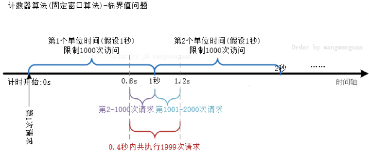

#### 滑动窗口限流

为了解决固定窗口算法的临界问题，有了滑动窗口限流，这种算法每次统计当前时间往前推一个单位的时间，统计这个单位时间内的请求量，是否超出阀值。（可以使用Redis中的有序集合sorted set来实现，就是每个member存储请求的信息，member的score就是请求发生的时间戳，每次接受请求时，先去查询有序集合的大小，如果数量超出，就删除时间戳过期的（也就是超出当前时间窗口的请求），删除后还是超出，就限流，否则就不限流，并且有一个定时任务定时删除时间戳过期的。）

但是由于每次都需要统计单位时间的请求量，开销远大于固定窗口算法，所以在真实的业务环境中需要慎重使用滑动窗口算法。

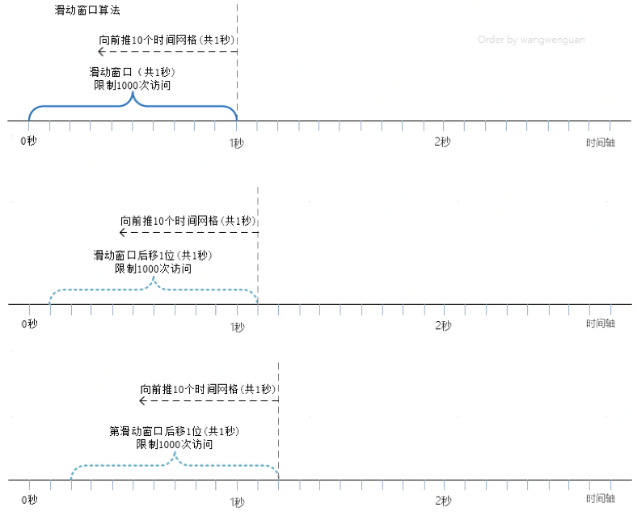

### 漏桶🪣

大致的漏桶限流规则如下：

1. 进水口（对应客户端请求）以任意速率流入进入漏桶。
2. 漏桶的容量是固定的，出水（放行）速率也是固定的。
3. 漏桶容量是不变的，如果处理速度太慢，桶内水量会超出了桶的容量，则后面流入的水滴会溢出，表示请求拒绝。


### 漏桶的问题

漏桶的出水速度固定，也就是请求放行速度是固定的。

网上抄来抄去的说法：

> 漏桶不能有效应对突发流量，但是能起到平滑突发流量（整流）的作用。

实际上的问题：

> 漏桶出口的速度固定，不能灵活的应对后端能力提升。比如，通过动态扩容，后端流量从1000QPS提升到1WQPS，漏桶没有办法。

### 令牌

令牌桶限流大致的规则如下：

1. 进水口按照某个速度，向桶中放入令牌。
2. 令牌的容量是固定的，但是放行的速度不是固定的，只要桶中还有剩余令牌，一旦请求过来就能申请成功，然后放行。
3. 如果令牌的发放速度，慢于请求到来速度，桶内就无牌可领，请求就会被拒绝。

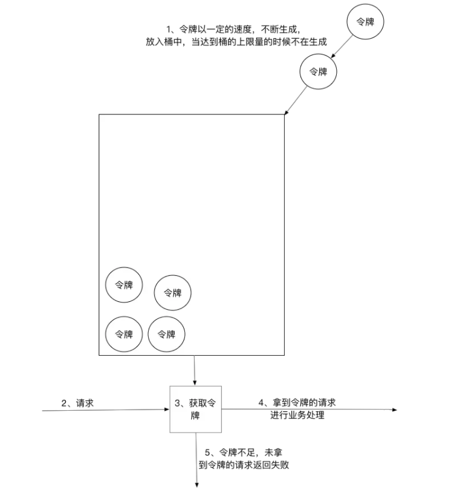

总之，令牌的**发送速率可以设置**，从而可以对突发的出口流量进行有效的应对。

>令牌桶与漏桶相似,不同的是令牌桶桶中放了一些令牌,服务请求到达后,要获取令牌之后才会得到服务,举个例子,我们平时去食堂吃饭,都是在食堂内窗口前排队的,这就好比是漏桶算法,大量的人员聚集在食堂内窗口外,以一定的速度享受服务,如果涌进来的人太多,食堂装不下了,可能就有一部分人站到食堂外了,这就没有享受到食堂的服务,称之为溢出,溢出可以继续请求,也就是继续排队,那么这样有什么问题呢?          如果这时候有特殊情况,比如有些赶时间的志愿者啦、或者高三要高考啦,这种情况就是突发情况,如果也用漏桶算法那也得慢慢排队,这也就没有解决我们的需求,对于很多应用场景来说，除了要求能够限制数据的平均传输速率外，还要求允许某种程度的突发传输。这时候漏桶算法可能就不合适了，令牌桶算法更为适合。

```java
import java.util.concurrent.CountDownLatch;
import java.util.concurrent.ExecutorService;
import java.util.concurrent.Executors;
import java.util.concurrent.atomic.AtomicInteger;

// 令牌桶 限速
@Slf4j
public class TokenBucketLimiter {
    // 上一次令牌发放时间
    public long lastTime = System.currentTimeMillis();
    // 桶的容量
    public int capacity = 2;
    // 令牌生成速度 /s
    public int rate = 2;
    // 当前令牌数量
    public AtomicInteger tokens = new AtomicInteger(0);

    //返回值说明：
    // false 没有被限制到
    // true 被限流
    public synchronized boolean isLimited(long taskId, int applyCount) {
        long now = System.currentTimeMillis();
        //时间间隔,单位为 ms
        long gap = now - lastTime;

        //计算时间段内的令牌数
        int reverse_permits = (int) (gap * rate / 1000);
        int all_permits = tokens.get() + reverse_permits;
        // 当前令牌数
        tokens.set(Math.min(capacity, all_permits));
        log.info("tokens {} capacity {} gap {} ", tokens, capacity, gap);

        if (tokens.get() < applyCount) {
            // 若拿不到令牌,则拒绝
            // log.info("被限流了.." + taskId + ", applyCount: " + applyCount);
            return true;
        } else {
            // 还有令牌，领取令牌
            tokens.getAndAdd( - applyCount);
            lastTime = now;

            // log.info("剩余令牌.." + tokens);
            return false;
        }

    }
```

## 2 一致性 hash 算法

[什么是一致性Hash算法 ](https://zhuanlan.zhihu.com/p/51296598)

在分布式系统中，`扩容缩容`操作极为常见，如果频繁进行重Hash操作显然是不可取的，一是消耗太大，而是可能引发服务的中断。此时，就要采用一致性Hash算法。

一致性Hash算法（Consistent Hashing）是一种 hash 算法，它能够==在Hash输出空间发生变化时，引起最小的变动==。以我们的例子来讲，增加或者移除一台服务器时，对原有的服务器和用户之间的映射关系产生的影响最小。

好的一致性Hash算法应该能够满足以下要求：

- 平衡性：这是Hash算法的基本要求，是指哈希的结果均匀地分配在整个输出空间中。
- 单调性：当发生数据节点变动时，对于相同的数据始终映射到相同的缓冲节点中或者新增加的缓冲节点中，避免无法找到原来的数据。
- 稳定性：当出现节点坏掉或热点访问而需要动态扩容时，尽量减少数据的移动。显然一般的Hash方法不满足这一点。

**具体思路就是一致性哈希将整个哈希输出空间设置为一个环形区域。**

例如，该环形区域用数字 $$0 - 2^{32-1}$$ 表示，沿顺时针方向值不断增大，0与$2^{32}$重合。整个哈希空间环如下：

接下来，我们将服务器进行Hash。可以使用服务器的编号或者ip等作为输入，得到一个输出值，映射在输出空间的环形区域上。假设它们的位置如下：


对于用户数据，同样进行Hash操作，映射在环形区域上。然后，**让该值沿着`顺时针`方向移动，遇到的第一个服务器就是它分配的服务器**。

例如有A、B、C、D四个数据对象，经过一致性哈希计算后，在环空间上的位置如下

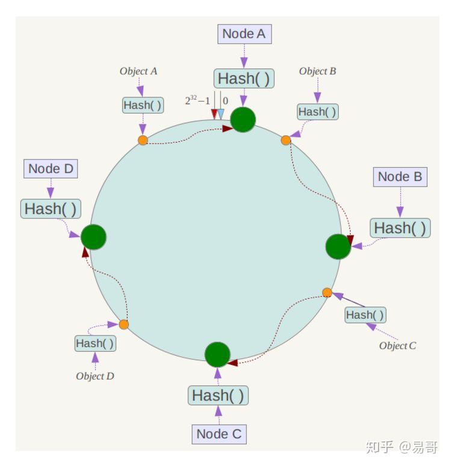

## 3 gin的路由处理

[gin的路由算法 · Go语言中文文档](https://www.topgoer.com/gin框架/gin源码解读/gin的路由算法.html)

gin的是路由算法其实就是一个`Trie树(也就是前缀树)`. 有关数据结构的可以自己去网上找相关资料查看.

gin的路由树算法是一棵前缀树. 不过并不是只有一颗树, 而是每种方法(POST, GET ...)都有自己的一颗树

例如，路由的地址是

- /hi
- /hello
- /:name/:id

gin 路由最终的样子大概是下面的样子

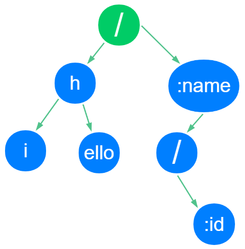

具体添加路由的方法，实现方法是这样的

```go
func (engine *Engine) addRoute(method, path string, handlers HandlersChain) {
    assert1(path[0] == '/', "path must begin with '/'")
    assert1(method != "", "HTTP method can not be empty")
    assert1(len(handlers) > 0, "there must be at least one handler")

    debugPrintRoute(method, path, handlers)
    // 此处可以好好看看
    root := engine.trees.get(method) 
    if root == nil {
        root = new(node)
        engine.trees = append(engine.trees, methodTree{method: method, root: root})
    }
    root.addRoute(path, handlers)
}
```

## 4 JWT详解

https://www.cnblogs.com/cy0628/p/15039001.html

https://www.jianshu.com/p/4a124a10fcaf

### 什么是JWT

JWT(JSON Web Token) 是一个开放标准(RFC 7519)，该token被设计为**紧凑且安全的，特别适用于分布式站点的单点登陆（SSO）场景**。用于作为JSON对象在各方之间安全地传输信息。该信息可以被验证和信任，因为它是数字签名的。

### 特点

跨域认证的问题：

1. 一种解决方案是 session 数据持久化，写入数据库或别的持久层。各种服务收到请求后，都向持久层请求数据。这种方案的优点是架构清晰，缺点是工程量比较大。另外，持久层万一挂了，就会单点失败。 
2. 另一种方案是==服务器索性不保存 session 数据了，所有数据都保存在客户端，每次请求都发回服务器。==**JWT 就是这种方案的一个代表**。也就是说，`服务器变成无状态了`，从而比较容易实现扩展。

### 使用场景

- 一次性验证：
  比如用户注册后需要发一封邮件让其激活账户，通常邮件中需要有一个链接，这个链接需要具备以下的特性：能够标识用户，该链接具有时效性（通常只允许几小时之内激活），不能被篡改以激活其他可能的账户…这种场景就和 jwt 的特性非常贴近，jwt 的 payload 中固定的参数：iss 签发者和 exp 过期时间正是为其做准备的。
- restful api的无状态认证
  使用 jwt 来做 restful api 的身份认证也是值得推崇的一种使用方案。客户端和服务端共享 secret；过期时间由服务端校验，客户端定时刷新；签名信息不可被修改。spring security oauth jwt 提供了一套完整的 jwt 认证体系。

### 结构

JWT由三部分组成，它们之间用圆点(.)连接。这三部分分别是：

* 头部 Header
* 载荷 Payload
* 签名 Signature


对象为一个很长的字符串，**字符之间通过"."分隔符分为三个子串**。注意JWT对象为一个长字串，各字串之间也没有换行符，一般格式为：`xxxxx.yyyyy.zzzzz `

头部：

* type：声明类型，这里是jwt
* alg：声明加密的算法 通常直接使用 HMAC SHA256

载荷：

* iss (issuer)：签发人
* exp (expiration time)：过期时间
* sub (subject)：主题
* aud (audience)：受众
* nbf (Not Before)：生效时间
* iat (Issued At)：签发时间
* jti (JWT ID)：编号

签名：

**是对前两部分的签名，防止数据篡改。** 首先，需要指定一个密钥（secret）。**这个密钥只有服务器才知道，不能泄露给用户。**然后，使用 Header 里面指定的签名算法（默认是 HMAC SHA256），按照下面的公式产生签名。

```java
 HMACSHA256(base64UrlEncode(header) + "." +  base64UrlEncode(payload), secret)
```

补充：**Base64**：有三个字符+、/和=，在 URL 里面有特殊含义，所以要被替换掉：=被省略、+替换成-，/替换成_ 。

### 用法

一般是将它放入HTTP请求的`Header Authorization`字段中。当跨域时，也可以将JWT被放置于POST请求的数据主体中。


## 5 http1的队头阻塞 http2的tcp阻塞 http3怎么改进

### HTTP/1.1

​	http1.1是目前最为主流的http协议版本，从1997年发布至今，仍是主流的http协议版本。

*  `引入了持久连接，或叫长连接`（ persistent connection），**即TCP连接默认不关闭，可以被多个请求复用，不用声明Connection: keep-alive。**
*  **引入了管道机制（ pipelining）**，即在同一个TCP连接里，客户端可以同时发送多个请求， 进一步改进了HTTP协议的效率。 
* 新增方法：PUT、 PATCH、 OPTIONS、 DELETE。 http协议不带有状态，每次请求都必须附上所有信息。请求的很多字段都是重复的，浪费带宽，影响速度。

### http/2

* http/2是一个**彻底的二进制协议，头信息和数据体都是二进制**，并且统称为"帧"（frame）： 头信息帧和数据帧。
* **复用TCP连接**，在一个连接里，客户端和浏览器都可以同时发送多个请求或回应，且不用按顺序一一对应，避免了`队头堵塞`的问题，此双向的实时通信称为多工。 
* HTTP/2 允许服务器未经请求，主动向客户端发送资源，即**服务器推送**。
* 引入**头信息压缩机制**（ header compression） ,头信息使用gzip或compress压缩后再发送。

### http/3

* 弃用`TCP`协议，改为使用基于`UDP`协议的`QUIC`协议实现。

此变化主要为了解决HTTP/2中存在的`tcp阻塞问题`。由于HTTP/2在**单个TCP连接上**使用了`多路复用`，受到`TCP拥塞控制`的影响，少量的丢包就可能导致整个TCP连接上的所有流被阻塞

* 使用 `stream` 进一步扩展了 HTTP2 的`多路复用`。

在 HTTP3 模式下，一**般传输多少个文件就会产生对应数量的 stream**。当这些文件中的其中一个发生丢包时，你只需要重传丢包文件的对应 stream 即可。

#### quic

[科普：QUIC协议原理分析](https://zhuanlan.zhihu.com/p/32553477)

Quic 全称 quick udp internet connection，“快速 UDP 互联网连接”，是由 google 提出的使用 udp 进行多路并发传输的协议。

Quic 相比现在广泛应用的 http2+tcp+tls 协议有如下优势 ：

1. 减少了 TCP 三次握手及 TLS 握手时间。
2. 改进的拥塞控制。
3. 避免队头阻塞的多路复用。
4. 连接迁移。
5. 前向冗余纠错。

**QUIC 核心特性连接建立延时低**

QUIC 协议选择了 UDP，因为 UDP 本身没有连接的概念，不需要三次握手，优化了连接建立的握手延迟。`0RTT 建连`可以说是 QUIC 相比 HTTP2 最大的性能优势。那什么是 `0RTT 建连`呢？这里面有两层含义。

1. 传输层 0RTT 就能建立连接。
2. 加密层 0RTT 就能建立加密连接。

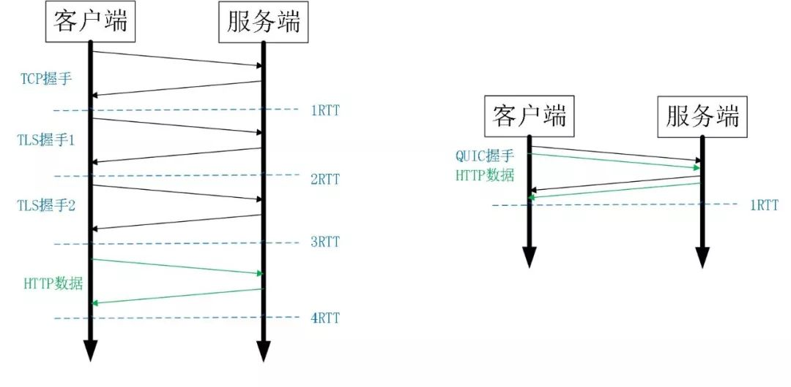

**没有队头阻塞的多路复用**

QUIC 的多路复用和 HTTP2 类似。在一条 QUIC 连接上可以并发发送多个 HTTP 请求 (stream)。但是 QUIC 的多路复用相比 HTTP2 有一个很大的优势。

**QUIC 一个连接上的多个 stream 之间没有依赖。**这样假如 stream2 丢了一个 udp packet，也只会影响 stream2 的处理。不会影响 stream2 之前及之后的 stream 的处理。这也就在很大程度上缓解甚至消除了队头阻塞的影响。

**可靠性**

TCP 为了保证可靠性，使用了基于字节序号的 Sequence Number 及 Ack 来确认消息的有序到达。

* Packet Number

QUIC 同样是一个可靠的协议，它使用 `Packet Number` 代替了 TCP 的 sequence number，并且每个 `Packet Number` 都**严格递增，也就是说就算 Packet N 丢失了，重传的 Packet N 的 Packet Number 已经不是 N，而是一个比 N 大的值。**而 TCP 呢，重传 segment 的 sequence number 保持不变，也正是由于这个特性，引入了 **Tcp 重传的歧义问题**。

* Stream Offset

但是单纯依靠严格递增的 `Packet Number` 肯定是无法保证数据的顺序性和可靠性。QUIC 又引入了一个 `Stream Offset` 的概念。

即一个 Stream 可以经过多个 Packet 传输，`Packet Number` 严格递增，没有依赖。但是 Packet 里的 Payload 如果是 Stream 的话，**就需要依靠 Stream 的 Offset 来保证应用数据的顺序。**如错误! 未找到引用源。所示，发送端先后发送了 Pakcet N 和 Pakcet N+1，Stream 的 Offset 分别是 x 和 x+y。

假设 Packet N 丢失了，发起重传，重传的 Packet Number 是 N+2，但是它的 Stream 的 Offset 依然是 x，这样就算 Packet N + 2 是后到的，依然可以将 Stream x 和 Stream x+y 按照顺序组织起来，交给应用程序处理

## 6 https 握手🤝

当客户端想要通过 HTTPS 请求访问服务端时，整个过程需要经过 7 次握手并消耗 9 倍的延迟。

1. TCP 协议需要通过三次握手建立 TCP 连接保证通信的可靠性（1.5-RTT）
2. TLS 协议会在 TCP 协议之上通过四次握手建立 TLS 连接保证通信的安全性（2-RTT）
3. HTTP 协议会在 TCP 和 TLS 上通过一次往返发送请求并接收响应（1-RTT）

工作原理：

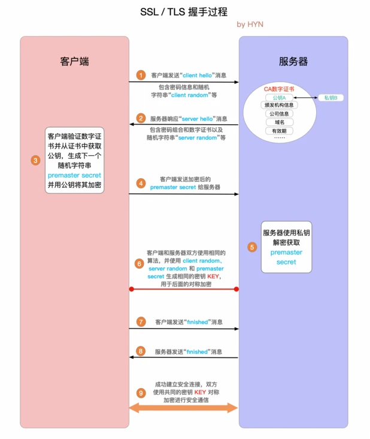

TLS握手4⃣️次握手🤝：


##  7 进程间的通信方式

👨‍💻**面试官** ：**进程间的通信常见的的有哪几种方式呢?**

🙋 **我** ：大概有 7 种常见的进程间的通信方式。

1. **管道/匿名管道(Pipes)** ：用于具有亲缘关系的父子进程间或者兄弟进程之间的通信。(==无名管道：只存在于内存中的文件==)
2. **有名管道(Names Pipes)** : 匿名管道由于没有名字，只能用于亲缘关系的进程间通信。为了克服这个缺点，提出了有名管道。有名管道严格遵循**先进先出(first in first out)**。有名管道以`磁盘文件`的方式存在，可以实现**本机任意两个进程通信**。（==命名管道：存在于实际的磁盘介质或者文件系统==）
3. **信号(Signal)** ：信号是一种比较复杂的通信方式，用于通知接收进程某个事件已经发生；
4. **信号量(Semaphores)** ：信号量是一个计数器，用于多进程对共享数据的访问，信号量的意图在于进程间同步。这种通信方式主要用于解决与同步相关的问题并避免竞争条件。
5. **消息队列(Message Queuing)** ：消息队列是**消息的链表**,具有特定的格式,**存放在内存中**并由消息队列标识符标识。管道和消息队列的通信数据都是先进先出的原则。与管道==不同的是消息队列存放在内核中==，只有在内核重启(即，操作系统重启)或者显式地删除一个消息队列时，该消息队列才会被真正的删除。消息队列可以实现消息的`随机查询`,消息不一定要以先进先出的次序读取,也可以按消息的类型读取.比 FIFO 更有优势。**消息队列克服了信号承载信息量少，管道只能承载无格式字节流以及缓冲区大小受限等缺点。**
6. **共享内存(Shared memory)** ：使得多个进程可以访问同一块内存空间，不同进程可以及时看到对方进程中对共享内存中数据的更新。这种方式需要**依靠某种同步操作，如互斥锁和信号量等**。可以说这是最有用的进程间通信方式。
7. **套接字(Sockets)** : 此方法主要用于在客户端和服务器之间通过网络进行通信。套接字是支持 TCP/IP 的网络通信的基本操作单元，可以看做是不同主机之间的进程进行双向通信的端点，简单的说就是通信的两方的一种约定，用套接字中的相关函数来完成通信过程。

## 8 线程间的同步的方式

👨‍💻**面试官** ：**那线程间的同步的方式有哪些呢?**

🙋 **我** ：线程同步是两个或多个共享关键资源的线程的并发执行。应该同步线程以避免关键的资源使用冲突。操作系统一般有下面三种线程同步的方式：

1. **互斥量(Mutex)**：采用互斥对象机制，只有拥有互斥对象的线程才有访问公共资源的权限。因为互斥对象只有一个，所以可以保证公共资源不会被多个线程同时访问。比如 Java 中的 synchronized 关键词和各种 Lock 都是这种机制。
2. **信号量(Semphares)** ：它允许同一时刻多个线程访问同一资源，但是需要控制同一时刻访问此资源的最大线程数量。
3. **事件(Event)** :`Wait/Notify`：通过通知操作的方式来保持多线程同步，还可以方便的实现多线程优先级的比较操作。

## 9 Nginx 负载均衡策略

[深入浅出Nginx 负载均衡算法篇 ](http://huhaipeng.top/2019/10/14/深入浅出Nginx-负载均衡算法篇/)

[深入剖析Nginx负载均衡算法](https://www.taohui.tech/2021/02/08/nginx/深入剖析Nginx负载均衡算法/)

[负载均衡-P2C算法](https://exceting.github.io/2020/08/13/负载均衡-P2C算法/)

官方提供的`RoundRobin`、最少连接数、随机选择这3个算法，只适用于无差别的上游服务。当上游server只处理特定范围的请求时，可以使用`ip_hash`、`hash`以及`hash consistent`这三种算法。==Nginx默认就是使用swrr的==

NGINX provides four load‑balancing techniques (Round Robin, Hash, IP Hash, and Least Connections), and NGINX Plus adds one more (Least Time)

### 1. 平滑加权轮询（smooth weighted round robin）

指定轮询的几率，**wight和访问比率成正比**，用于后台**服务器性能不均匀**的情况。

**动态权重的实现**：`current_weight`初始化为0，而`effective_weight`就是**动态权重**，它被初始化为server指令后的weight权重。我们先忽略转发失败的场景，此时RoundRobin算法可以简化为4步：

1. 遍历upstream组中的所有server，将`current_weight`的值增加`effective_weight`；
2. 将全部的权重值相加得到`total`；
3. 选择`current_weight`**最大**的server；
4. 将这个选中server的`current_weight`**减去**`total`值。

**网络错误时：**

在server指令后，可以加入`max_fails`和`fail_timeout`选项，它们共同对转发失败的次数加以限制：

1. 在`fail_timeout`秒内（默认为10秒），**每当转发失败，server的权重都会适当调低（通过effective_weight实现）**；
2. 如果转发失败次数达到了`max_fails`次，则接下来的`fail_timeout`秒内不再向该server转发任何请求；
3. 在等待fail_timeout秒的空窗期后，server将会基于最低权重执行算法，尝试转发请求；
4. **每成功转发1次权重加1，直到恢复至weight配置**。

### 2. hash

基于任意关键字作为 hash_key

#### 一致性哈希（consistant hash）

​	除了普通的ip哈希，nginx还提供一种一致性哈希的负载均衡算法。一致性哈希相比于普通的ip哈希来说，多了**==虚拟节点==**这个概念，实现的效果的话，理论上来讲，因为多了虚拟节点的概念，所以更加灵活。**当后端是缓存服务器时，经常使用一致性哈希算法来进行负载均衡。使用一致性哈希的好处在于，增减集群的缓存服务器时，只有少量的缓存会失效，回源量较小**。**nginx的普通的ip_hash算法，==若需要增减upstream的数量然后reload，之前的请求就全部落到不同的机器上了。而用了一致性哈希后，增减机器然后reload，只会造成有小部分请求不能落到原来的机器上==**。

nginx实现的一致性哈希算法中，比较关键的几个点如下：

1. 真实节点和虚拟节点是独立的。其中真实节点是用`round robin`来进行初始化的。**虚拟节点的数量是根据权重值来决定的， niginx里，虚拟节点的个数为`total_weight` * 160**。
2. 一个真实节点对应 weight * 160 个虚拟节点。
3. 一个虚拟节点里面包含两个变量分别是`uint32_t hash`和`ngx_str_t server`。`hash`是当前节点的哈希值，`server`是 server指令的第一个参数，就是HOST和PORT。
4. 每个虚拟节点的hash值都不同。
5. 创建好虚拟节点之后，会根据每个虚拟节点的哈希值大小来进行排序，对于hash值相同的虚拟节点，只保留第一个。

经过上述步骤，我们得到一个所有虚拟节点组成的数组，其元素的hash值有序而不重复。也就是说，整个哈希环建立起来了。

### 3. ip_hash

​	根据每个请求的ip的hash结果分配，因此能**保证同一个==客户端ip==的请求能访问到同一个后端服务器**，可以解决 session 和分布式缓存问题。

​	在nginx里，**ip哈希是带权重的**，是使用了上面的roundrobin函数进行了一部份初始化，带权重的意思是在ip hash完成得到`hash`值之后，再根据权重计算一波，最后才决定将该请求发送到哪一台后端机器。由于同一个ip哈希得到的值和后端的权重是固定的，所以同一个ip落到哪一台后端机器都是唯一确定的。

### 4. 最少连接数(Least Conn)

每次选取后端的时候选择`活跃连接数最少`的那个后端rs来进行请求的分配。如果有多个后端的conns/weight值同为最小的，那么对它们采用加权轮询算法

### 5. 随机(Random)

执行随机算法时，首先取小于`total_weight `的随机数，接着，基于二分法遍历有序数组，找到下标x对应的上游server。

事实上，Random算法还有一个功能，你可以在random指令后添加two least_conn选项，这样算法将会随机找出2个server，再选择并发连接数最少的那1个——`P2C算法`

#### P2C

`P2C`算法全称`Pick of 2 choices`，相比`WRR`，P2C有着更科学的LB策略，它通过随机选择两个节点后在这俩节点里选择优胜者来避免`羊群效应`，并通过`指数加权移动平均算法`统计服务端的实时状态，从而做出最优选择。

P2C算法下的每个节点（下称`Node`）必须含有下方图中几个指标，它们的计算方法已经标出：


## 10 Session和Cookie区别

​	`cookie`实际上是一小段的文本信息。客户端请求服务器，如果服务器需要记录该用户的状态，就使用response向客户端浏览器颁发一个`cookie`。客户端浏览器会把`cookie`保存起来。当浏览器再次请求该网站时，浏览器就会把请求地址和`cookie`一同给服务器。服务器检查该`cookie`，从而判断用户的状态。服务器还可以根据需要修改`cookie`的内容。 

​	`session`是另一种记录客户状态的机制。==不同的是`cookie`保存在客户端浏览器中，而`session`保存在服务器上==。`session`是存在服务器的一种用来存放用户数据的类HashTable结构，客户端浏览器访问服务器的时候，服务器把客户端信息以某种形式记录在服务器上，这就是`session`。客户端浏览器再次访问时只需要从该`session`中查找该客户的状态就可以了。 

如果说`cookie`机制是通过检查客户身上的“通信证”，那么`session`机制就是通过检查服务器上的“客户明细表”来确认客户身份。

1. 存储位置不同，Cookie在浏览器端存储，Session在服务器端存储；
2. 存储容量不同，Cookie存储容量很小，Session存储容量可以很大；
3. 安全性不同，Cookie安全性较低，Session安全性很高；

## 11 CAP 理论

[谈谈分布式系统的CAP理论 ](https://zhuanlan.zhihu.com/p/33999708)

一个分布式系统最多只能同时满足一致性（Consistency）、可用性（Availability）和分区容错性（Partition tolerance）这三项中的两项。

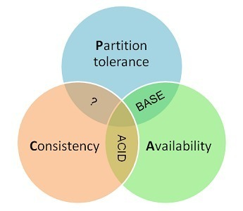

### **Consistency 一致性**

一致性指“`all nodes see the same data at the same time`”，即==所有节点在同一时间的数据完全一致==。一致性是因为多个数据拷贝下并发读写才有的问题，因此理解时一定要注意结合考虑多个数据拷贝下并发读写的场景。

- 强一致性：对于关系型数据库，要求更新过的数据能被后续的访问都能看到，这是强一致性。

- 弱一致性：如果能容忍后续的部分或者全部访问不到，则是弱一致性。

- 最终一致性：如果经过一段时间后要求能访问到更新后的数据，则是最终一致性。

### **Availability 可用性**

可用性指“`Reads and writes always succeed`”，即==服务在正常响应时间内一直可用==。

好的可用性主要是指系统能够很好的为用户服务，不出现用户操作失败或者访问超时等用户体验不好的情况。可用性通常情况下可用性和`分布式数据冗余`，`负载均衡`等有着很大的关联。

### **Partition Tolerance分区容错性**

分区容错性指分布式系统**在遇到某节点或网络分区故障的时候，仍然能够对外提供满足一致性或可用性的服务。**

## 12 CAS原理，会去操作系统的核心态吗

​	`CAS`即`Compare And Swap`的缩写，翻译成中文就是**比较并交换**，其作用是让CPU比较内存中某个值是否和预期的值相同，如果相同则将这个值更新为新值，不相同则不做更新，也就是CAS是**原子性**的操作(读和写两者同时具有原子性)，其实现方式是通过借助`C/C++`调用CPU指令完成的，所以效率很高。

**cas指令不会切换核心态**，lock也不会切换，lock cas也不会。

CAS相当于在用户态代码里边插入了一个`cmpxchg`指令，直观看大概是这个样子：用户态内存空间[...你的代码你的代码cmpxchg你的代码你的代码...]

这样CPU一直在用户态执行，执行到`cmpxchg`指令也不是说就是切换内核态了，切换到内核态可以这么理解：就是CPU开始执行了内核态内存空间的操作系统的代码。

总结，CAS是没有发生用户态到内核态的切换的。只是在用户态执行了`cmpxchg`指令而已（这个指令`由硬件保证原子性`，所谓不可再分的CPU同步原语）。而执行指令要比上下文切换的开销要小，所以CAS要比重量级互斥锁性能要高。

### CAS的缺点

`CAS`虽然高效的实现了原子性操作，但是也存在一些缺点，主要表现在以下三个方面。

1. ABA问题

**解决方法**： 在变量前面加上版本号，每次变量更新的时候变量的**版本号都`+1`**，即`A->B->A`就变成了`1A->2B->3A`。

2. 循环时间长开销大

如果`CAS`操作失败，就需要循环进行`CAS`操作(循环同时将期望值更新为最新的)，如果长时间都不成功的话，那么会造成CPU极大的开销。

> 这种循环也称为自旋

**解决方法**： 限制自旋次数，防止进入死循环。

3. 只能保证一个共享变量的原子操作

`CAS`的原子操作只能针对一个共享变量。

**解决方法**： 如果需要对多个共享变量进行操作，可以使用加锁方式(悲观锁)保证原子性，或者可以把多个共享变量合并成一个共享变量进行`CAS`操作。

## 13 time_wait

> 为什么TIME_WAIT状态需要经过2MSL(最大报文段生存时间)才能返回到CLOSE状态？

2*MSL(maximum segment lifetime)

虽然按道理，四个报文都发送完毕，我们可以直接进入`CLOSE`状态了，但是我们**必须假象网络是不可靠 的，有可以最后一个ACK丢失**。所以`TIME_WAIT`状态就是用来重发可能丢失的ACK报文。

还有一个原因，防止类似与“三次握手”中提到了的“已经失效的连接请求报文段”出现在本连接中。客户端发送完最后一个确认报文后，在这个2MSL时间中，就可以使**==本连接持续的时间内所产生的所有报文段都从网络中消失。这样新的连接中不会出现旧连接的请求报文==**。

## 14 用UDP实现TCP

#### 面向连接

TCP 的连接建立是从 “三次握手” 开始，理论上我们也可以模拟这种方式，使用 UDP 发三个包来模拟连接建立。同理，断开连接的 “四次握手”，也可以通过 UDP 发包模拟。

#### 确认与丢包问题

​	如果接收端收到了数据包，可以做一个确认，**发送一个 ACK 给发送端**(这个 ACK 参照 TCP)。如果有的数据包提前到达，接收端可以缓存着。
​	如果有的数据包丢失，接收方可以设置超时，要求发送端重新发送。超时时间过短（相较RTT），导致过多的重传，超时时间过长，影响传输速度。

#### 顺序问题

​	所有数据包都有自己的唯一顺序 ID，这部分可能要修改协议头。接收端通过返回 ACK 告诉发送端，“我准备接收某 ID 的数据包”。

#### 流量控制

参照滑动窗口协议，发送端通过 ACK 中夹带的接收端窗口大小，控制自身的发送速率。

会发生死锁吗？

当发送者收到了一个窗口为0的应答，发送者便停止发送，等待接收者的下一个应答。但是如果这个窗口不为0的应答在传输过程丢失，发送者一直等待下去，而接收者以为发送者已经收到该应答，等待接收新数据，这样双方就相互等待，从而产生死锁。

每当发送者收到一个零窗口的应答后就启动该计时器。时间一到便主动发送报文询问接收者的窗口大小。若接收者仍然返回零窗口，则重置该计时器继续等待；若窗口不为0，则表示应答报文丢失了，此时重置发送窗口后开始发送，这样就避免了死锁的产生。

#### 拥塞控制

拥塞控制应对网络异常的场景，包括网络中出现的丢包和超时。

慢启动算法：一开始使用小流量试探网络质量，指数型增加拥塞窗口，避免拥塞。当窗口大小等于阈值时，窗口改为一个一个增加。
拥塞避免算法：当出现超时（拥塞）时，我们及时将窗口大小调整为当前的一半，然后窗口大小开始慢慢增加，如果再次出现超时（拥塞），那么重复之前的操作。

额外功能：
快重传算法：接收端收到失序的数据包时，立即发出重复确认（不要等到自己的发送数据时稍待确认）。而发送端一脸多次收到重复确认时，就立即重传接收端未收到的数据包，而不必等待重传计时器到期。
快恢复算法：当发送端收到多个重复确认时，此时网络可能没有出现拥塞（因为拥塞的话，可能连重复确认都接收不到），但是为了预防网络拥塞，开始采取拥塞避免算法。

## 15 kafka

[深入浅出理解基于 Kafka 和 ZooKeeper 的分布式消息队列 (gitbook.cn)](https://gitbook.cn/books/5ae1e77197c22f130e67ec4e/index.html)

### Kafka 总体架构

基于 Kafka-ZooKeeper 的分布式消息队列系统总体架构如下：


如上图所示，一个典型的 Kafka 体系架构包括若干 Producer（消息生产者），若干 broker（作为 Kafka 节点的服务器），若干 Consumer（Group），以及一个 ZooKeeper 集群。Kafka通过 ZooKeeper 管理集群配置、选举 Leader 以及在 consumer group 发生变化时进行 Rebalance（即消费者负载均衡，在下一课介绍）。Producer 使用 push（推）模式将消息发布到 broker，Consumer 使用 pull（拉）模式从 broker 订阅并消费消息。

上图仅描摹了一个总体架构，并没有对作为 Kafka 节点的 broker 进行深入刻画，事实上，它的内部细节相当复杂，如下图所示，Kafka 节点涉及 Topic、Partition 两个重要概念。


在 Kafka 架构中，有几个术语：

- **Producer**：生产者，即消息发送者，push 消息到 Kafka 集群中的 broker（就是 server）中；
- **Broker**：Kafka 集群由多个 Kafka 实例（server） 组成，每个实例构成一个 broker，**说白了就是服务器**；
- **Topic**：producer 向 kafka 集群 push 的消息会被归于某一类别，即Topic，这本质上只是一个**逻辑概念**，面向的对象是 producer 和 consumer，producer 只需要关注将消息 push 到哪一个 Topic 中，而 consumer 只需要关心自己订阅了哪个 Topic；
- **Partition**：每一个 Topic 又被分为多个 Partitions，即物理分区；**出于`负载均衡`的考虑，同一个 Topic 的 Partitions 分别存储于 Kafka 集群的多个 broker 上**；**而为了提高`可靠性`，这些 Partitions 可以由 Kafka 机制中的 replicas 来设置备份的数量**；如上面的框架图所示，每个 partition 都存在两个备份；
- **Consumer**：消费者，从 Kafka 集群的 broker 中 pull 消息、消费消息；
- **Consumer group**：每条消息只能被 consumer-group 中的一个 Consumer 消费，但可以被多个 consumer-group 消费；
- **replicas**：partition 的副本，保障 partition 的`高可用`；
- **leader**：replicas 中的一个角色， **处理 partition 的所有读写请求，producer 和 consumer 只跟 leader 交互**
- **follower**：replicas 中的一个角色，从 leader 中复制数据，作为副本，一旦 leader 挂掉，会从它的 followers 中选举出一个新的 leader 继续提供服务；
- **controller**：Kafka 集群中的其中一个服务器，用来进行 leader election 以及 各种 failover；
- **ZooKeeper**：Kafka 通过 ZooKeeper 来存储集群的 meta 信息等，文中将详述。

### kafuka会丢失数据吗

* producer->broker：会
* broker->broker之间同步：可能你发送的消息后broker就挂了，这时挂掉的broker还没来得及把数据同步给别的broker，数据就自然就丢了
* broker->磁盘：发送到Broker之后，也不能保证数据就一定不丢了，毕竟Broker会把数据存储到磁盘之前，走的是操作系统缓存

**解决：**使用带有`callback`的api，设置 acks、retries、factor等等些参数来保证 Producer 发送的消息不会丢就好啦。如果发送成功了，会回调告诉你已经发送成功了。如果失败了，那收到回调之后自己在业务上做重试就好了。

此时一般是要求起码设置如下 4 个参数：

- 给 `topic` 设置 `replication.factor` 参数：这个值必须大于 1，要求每个 `partition` 必须有 **至少** 2 个副本。
- 在 `Kafka` 服务端设置 `min.insync.replicas` 参数：这个值必须大于 1，这个是 **要求一个 leader 至少感知到有至少一个 follower 还跟自己保持联系**，没掉队，这样才能确保 `leader` 挂了还有一个 `follower` 吧。
- 在 `producer` 端设置 `acks=all`：这个是要求每条数据，**必须是写入所有 replica 之后，才能认为是写成功了**。
- 在 `producer` 端设置 `retries=MAX`（很大很大很大的一个值，无限次重试的意思）：这个是要求**一旦写入失败，就无限重试**，卡在这里了。

这样配置之后，至少在Kafka `broker` 端就可以保证在`leader` 所在 `broker` 发生故障，进行`leader` 切换时，数据不会丢失。

#### 生产端幂等性发送

为了实现Producer的幂等语义，Kafka引入了`Producer ID`（即`PID`）和`Sequence Number`。每个新的Producer在初始化的时候会被分配一个唯一的PID，该PID对用户完全透明而不会暴露给用户。

对于每个PID，该Producer发送数据的每个`<Topic, Partition>`都对应一个从0开始单调递增的`Sequence Number`。

类似地，Broker端也会为每个`<PID, Topic, Partition>`维护一个序号，并且每次Commit一条消息时将其对应序号递增。对于接收的每条消息，**如果其序号比Broker维护的序号（即最后一次Commit的消息的序号）大一**，则Broker会接受它，**否则将其丢弃**：

- 如果消息序号比Broker维护的序号大一以上，说明中间有数据尚未写入，也即乱序，此时Broker拒绝该消息，Producer抛出`InvalidSequenceNumber`
- 如果消息序号小于等于Broker维护的序号，说明该消息已被保存，即为重复消息，Broker直接丢弃该消息，Producer抛出`DuplicateSequenceNumber`

上述设计解决了0.11.0.0之前版本中的两个问题：

- Broker保存消息后，发送ACK前宕机，Producer认为消息未发送成功并重试，造成数据重复
- 前一条消息发送失败，后一条消息发送成功，前一条消息重试后成功，造成数据乱序。

#### 消费数据时的可靠性

要想client端消费数据不能丢，肯定是不能使用`autoCommit`的，所以必须是**手动提交**的。

1. 从Kafka拉取消息（一次批量拉取500条，这里主要看配置）
2. 为每条拉取的消息分配一个`msgId`（递增）
3. 将`msgId`存入内存队列(`sortSet`)中
4. 使用Map存储`msgId`与`msg`(有offset相关的信息）映射关系
5. 当业务处理完消息后，ack时，**获取当前处理的消息`msgId`，然后从sortSet移除该msgld**（此时代表已经处理过了）
6. 接着与sortSet队列的首部第一个Id比较（其实就是最小的`msgId`），如果当前`msgld<=sortSet第一个ID`，则提交当前`offset`
7. 系统即便挂了，在下次重启时就会从sortSet队首的消息开始拉取，实现至少处理一次语义，会有少量的消息重复，但只要下游做好幂等就OK了

#### 事务性保证

上述幂等设计只能保证==单个Producer==对于同一个`<Topic, Partition>`的`Exactly Once`语义。

另外，它并**不能保证写操作的原子性，更不能保证多个读写操作的的原子性**。尤其对于Kafka Stream应用而言，典型的操作即是从某个Topic消费数据，经过一系列转换后写回另一个Topic，保证从源Topic的读取与向目标Topic的写入的原子性有助于从故障中恢复。

事务保证可使得应用程序将生产数据和消费数据当作一个原子单元来处理，要么全部成功，要么全部失败，即使该生产或消费跨多个`<Topic, Partition>`。

另外，有状态的应用也可以保证重启后从断点处继续处理，也即事务恢复。

为了实现这种效果，应用程序必须提供一个稳定的（重启后不变）唯一的ID，也即`Transaction ID`。`Transactin ID`与`PID`可能一一对应。区别在于`Transaction ID`由用户提供，而`PID`是内部的实现对用户透明。

另外，为了保证新的Producer启动后，旧的具有相同`Transaction ID`的Producer即失效，每次Producer通过`Transaction ID`拿到PID的同时，还会获取一个单调递增的epoch。由于旧的Producer的epoch比新Producer的epoch小，Kafka可以很容易识别出该Producer是老的Producer并拒绝其请求。

有了`Transaction ID`后，Kafka可保证：

- 跨Session的数据幂等发送。当具有相同`Transaction ID`的新的Producer实例被创建且工作时，旧的且拥有相同`Transaction ID`的Producer将不再工作。
- 跨Session的事务恢复。如果某个应用实例宕机，新的实例可以保证任何未完成的旧的事务要么Commit要么Abort，使得新实例从一个正常状态开始工作。

需要注意的是，上述的事务保证是从Producer的角度去考虑的。从Consumer的角度来看，该保证会相对弱一些。尤其是不能保证所有被某事务Commit过的所有消息都被一起消费，因为：

- 对于压缩的Topic而言，同一事务的某些消息可能被其它版本覆盖
- 事务包含的消息可能分布在多个Segment中（即使在同一个Partition内），当老的Segment被删除时，该事务的部分数据可能会丢失
- Consumer在一个事务内可能通过seek方法访问任意Offset的消息，从而可能丢失部分消息
- Consumer可能并不需要消费某一事务内的所有Partition，因此它将永远不会读取组成该事务的所有消息

### 消息队列的使用场景有哪些？

1. **==异步通信==**：有些业务不想也不需要立即处理消息。消息队列提供了异步处理机制，允许用户把一个消息放入队列，但并不立即处理它。想向队列中放入多少消息就放多少，然后在需要的时候再去处理它们。
2. **==解耦==**：降低工程间的强依赖程度，针对异构系统进行适配。在项目启动之初来预测将来项目会碰到什么需求，是极其困难的。通过消息系统在处理过程中间插入了一个隐含的、基于数据的接口层，两边的处理过程都要实现这一接口，当应用发生变化时，可以独立的扩展或修改两边的处理过程，只要确保它们遵守同样的接口约束
3. **==削峰==**：在访问量剧增的情况下，应用仍然需要继续发挥作用，但是这样的突发流量无法提取预知；如果以为了能处理这类瞬间峰值访问为标准来投入资源随时待命无疑是巨大的浪费。使用消息队列能够使关键组件顶住突发的访问压力，而不会因为突发的超负荷的请求而完全崩溃

1.接口的吞吐量会大幅度提高（因为未做真正实际调用，接口RT会非常低）【异步】

2.即便有大批量的消息调用接口都不会让系统受到影响（流量由消息队列承载）【削峰】

### 什么Kafka能承载这么大的QPS?

​	消息队列「最核心」的功能就是把生产的数据存储起来，然后分发给各个业务把数据再读取出来。跟我们处理请求时不一样可，我们在业务处理时可能会调别人的接口，可能会需要去查数据库…等等一系列的操作才行，这些操作非常耗时。Kafka在「**存储**」和「**读取**」这个过程中又做了很多的优化。

1. 我们往一个Topic发送消息或者读取消息时，实际内部是多个Partition在处理【并行】
2. 在存储消息时，Kafka内部是**顺序写磁盘**的，并且利用了操作系统的缓冲区来提高性能【appendt➕cache】
3. 在读写数据中也减少CPU拷贝的次数【零拷贝】

#### 零拷贝

传统的IO接口像read和write系统调用，在执行过程中都是涉及到数据拷贝操作的，比如调用read()接口去读取一个文件时，首先需要将CPU由用户切换成内核态，然后把文件从磁盘读取

##### read()和write()

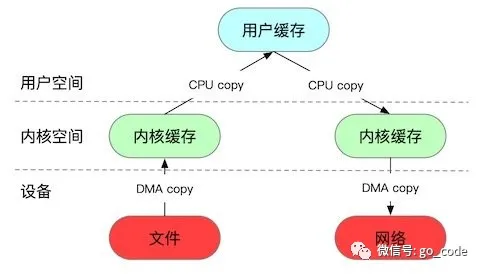

**read()系统调用的步骤：** 

1. 用户态到内核态的切换，然后会发出 sys_read()系统调用，从文件读取数据。(一次上下文切换) ，磁盘控制器会使用DMA技术将磁盘文件拷贝到内核内存空间的缓冲区。**(一次DMA拷贝**) 
2. CPU会将数据从内核内存空间的缓冲区拷贝到用户进程内存空间的缓冲区。(**一次CPU拷贝**)，然后read()系统调用返回后，会进行内核态往用户态的切换。(一次上下文切换)

**write()系统调用的步骤：**

1. 从用户态切换到内核态，然后会将数据从用户程序的内存空间拷贝到内核内存空间中的Socket缓冲区。(一次上下文切换，**一次CPU拷贝**) 
2. 网卡会使用DMA技术，将数据从内核内存空间中的缓冲区拷贝到网卡。(**一次DMA拷贝**) write()调用完成后会从内核态切换到用户态。(一次上下文切换)

##### 2.MMAP和write()

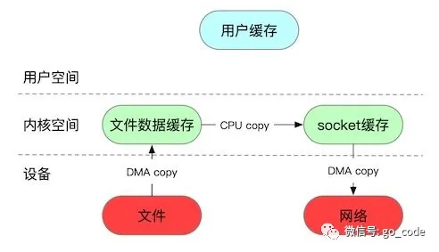**mmap**

1. CPU从用户态切换到内核态，磁盘控制器使用DMA技术将数据从磁盘拷贝到内核的内存空间。不会将数据拷贝到用户程序的内存空间，而是**用一块物理内存将读缓冲区的地址和用户空间的地址进行映射，从而让用户进程可以直接访问这部分内存**。(一次上下文切换，**一次DMA拷贝**)

2. mmap调用完毕后，CPU会从内核态切换到用户态。(一次上下文切换)

mmap相比于read()可以减少一次CPU拷贝，因为数据是存在内核的内存空间中。

**write**

1. 首先CPU从用户态切换到内核态，然后把数据从内核的内存空间拷贝到内核中Socket缓冲区。(一次上下文切换，一次CPU拷贝)

2. 网卡使用DMA技术，将数据从Socket缓冲区拷贝到网卡。发送完毕后，从内核态切换为用户态。(一次上下文切换，一次DMA拷贝)

##### sendfile

这种方式**只能用于发送文件，不能修改文件**，在Kakfa发送消息给消费者时有用到。

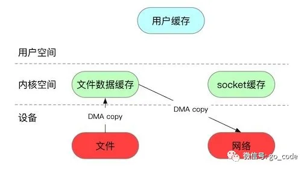

读取时：

1.首先CPU从用户态切换成内核态，然后磁盘控制器使用DMA技术将文件从磁盘拷贝到内核空间的缓冲区中。（一次上下文切换，**一次DMA拷贝**）

发送时：

2.早期的版本是将数据从内核空间中的缓存区拷贝到内核空间的Socket缓冲区，在Linux 2.4以后，是只需要将数据在内核空间的文件数据缓存中的位置和偏移量写入到Socket缓存中，然后网卡直接从Socket缓存中读取文件的位置和偏移量，使用DMA技术拷贝到网卡。发送完毕后，从内核态切换为用户态。（一次上下文切换，**一次DMA拷贝**。）

**总结：**

传统read()和write()方案：数据拷贝了4次，CPU上下文切换了很多次

`mmap`和write()方案：数据拷贝了3次，会减少一次CPU拷贝，上下文切换了4次。(可以减少1次CPU拷贝)

`sendfile`方案：数据拷贝了2次，上下文切换了2次。但是用户进程不能修改数据。(可以减少2次CPU拷贝，至少2次上下文切换)

从Producer->Broker，Kafka是把网卡的数据持久化硬盘，用的是`mmap`；从Broker->Consumer，Kafka是从硬盘的数据发送至网卡，用的是`sendFile`（实现CPU零拷贝）

### Kafka什么时候进行rebalance？

1. **topic下分区的数量增加了或者减少了**。

2. **消费者的数量发生了改变**，例如新增加了消费者或者有消费者挂掉了。 Kafka有一个`session.timeout.ms`，最大会话超时时间，最长是10s。就是如果broker与消费者之间的心跳包超过10s还没有收到回应，就会认为消费者掉线了。以及还有一个`max.poll.interval.ms`参数，消费者两次去broker拉取消息的间隔，默认是5分钟。如果消费者两次拉取消息的间隔超过了5分钟，就会认为消费者掉线了。

一旦发生rebalance了，有可能会导致`重复消费`的问题，就是消费者A拉取了100条消息，消费时间超过了5分钟，被broker认定下线，就会进行rebalance，把这个分区分配给其他消费者消费，其他消费者就会进行重复消费。

怎么解决rebalance带来的`重复消费`问题呢？

1. **可以减少每批消息的处理时间**，或者是修改max.poll.records，**减小每次拉取消息的数量**。

2. 可以自行在MySQL或者Redis里面存储每个分区消费的offset，然后消费者去一个新的分区拉取消息时先去读取上次消费的offset。

3. 为消息分配一个唯一的消息id，通过消息id来判定是否重复消费了。

## 16 IO 多路复用

### 同步IO和异步IO

* 同步IO：应用程序主动向内核查询是否有可用数据，如果有自己负责把数据从内核copy到用户空间。

* 异步IO：应用程序向内核发起读数据请求需要：（1）告诉内核数据存放位置（2）注册回调函数，当内核完成数据copy后调用回调通知应用程序取数据。

同步IO/异步IO最大区别：同步 IO 数据从内核空间到用户空间的copy 动作是由应用程序自己完成。而异步IO则是注册回调函数并告知内核用户空间缓冲区存放地址，数据 copy 由内核完成。

 便于简单理解、记忆：

> * **阻塞IO**, 给女神发一条短信, 说我来找你了, 然后就默默的一直等着女神下楼, 这个期间除了等待你不会做其他事情, 属于备胎做法.
>
> * **非阻塞IO**, 给女神发短信, 如果不回, 接着再发, 一直发到女神下楼, 这个期间你除了发短信等待不会做其他事情, 属于专一做法.
>
> * **IO多路复用**, 是找一个宿管大妈来帮你监视下楼的女生, 这个期间你可以些其他的事情. 例如可以顺便看看其他妹子,玩玩王者荣耀, 上个厕所等等. IO复用又包括 select, poll, epoll 模式. 那么它们的区别是什么?
>
>   - 1） **select大妈** 每一个女生下楼, select大妈都不知道这个是不是你的女神, 她需要一个一个询问, 并且select大妈能力还有限, 最多一次帮你监视1024个妹子
>
>   - 2） **poll大妈**不限制盯着女生的数量, 只要是经过宿舍楼门口的女生, 都会帮你去问是不是你女神
>
>   - 3） **epoll大妈**不限制盯着女生的数量, 并且也不需要一个一个去问. 那么如何做呢? epoll大妈会为每个进宿舍楼的女生脸上贴上一个大字条,上面写上女生自己的名字, 只要女生下楼了, epoll大妈就知道这个是不是你女神了, 然后大妈再通知你。
>     
>上面这些同步IO有一个共同点就是, 当女神走出宿舍门口的时候, 你已经站在宿舍门口等着女神的, 此时你属于**阻塞状态**
>
>接下来是**异步IO**的情况：你告诉女神我来了, 然后你就去打游戏了, 一直到女神下楼了, 发现找不见你了, 女神再给你打电话通知你, 说我下楼了, 你在哪呢? 这时候你才来到宿舍门口。 此时属于逆袭做法


### **阻塞IO模型**

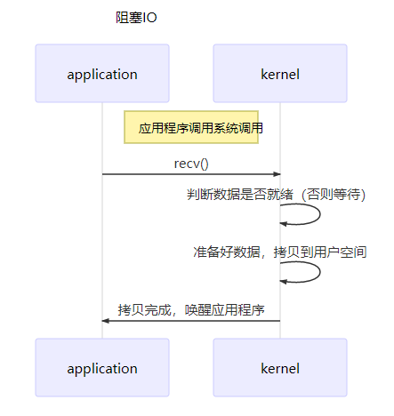

最传统的一种IO模型，即在读写数据过程中会发生阻塞现象。

当用户线程发出IO请求之后，内核会去查看数据是否就绪，如果没有就绪就会等待数据就绪，**而用户线程就会处于阻塞状态，用户线程交出CPU**。当数据就绪之后，内核会将数据拷贝到用户线程，并返回结果给用户线程，用户线程才解除 block 状态。

代码如下：

```c
printf("Calling recv(). \n");
ret =  recv(socket, recv_buf, sizeof(recv_buf), 0); 
printf("Had called recv(). \n")
```

也许有人会说，可以采用多线程+ 阻塞IO 来解决效率问题，但是由于在多线程 + 阻塞IO 中，每个socket对应一个线程，这样会造成很大的资源占用，并且尤其是对于长连接来说，线程的资源一直不会释放，如果后面陆续有很多连接的话，就会造成性能上的瓶颈。

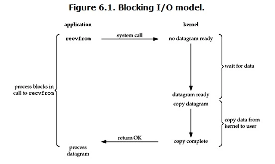

当用户进程调用了`recvfrom`这个系统调用，kernel就开始了IO的第一个阶段：准备数据（对于网络IO来说，很多时候数据在一开始还没有到达。比如，还没有收到一个完整的UDP包。这个时候kernel就要等待足够的数据到来）。这个过程需要等待，也就是说数据被拷贝到操作系统内核的缓冲区中是需要一个过程的。而在用户进程这边，整个进程会被阻塞（当然，是进程自己选择的阻塞）。当kernel一直等到数据准备好了，它就会将数据从kernel中拷贝到用户内存，然后kernel返回结果，用户进程才解除block的状态，重新运行起来。

所以，**blocking IO的特点就是在IO执行的两个阶段都被block了。**

 

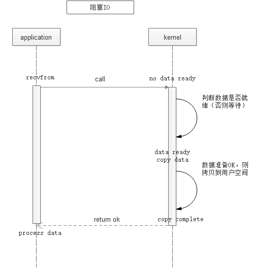

 应用程序请求内核读取数据，内核数据数据缓冲区无数据或者数据未就绪前，阻塞等待。内核系统等待数据准备就绪后，拷贝数据到用户空间，待拷贝完成后，返回结果，用户程序接触阻塞，处理数据。

### 非阻塞IO模型

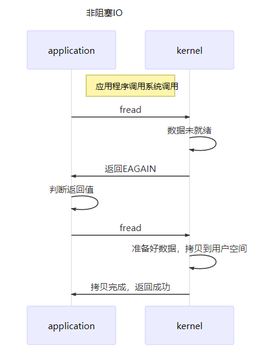

当用户线程发起一个IO操作后，并不需要等待，而是马上就得到了一个结果。如果结果是一个error时，它就知道数据还没有准备好，**于是它可以再次发送IO操作**。一旦内核中的数据准备好了，并且又再次收到了用户线程的请求，那么内核它马上就将数据拷贝到了用户线程，然后返回。

在非阻塞IO模型中，**用户线程需要不断地询问内核数据是否就绪**，也就说**非阻塞IO不会交出CPU，而会一直占用CPU**。

对于非阻塞IO就有一个非常严重的问题，在while循环中需要不断地去询问内核数据是否就绪，**这样会导致CPU占用率非常高**，因此一般情况下很少使用while循环这种方式来读取数据。

```c
while(1)
{
    printf("Calling recv(). \n");
    ret =  recv(socket, recv_buf, sizeof(recv_buf), 0); 
    if (EAGAIN == ret) {continue;}
    else if(ret > -1) { break;}
    printf("Had called recv(), retry.\n");
}
```

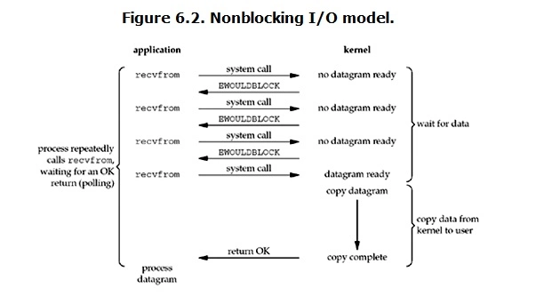

 Linux下，可以通过设置socket使其变为non-blocking。

当用户进程发出`read`操作时，如果kernel中的数据还没有准备好，那么它并不会block用户进程，而是立刻返回一个error。从用户进程角度讲 ，它发起一个read操作后，并不需要等待，而是马上就得到了一个结果。用户进程判断结果是一个error时，它就知道数据还没有准备好，于是它可以再次发送read操作。一旦kernel中的数据准备好了，并且又再次收到了用户进程的system call，那么内核它马上就将数据拷贝到了用户内存，然后返回。

所以，**nonblocking IO的特点是用户进程需要不断的主动询问kernel数据好了没有**。

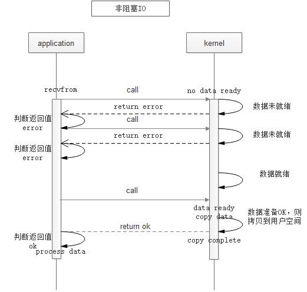

 应用程序请求内核读取数据，内核直接返回结果，如果数据未准备就绪，则返回error，应用程序继续请求，周而复始，直到内核数据准备就绪后，当内核再次收到应用程序请求后，将数据拷贝到用户空间，待拷贝完成后返回ok，应用程序处理数据。

###  **IO多路复用模型**

I/O多路复用是操作系统级别的，属于linux操作系统的五种I/O模型中的一种，是操作系统级别**同步非阻塞**的。操作系统级别的异步I/O才是真正**异步非阻塞的**。

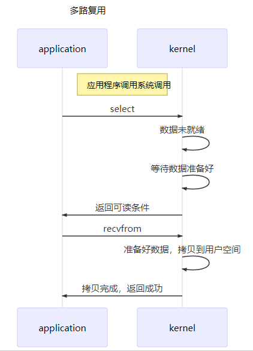

 所谓 ==I/O多路复用机制，就是说通过一种机制，可以监视多个描述符，一旦某个描述符就绪（一般是读就绪或者写就绪），能够通知程序进行相应的读写操作==。这种机制的使用需要额外的功能来配合： `select`、`poll`、`epoll`。

- `select`、`poll`，`epoll`本质上都是**同步I/O，因为他们都需要在读写事件就绪后自己负责进行读写，也就是说这个读写过程是阻塞的**。
- `select` 时间复杂度O(n)，**它仅仅知道了，有I/O事件发生了，却并不知道是哪几个流**（可能有一个，多个，甚至全部），我们只能无差别轮询所有流，找出能读出数据，或者写入数据的流，对他们进行操作。所以**select具有O(n)的无差别轮询复杂度**，同时处理的流越多，无差别轮询时间就越长。(最多监听1024个)
- `poll`（翻译：轮询）时间复杂度O(n)，poll本质上和select没有区别，它将用户传入的数组拷贝到内核空间，然后查询每个`fd`对应的设备状态， **但是==它没有最大连接数的限制==**，原因是它是基于链表来存储的.
- `epoll` 时间复杂度O(1)，**epoll可以理解为event poll**，不同于忙轮询和无差别轮询，epoll会把哪个流发生了怎样的I/O事件通知我们。所以我们说epoll实际上是**事件驱动（每个事件关联上fd）**的，此时我们对这些流的操作都是有意义的。**（复杂度降低到了O(1)）。**  

在多路复用 IO 模型中，==会有一个内核线程不断去轮询多个socket的状态，只有当真正读写事件发生时，才真正调用实际的 IO 读写操作==。因为在多路复用 IO 模型中，只需要使用一个线程就可以管理多个socket，系统不需要建立新的进程或者线程，也不必维护这些线程和进程，并且只有在真正有读写事件进行时，才会使用 IO 资源，所以它大大减少了资源占用。

 

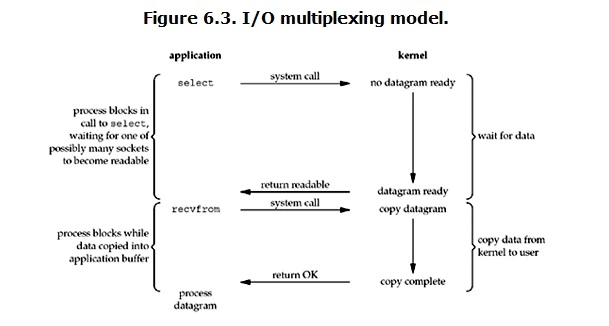

`select`/`epoll`的好处就在于单个process就可以同时处理多个网络连接的IO。它的基本原理就是select，poll，epoll这个function会==不断的轮询所负责的所有socket==，当某个socket有数据到达了，就通知用户进程。

当用户进程调用了select，那么整个进程就会被block，而同时，kernel会 “监视”所有select负责的socket，当任何一个socket中的数据准备好了，select就会返回。这个时候用户进程再调用 read 操作，将数据从kernel拷贝到用户进程。所以，==IO多路复用的特点是通过一种机制一个进程能同时等待多个文件描述符，而这些文件描述符（套接字描述符）其中的任意一个进入就绪状态，select()函数就可以返回==。

这里需要使用两个system call（`select `和 `recvfrom`），而blocking IO只调用了一个system call（`recvfrom`）。但是，用select的优势在于它可以同时处理多个connection。

如果处理的连接数不是很高的话，使用select/epoll的web server不一定比使用mutil-threading + blocking IO的web server性能更好，可能延迟还更大。**select/epoll 的优势并不是对于单个连接能处理得更好，而是在于性能更多的连接。** 

 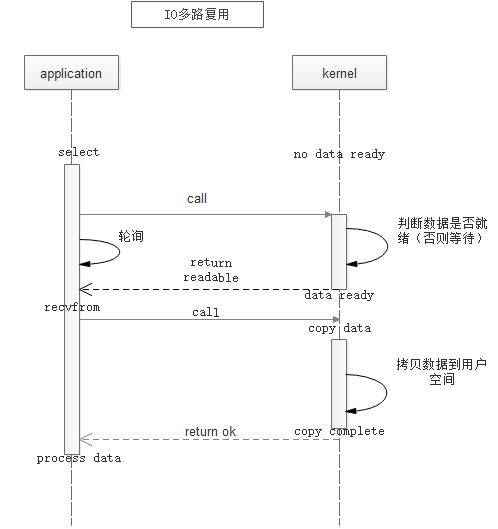

应用程序请求内核读取数据，首先调用了select，内核监控select监控的所有socket，当有任何一个socket数据准备就绪后，就返回给用户进程可读，然后用户进程再次向内核发送读取指令，内核将数据拷贝到用户空间，并返回结果，用户进程获得数据后进行处理。这里关于select、poll、epoll的区别不在这里描述，参见：[《select、poll、epoll之间的区别(搜狗面试)》](https://www.cnblogs.com/aspirant/p/9166944.html)

#### **select：**

select本质上是通过设置或者`检查存放fd标志位`的数据结构来进行下一步处理。这样所带来的缺点是：

1、 单个进程可监视的fd数量被限制，即能监听端口的大小有限。

   一般来说这个数目和系统内存关系很大，具体数目可以cat /proc/sys/fs/file-max察看。**32位机默认是1024个。64位机默认是2048.**

2、 对socket进行扫描时是**线性扫描**，即采用轮询的方法，效率较低：

​    当套接字比较多的时候，每次select()都要通过遍历`FD_SETSIZE`个Socket来完成调度，不管哪个Socket是活跃的,都遍历一遍。这会浪费很多CPU时间。如果能给套接字注册某个回调函数，当他们活跃时，自动完成相关操作，那就避免了轮询，这正是epoll与kqueue做的。

3、需要维护一个用来存放大量fd的数据结构，这样会使得用户空间和内核空间在传递该结构时复制开销大

#### **poll：**

poll 本质上和 select 没有区别，它将用户传入的数组拷贝到内核空间，然后查询每个fd对应的设备状态，如果设备就绪则在设备等待队列中加入一项并继续遍历，如果遍历完所有fd后没有发现就绪设备，则挂起当前进程，直到设备就绪或者主动超时，被唤醒后它又要再次遍历fd。这个过程经历了多次无谓的遍历。

**它没有最大连接数的限制**，原因是它是`基于链表来存储`的，但是同样有一个缺点：

1、大量的fd的数组被整体复制于用户态和内核地址空间之间，而不管这样的复制是不是有意义。          

2、poll还有一个特点是“水平触发”，如果报告了fd后，没有被处理，那么下次poll时会再次报告该fd。

####  **epoll:**

epoll有`EPOLLLT`和`EPOLLET`两种触发模式，LT是默认的模式，ET是“高速”模式。LT模式下，只要这个 fd 还有数据可读，每次 epoll_wait都会返回它的事件，提醒用户程序去操作，而在ET（边缘触发）模式中，它只会提示一次，直到下次再有数据流入之前都不会再提示了，无论 fd 中是否还有数据可读。所以在 ET 模式下，read一个fd的时候一定要把它的 buffer 读光，也就是说一直读到 read 的返回值小于请求值，或者 遇到`EAGAIN`错误。还有一个特点是，epoll使用“事件”的就绪通知方式，==通过`epoll_ctl`注册fd，一旦该 fd 就绪，内核就会采用类似callback的回调机制来激活该fd，epoll_wait便可以收到通知==。epoll提供了三个函数，`epoll_create`,`epoll_ctl`和`epoll_wait`，`epoll_create`是创建一个`epoll`句柄；`epoll_ctl`是注册要监听的事件类型；`epoll_wait`则是等待事件的产生。

**epoll为什么要有EPOLLET触发模式？**

如果采用EPOLLLT模式的话，系统中一旦有大量你不需要读写的就绪文件描述符，它们每次调用epoll_wait都会返回，这样会大大降低处理程序检索自己关心的就绪文件描述符的效率.。而采用EPOLLET这种边沿触发模式的话，当被监控的文件描述符上有可读写事件发生时，epoll_wait()会通知处理程序去读写。如果这次没有把数据全部读写完(如读写缓冲区太小)，那么下次调用epoll_wait()时，它不会通知你，也就是它只会通知你一次，直到该文件描述符上出现第二次可读写事件才会通知你！！！**这种模式比水平触发效率高，系统不会充斥大量你不关心的就绪文件描述符**

**epoll的优点：**

1. **没有最大并发连接的限制，能打开的FD的上限远大于1024（1G的内存上能监听约10万个端口）**；
2. **效率提升，==不是轮询的方式，不会随着FD数目的增加效率下降。只有活跃可用的FD才会调用callback函数==；**
   **即Epoll最大的优点就在于它只管你“活跃”的连接，而跟连接总数无关，因此在实际的网络环境中，Epoll的效率就会远远高于select和poll。**

3. 即 epoll 使用 `mmap `减少复制开销。

**总结：**

（1）`select`，`poll`实现需要自己**不断轮询所有fd集合**，直到设备就绪，期间可能要睡眠和唤醒多次交替。而`epoll`其实也需要调用`epoll_wait`不断轮询`就绪链表`，期间也可能多次睡眠和唤醒交替，但是它是**设备就绪时，调用回调函数，把就绪fd放入就绪链表中，并唤醒在epoll_wait中进入睡眠的进程。**虽然都要睡眠和交替，但是select和poll在“醒着”的时候要遍历整个fd集合，而epoll在“醒着”的时候只要判断一下就绪链表是否为空就行了，这节省了大量的CPU时间。这就是回调机制带来的性能提升。

（2）select，poll**每次调用都要把fd集合从用户态往内核态拷贝一次**，并且要把current往设备等待队列中挂一次，而epoll只要一次拷贝，而且把current往等待队列上挂也只挂一次（在epoll_wait的开始，注意这里的等待队列并不是设备等待队列，只是一个epoll内部定义的等待队列）。这也能节省不少的开销。 

## todo

- mysql的insert的过程实现

- 流量控制

- 虚拟内存

- 信号量的实现

- http https://github.com/febobo/web-interview

- redis和mysql的同步

- 很多用户直接访问mysql出现的问题

- redis 获取所有key命令

- epoll 的两种触发方式了解吗？（水平和边缘）

- 写一个超时控制，三个goroutine，分别取名a,b,c，a和c控制在100ms内，b控制在200ms内。外面主goroutine超时控制在300ms内。（也算是前面给自己挖坑了，写了个七七八八吧，面试官中途有提醒）

- hash 一致性 虚拟节点起到了什么作用？增加和删除节点的时候为什么有优势？ 

- hyperloglog 误差范围是多少？是固定的还是浮动的？为什么有误差了解吗？

- 2 T的两个大文件A、B，文件中每一行都存储一个字符串。内存只有 1 G，找出两个文件中相同的字符串。（hash后取余分成小文件，A小文件读进内存用map或者字典树存储，然后对比相同序号的B小文件来找） 

  （1）map 和 字典树的复杂度？ 
  
  （2）你这种方式每个字符串会遍历几次？能不能优化？还有没有别的方法？ 
  
  （3）使用bitmap来统计，存在误差怎么解决？（母鸡鸭）
  
- 布隆误判率很低，一般平均每条记录占用 1.2 字节时，误判率即可降低到 1%，1.8 字节，误判率可以降到千分之一。基本可以满足大多数业务场景的需要
